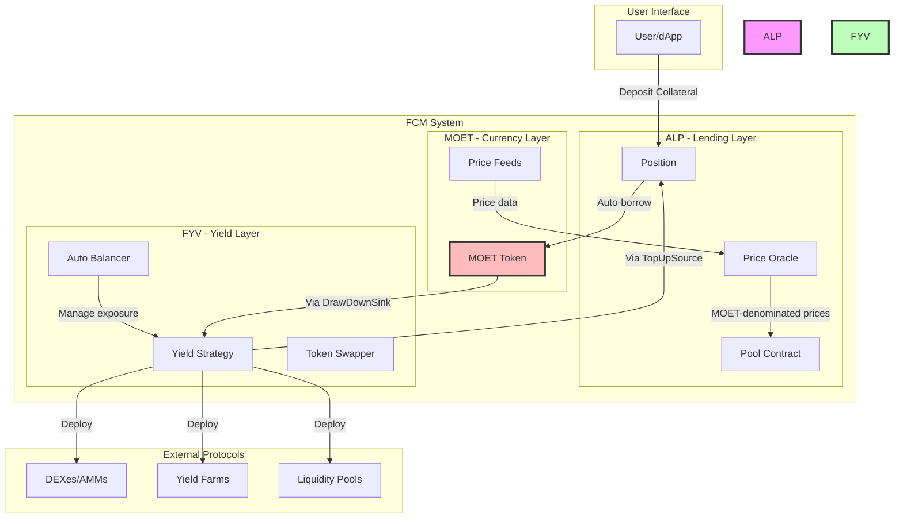
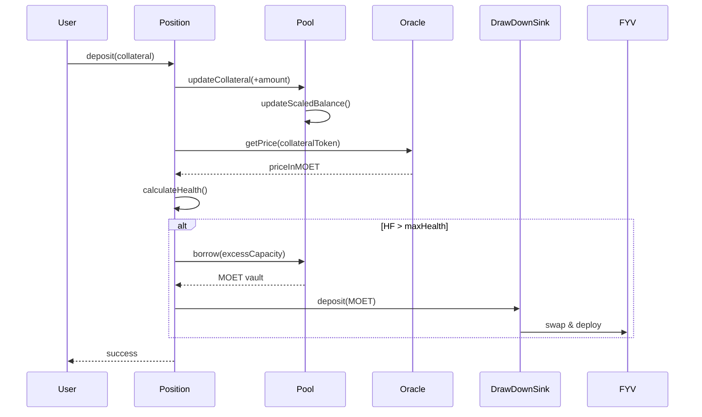
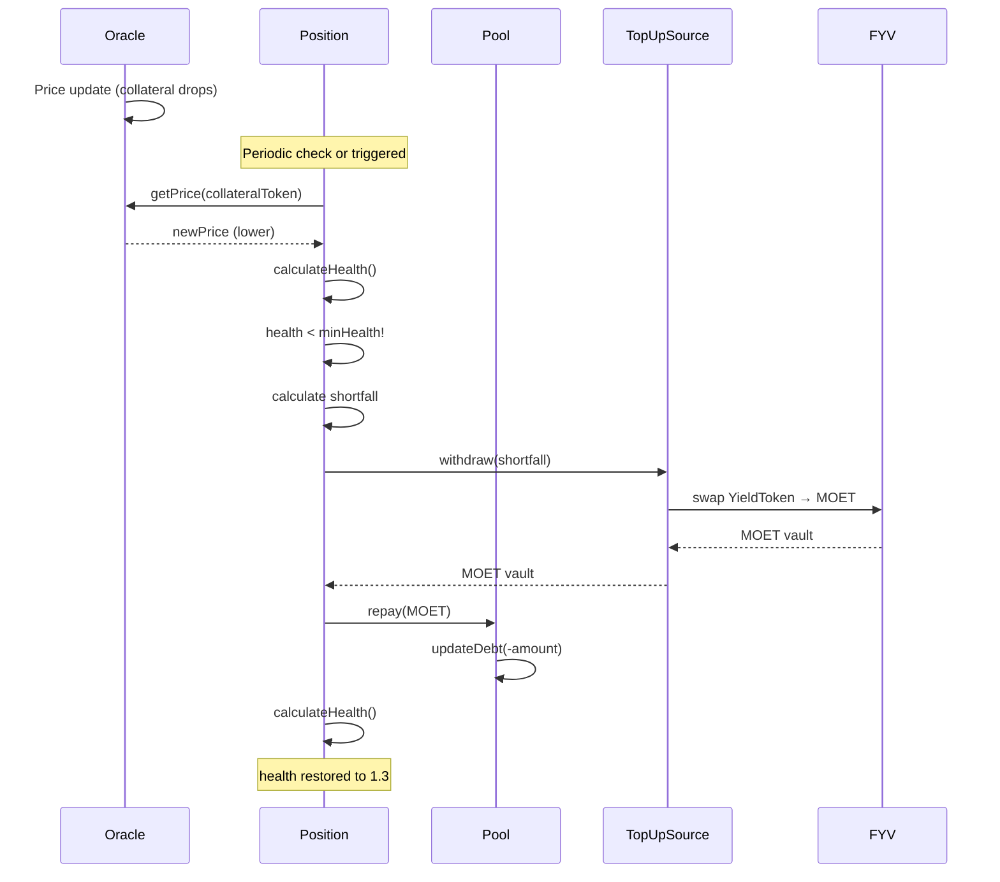

# FCM Architecture Overview

This document explains how Flow Credit Market's three core components - ALP, FYV, and MOET - integrate to create a complete yield-generating system with automated liquidation prevention.

## High-Level Architecture



## Component Integration

### 1. ALP ↔ MOET Integration

**Purpose**: MOET serves as the unit of account and primary borrowed asset for ALP.

**Integration points**:

```
ALP Pool
├── defaultToken: Type<@MOET.Vault>
├── priceOracle: Returns prices in MOET terms
├── Auto-borrowing: Borrows MOET
└── Debt tracking: Denominated in MOET
```

**Key interactions**:

1. **Price Quotation**: All token prices quoted in MOET
   ```
   FLOW/MOET: 1.0
   USDC/MOET: 1.0
   stFLOW/MOET: 1.05
   ```

2. **Health Calculations**: All in MOET terms
   ```
   Effective Collateral = FLOW amount × FLOW/MOET price × collateral factor
   Effective Debt = MOET borrowed
   Health Factor = Effective Collateral / Effective Debt
   ```

3. **Auto-Borrowing**: Always borrows MOET
   ```
   User deposits → ALP calculates capacity → Borrows MOET → User receives MOET
   ```

### 2. ALP ↔ FYV Integration

**Purpose**: FYV receives borrowed funds from ALP and provides liquidity for liquidation prevention.

**Integration via DeFi Actions**:

```
ALP Position
├── DrawDownSink → FYV Strategy (when overcollateralized)
└── TopUpSource ← FYV Strategy (when undercollateralized)
```

**Interaction flow**:

#### Overcollateralized (HF > 1.5)

```sequence
Position detects: HF = 1.8 (too high)
↓
Position calculates: Can borrow $200 more MOET
↓
Position borrows: 200 MOET from Pool
↓
Position pushes: 200 MOET → DrawDownSink
↓
DrawDownSink = FYV Strategy
↓
FYV Strategy swaps: 200 MOET → 200 YieldToken
↓
AutoBalancer holds: YieldToken, generates yield
```

#### Undercollateralized (HF < 1.1)

```sequence
Position detects: HF = 1.05 (too low)
↓
Position calculates: Need to repay $150 MOET
↓
Position pulls: Request 150 MOET from TopUpSource
↓
TopUpSource = FYV Strategy
↓
FYV Strategy swaps: 150 YieldToken → 150 MOET
↓
Position repays: 150 MOET to Pool
↓
New HF: 1.3 (restored to target)
```

**Code integration**:

```cadence
// ALP side (simplified)
access(all) struct Position {
    access(self) var drawDownSink: {DeFiActions.Sink}?
    access(self) var topUpSource: {DeFiActions.Source}?

    // When overcollateralized
    fun rebalanceDown() {
        let borrowed <- pool.borrow(amount: excessCapacity)
        self.drawDownSink?.deposit(vault: <-borrowed)
    }

    // When undercollateralized
    fun rebalanceUp() {
        let repayment <- self.topUpSource?.withdraw(amount: shortfall)
        pool.repay(vault: <-repayment)
    }
}
```

```cadence
// FYV side (simplified)
access(all) struct TracerStrategy {
    // Implements DeFi Actions interfaces
    access(all) fun createSink(): {DeFiActions.Sink} {
        // Returns sink that swaps MOET → YieldToken
    }

    access(all) fun createSource(): {DeFiActions.Source} {
        // Returns source that swaps YieldToken → MOET
    }
}
```

### 3. FYV ↔ MOET Integration

**Purpose**: MOET is the medium of exchange between FYV and external yield sources.

**Flow**:

```
FYV receives MOET → Swaps to target token → Deploys to yield source
↓
Time passes, yield accumulates
↓
When needed: Exit yield source → Swap to MOET → Return to ALP
```

**Example with TracerStrategy**:

```
1. Receive MOET from ALP
   ├── DrawDownSink.deposit(moetVault)

2. Swap MOET → YieldToken
   ├── Swapper.swap(moet → yieldToken)
   └── AutoBalancer.hold(yieldToken)

3. Generate yield
   ├── YieldToken appreciates
   ├── Farming rewards accrue
   └── Trading fees accumulate

4. Provide back to ALP (when needed)
   ├── AutoBalancer.release(yieldToken)
   ├── Swapper.swap(yieldToken → moet)
   └── TopUpSource.withdraw() returns MOET
```

## Data Flow Architecture

### User Deposit Flow



### Price Change & Rebalancing Flow



## Component Responsibilities

### ALP Responsibilities

| Function | Description |
|----------|-------------|
| **Position Management** | Create, track, and manage user positions |
| **Collateral Tracking** | Monitor deposited collateral using scaled balances |
| **Debt Tracking** | Track borrowed amounts with interest accrual |
| **Health Monitoring** | Calculate and monitor position health factors |
| **Auto-Borrowing** | Automatically borrow MOET when overcollateralized |
| **Auto-Repayment** | Automatically repay when undercollateralized |
| **Liquidation** | Handle traditional liquidations if auto-repayment fails |
| **Interest Calculation** | Accrue interest on borrowed amounts |
| **Oracle Integration** | Query prices for health calculations |

### FYV Responsibilities

| Function | Description |
|----------|-------------|
| **Strategy Management** | Implement and manage yield strategies |
| **Capital Deployment** | Deploy received MOET to yield sources |
| **Yield Generation** | Generate returns through various mechanisms |
| **Token Swapping** | Swap between MOET and yield tokens |
| **Auto-Balancing** | Maintain optimal exposure to yield tokens |
| **Liquidity Provision** | Provide MOET when ALP needs rebalancing |
| **Risk Management** | Monitor and adjust strategy parameters |
| **Yield Compounding** | Reinvest returns for compound growth |

### MOET Responsibilities

| Function | Description |
|----------|-------------|
| **Unit of Account** | Provide standardized pricing unit |
| **Value Transfer** | Enable value flow between ALP and FYV |
| **Price Stability** | Maintain stable value (if stablecoin) |
| **Oracle Integration** | Provide price feeds for all assets |
| **Liquidity** | Ensure deep liquidity for swaps |

## Communication Patterns

### 1. DeFi Actions Pattern (ALP ↔ FYV)

**Sink Pattern** (Push):
```cadence
// ALP pushes to FYV
access(all) resource interface Sink {
    access(all) fun deposit(vault: @{FungibleToken.Vault})
}

// Usage
let sink = fyvStrategy.createSink()
sink.deposit(vault: <-moetVault)
```

**Source Pattern** (Pull):
```cadence
// ALP pulls from FYV
access(all) resource interface Source {
    access(all) fun withdraw(amount: UFix64, type: Type): @{FungibleToken.Vault}
}

// Usage
let source = fyvStrategy.createSource()
let moet <- source.withdraw(amount: 100.0, type: Type<@MOET.Vault>())
```

### 2. Oracle Pattern (ALP ↔ MOET)

**Price Query**:
```cadence
// ALP queries prices in MOET terms
access(all) resource interface PriceOracle {
    access(all) fun getPrice(token: Type): UFix64
}

// Usage
let flowPrice = oracle.getPrice(Type<@FlowToken.Vault>())
// Returns: 1.0 (1 FLOW = 1 MOET)
```

### 3. Event-Driven Pattern

**Key events across components**:
```cadence
// ALP events
access(all) event PositionCreated(pid: UInt64, owner: Address)
access(all) event Borrowed(pid: UInt64, amount: UFix64)
access(all) event Repaid(pid: UInt64, amount: UFix64)
access(all) event Rebalanced(pid: UInt64, newHealth: UFix64)

// FYV events
access(all) event StrategyDeployed(amount: UFix64, strategy: String)
access(all) event YieldGenerated(amount: UFix64)
access(all) event LiquidityProvided(amount: UFix64, toALP: Bool)

// MOET events
access(all) event TokensMinted(amount: UFix64, recipient: Address)
access(all) event TokensBurned(amount: UFix64)
```

## System States

### Normal Operation State

```
System State: Healthy
├── ALP Positions: All HF between 1.1 and 1.5
├── FYV Strategies: Generating yield normally
├── MOET: Stable and liquid
└── Oracles: Providing fresh prices

Actions:
- Accept new deposits
- Allow withdrawals
- Process rebalancing
- Generate yield
```

### Stress State (Price Volatility)

```
System State: Under Stress
├── ALP Positions: Some HF approaching 1.1
├── FYV Strategies: May need to provide liquidity
├── MOET: May see increased trading volume
└── Oracles: Prices updating frequently

Actions:
- Trigger frequent rebalancing
- FYV provides liquidity to ALP
- Some yield positions exited
- Increased monitoring
```

### Emergency State

```
System State: Emergency
├── ALP Positions: Multiple HF < 1.0
├── FYV Strategies: Emergency liquidation mode
├── MOET: Potential depeg risk
└── Oracles: Stale or unreliable

Actions:
- Circuit breakers activated
- Liquidations triggered
- Deposits paused
- Admin intervention required
```

## Scalability & Performance

### Optimizations

1. **Scaled Balance System** (ALP):
   - Avoids updating every position on interest accrual
   - Single interest index update affects all positions
   - Gas-efficient for large position counts

2. **Batch Rebalancing** (ALP):
   - Multiple positions can be rebalanced in one transaction
   - Keepers can optimize gas costs

3. **Lazy Evaluation** (All components):
   - Prices only fetched when needed
   - Health only calculated when accessed
   - Interest only accrued when position touched

4. **Event-Driven Updates** (All components):
   - Off-chain indexers track state
   - UI updates without constant blockchain queries
   - Reduces RPC load

### Limits & Constraints

| Component | Limit | Reason |
|-----------|-------|--------|
| ALP Max Positions | Configurable | Gas limits for iteration |
| FYV Strategies per Vault | ~10-20 | Complexity management |
| Rebalancing Frequency | ~1 per block | Gas and Oracle freshness |
| Max Leverage | ~5x | Safety (1.0 HF = 100%, 1.1-1.5 range) |

## Security Architecture

### Defense in Depth

**Layer 1: Input Validation**
- All user inputs sanitized
- Type checking enforced
- Capability-based access control

**Layer 2: Business Logic**
- Health factor checks before operations
- Minimum/maximum limits enforced
- Oracle staleness checks

**Layer 3: Circuit Breakers**
- Emergency pause functionality
- Liquidation warm-up periods
- Admin override capabilities

**Layer 4: Economic Security**
- Over-collateralization requirements
- Liquidation incentives
- Oracle price deviation limits

**Layer 5: Monitoring**
- Event emission for all critical operations
- Off-chain monitoring systems
- Automated alerts

## Next Steps

- **Understand the math**: [Mathematical Foundations](./math.md)
- **Explore ALP details**: [ALP Architecture](../alp/architecture.md)
- **Learn about FYV**: [FYV Documentation](../flow-yield-vaults/index.md)
- **Deep dive into MOET**: [MOET Documentation](../moet/index.md)

---

:::tip Key Insight
FCM's architecture is designed for **composability** and **automation**. Each component has clear responsibilities and communicates through standardized interfaces (DeFi Actions), enabling:
- Independent development and upgrades
- Third-party strategy integrations
- System resilience through modularity
:::
