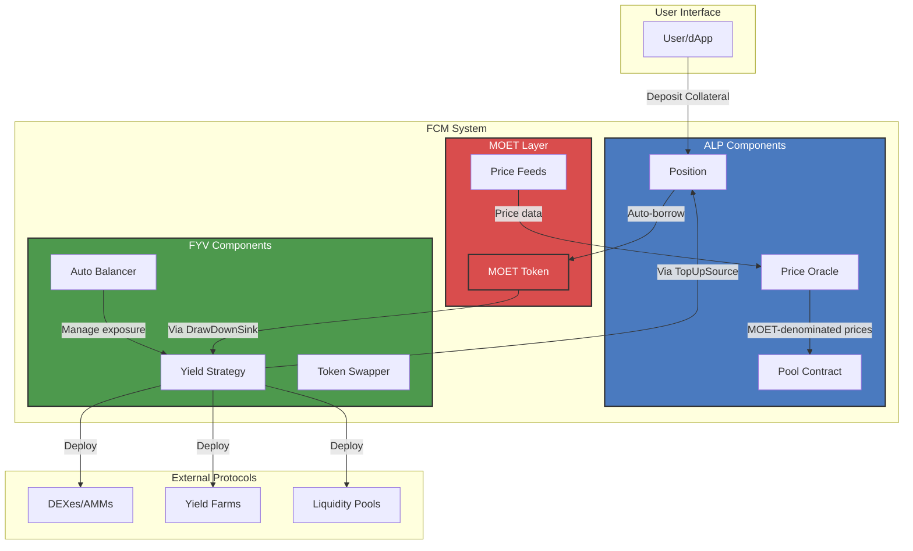

# FCM Architecture Overview

This document explains how Flow Credit Market's (FCM) three core components - [Automated Lending Platform (ALP)](../alp/index.md), [Flow Yield Vaults (FYV)](#), and [Medium Of Exchange Token (MOET)](#) - integrate to create a complete yield-generating system with automated liquidation prevention.


:::tip Key Insight
FCM's architecture is designed for **composability** and **automation**. Each component has clear responsibilities and communicates through standardized interfaces (DeFi Actions), enabling:
- Independent development and upgrades
- Third-party strategy integrations
- System resilience through modularity
:::

## High-Level Architecture



## Component Integration

### 1. ALP ↔ MOET Integration

**Purpose**: MOET serves as the unit of account and primary borrowed asset for ALP.

**Integration points**:

```
ALP Pool
├── defaultToken: Type<@MOET.Vault>
├── priceOracle: Returns prices in MOET terms
├── Auto-borrowing: Borrows MOET
└── Debt tracking: Denominated in MOET
```

**Key interactions**:

1. **Price Quotation**: All token prices quoted in MOET
   ```
   FLOW/MOET: 1.0
   USDC/MOET: 1.0
   stFLOW/MOET: 1.05
   ```

2. **Health Calculations**: All in MOET terms
   ```
   Effective Collateral = FLOW amount × FLOW/MOET price × collateral factor
   Effective Debt = MOET borrowed
   Health Factor = Effective Collateral / Effective Debt
   ```

3. **Auto-Borrowing**: Always borrows MOET
   ```
   User deposits → ALP calculates capacity → Borrows MOET → User receives MOET
   ```

### 2. ALP ↔ FYV Integration

**Purpose**: FYV receives borrowed funds from ALP and provides liquidity for liquidation prevention.

**Integration via DeFi Actions**:

```
ALP Position
├── DrawDownSink → FYV Strategy (when overcollateralized)
└── TopUpSource ← FYV Strategy (when undercollateralized)
```

**Interaction flow**:

#### Overcollateralized (HF > 1.5)

```sequence
Position detects: HF = 1.8 (too high)
↓
Position calculates: Can borrow $200 more MOET
↓
Position borrows: 200 MOET from Pool
↓
Position pushes: 200 MOET → DrawDownSink
↓
DrawDownSink = FYV Strategy
↓
FYV Strategy swaps: 200 MOET → 200 YieldToken
↓
AutoBalancer holds: YieldToken, generates yield
```

#### Undercollateralized (HF < 1.1)

```sequence
Position detects: HF = 1.05 (too low)
↓
Position calculates: Need to repay $150 MOET
↓
Position pulls: Request 150 MOET from TopUpSource
↓
TopUpSource = FYV Strategy
↓
FYV Strategy swaps: 150 YieldToken → 150 MOET
↓
Position repays: 150 MOET to Pool
↓
New HF: 1.3 (restored to target)
```

**Code integration**:

The integration is implemented through DeFi Actions interfaces in Cadence. On the ALP side, each Position holds references to a DrawDownSink and TopUpSource, which are called during rebalancing operations. When the position becomes overcollateralized, it borrows additional funds and pushes them to the DrawDownSink. When undercollateralized, it pulls funds from the TopUpSource to repay debt.

```cadence
// ALP side (simplified)
access(all) struct Position {
    access(self) var drawDownSink: {DeFiActions.Sink}?
    access(self) var topUpSource: {DeFiActions.Source}?

    // When overcollateralized
    fun rebalanceDown() {
        let borrowed <- pool.borrow(amount: excessCapacity)
        self.drawDownSink?.deposit(vault: <-borrowed)
    }

    // When undercollateralized
    fun rebalanceUp() {
        let repayment <- self.topUpSource?.withdraw(amount: shortfall)
        pool.repay(vault: <-repayment)
    }
}
```

On the FYV side, strategies implement the DeFi Actions interfaces by providing Sink and Source creation functions. These functions return objects that handle the swap between MOET and yield-bearing tokens. When ALP calls the Sink, FYV converts MOET into yield tokens. When ALP pulls from the Source, FYV converts yield tokens back to MOET.

TracerStrategy is one of FYV's yield strategies that tracks and manages positions in external yield-generating protocols. It acts as the bridge between ALP's lending system and external DeFi opportunities, automatically converting between MOET and yield tokens while maintaining the optimal balance for returns.

```cadence
// FYV side (simplified)
access(all) struct TracerStrategy {
    // Implements DeFi Actions interfaces
    access(all) fun createSink(): {DeFiActions.Sink} {
        // Returns sink that swaps MOET → YieldToken
    }

    access(all) fun createSource(): {DeFiActions.Source} {
        // Returns source that swaps YieldToken → MOET
    }
}
```

### 3. FYV ↔ MOET Integration

**Purpose**: MOET is the medium of exchange between FYV and external yield sources.

**Flow**:

```
FYV receives MOET → Swaps to target token → Deploys to yield source
↓
Time passes, yield accumulates
↓
When needed: Exit yield source → Swap to MOET → Return to ALP
```

**Example with TracerStrategy**:

```
1. Receive MOET from ALP
   ├── DrawDownSink.deposit(moetVault)

2. Swap MOET → YieldToken
   ├── Swapper.swap(moet → yieldToken)
   └── AutoBalancer.hold(yieldToken)

3. Generate yield
   ├── YieldToken appreciates
   ├── Farming rewards accrue
   └── Trading fees accumulate

4. Provide back to ALP (when needed)
   ├── AutoBalancer.release(yieldToken)
   ├── Swapper.swap(yieldToken → moet)
   └── TopUpSource.withdraw() returns MOET
```

## Data Flow Architecture

### User Deposit Flow

```mermaid
graph LR
    User[👤 You deposit<br/>1000 FLOW] --> Position[ALP Position<br/>stores collateral]
    Position --> Oracle[Oracle checks<br/>FLOW price]
    Oracle --> Health{Health Factor<br/>calculation}
    Health -->|HF > 1.5<br/>Can borrow| Borrow[Auto-borrow<br/>615 MOET]
    Health -->|HF ≤ 1.5<br/>No borrowing| Done1[✅ Deposit complete]
    Borrow --> DrawDown[Push to<br/>DrawDownSink]
    DrawDown --> FYV[FYV Strategy<br/>swaps to yield tokens]
    FYV --> Done2[✅ Earning yield<br/>HF = 1.3]

    style Position fill:#4a7abf,stroke:#333,stroke-width:2px,color:#fff
    style FYV fill:#4d994d,stroke:#333,stroke-width:2px,color:#fff
    style Borrow fill:#d94d4d,stroke:#333,stroke-width:2px,color:#fff
    style Done2 fill:#4d994d,stroke:#333,stroke-width:2px,color:#fff
```



### Price Drop & Rebalancing Flow

```mermaid
graph LR
    Drop[📉 FLOW price<br/>drops 20%] --> Position[ALP Position<br/>detects HF = 1.05]
    Position --> Calc[Calculate needed<br/>repayment: 123 MOET]
    Calc --> TopUp[Pull from<br/>TopUpSource]
    TopUp --> FYV[FYV Strategy<br/>swaps yield tokens]
    FYV --> MOET[Returns<br/>123 MOET]
    MOET --> Repay[ALP repays<br/>debt to Pool]
    Repay --> Restored[✅ Health restored<br/>HF = 1.3]

    style Position fill:#4a7abf,stroke:#333,stroke-width:2px,color:#fff
    style FYV fill:#4d994d,stroke:#333,stroke-width:2px,color:#fff
    style MOET fill:#d94d4d,stroke:#333,stroke-width:2px,color:#fff
    style Restored fill:#4d994d,stroke:#333,stroke-width:2px,color:#fff
```



## Component Responsibilities

### ALP Responsibilities

| Function | Description |
|----------|-------------|
| **Position Management** | Create, track, and manage user positions |
| **Collateral Tracking** | Monitor deposited collateral using scaled balances |
| **Debt Tracking** | Track borrowed amounts with interest accrual |
| **Health Monitoring** | Calculate and monitor position health factors |
| **Auto-Borrowing** | Automatically borrow MOET when overcollateralized |
| **Auto-Repayment** | Automatically repay when undercollateralized |
| **Liquidation** | Handle traditional liquidations if auto-repayment fails |
| **Interest Calculation** | Accrue interest on borrowed amounts |
| **Oracle Integration** | Query prices for health calculations |

### FYV Responsibilities

| Function | Description |
|----------|-------------|
| **Strategy Management** | Implement and manage yield strategies |
| **Capital Deployment** | Deploy received MOET to yield sources |
| **Yield Generation** | Generate returns through various mechanisms |
| **Token Swapping** | Swap between MOET and yield tokens |
| **Auto-Balancing** | Maintain optimal exposure to yield tokens |
| **Liquidity Provision** | Provide MOET when ALP needs rebalancing |
| **Risk Management** | Monitor and adjust strategy parameters |
| **Yield Compounding** | Reinvest returns for compound growth |

### MOET Responsibilities

| Function | Description |
|----------|-------------|
| **Unit of Account** | Provide standardized pricing unit |
| **Value Transfer** | Enable value flow between ALP and FYV |
| **Price Stability** | Maintain stable value (if stablecoin) |
| **Oracle Integration** | Provide price feeds for all assets |
| **Liquidity** | Ensure deep liquidity for swaps |

## Communication Patterns

### 1. DeFi Actions Pattern (ALP ↔ FYV)

DeFi Actions enables ALP and FYV to communicate through standardized interfaces without tight coupling. The Sink pattern allows ALP to push borrowed funds to FYV strategies, while the Source pattern enables ALP to pull funds back when needed for rebalancing or repayment.

**Sink Pattern** (Push):

When ALP has excess borrowing capacity or newly borrowed funds, it uses the Sink interface to deposit MOET into FYV strategies. The FYV strategy receives the funds and automatically converts them to yield-bearing tokens.

```cadence
// ALP pushes to FYV
access(all) resource interface Sink {
    access(all) fun deposit(vault: @{FungibleToken.Vault})
}

// Usage
let sink = fyvStrategy.createSink()
sink.deposit(vault: <-moetVault)
```

**Source Pattern** (Pull):

When ALP needs funds to maintain position health, it pulls from the Source interface. FYV converts yield tokens back to MOET and provides the requested amount, enabling automatic liquidation prevention.

```cadence
// ALP pulls from FYV
access(all) resource interface Source {
    access(all) fun withdraw(amount: UFix64, type: Type): @{FungibleToken.Vault}
}

// Usage
let source = fyvStrategy.createSource()
let moet <- source.withdraw(amount: 100.0, type: Type<@MOET.Vault>())
```

### 2. Oracle Pattern (ALP ↔ MOET)

The Oracle pattern provides a standardized way for ALP to query token prices in MOET terms. All collateral and debt calculations use these MOET-denominated prices, ensuring consistency across the system. This enables health factor calculations and determines borrowing capacity based on real-time market data.

**Price Query**:

The PriceOracle interface returns the current price of any token type denominated in MOET. For example, querying the price of FLOW returns how many MOET one FLOW is worth, which ALP uses to calculate effective collateral values.

```cadence
// ALP queries prices in MOET terms
access(all) resource interface PriceOracle {
    access(all) fun getPrice(token: Type): UFix64
}

// Usage
let flowPrice = oracle.getPrice(Type<@FlowToken.Vault>())
// Returns: 1.0 (1 FLOW = 1 MOET)
```

### 3. Event-Driven Pattern

FCM components communicate state changes through events, enabling monitoring, analytics, and external integrations. Each component emits events for significant actions like position changes, yield generation, and token operations. These events allow off-chain systems to track user activity, trigger notifications, and maintain historical records without polling smart contracts.

**Key events across components**:

ALP emits events for all position lifecycle operations including creation, borrowing, repayment, and rebalancing. FYV broadcasts events when deploying to strategies, generating yield, or providing liquidity back to ALP. MOET tracks token supply changes through mint and burn events, ensuring transparency in the stablecoin's circulation.

```cadence
// ALP events
access(all) event PositionCreated(pid: UInt64, owner: Address)
access(all) event Borrowed(pid: UInt64, amount: UFix64)
access(all) event Repaid(pid: UInt64, amount: UFix64)
access(all) event Rebalanced(pid: UInt64, newHealth: UFix64)

// FYV events
access(all) event StrategyDeployed(amount: UFix64, strategy: String)
access(all) event YieldGenerated(amount: UFix64)
access(all) event LiquidityProvided(amount: UFix64, toALP: Bool)

// MOET events
access(all) event TokensMinted(amount: UFix64, recipient: Address)
access(all) event TokensBurned(amount: UFix64)
```

## System States

### Normal Operation State

```
System State: Healthy
├── ALP Positions: All HF between 1.1 and 1.5
├── FYV Strategies: Generating yield normally
├── MOET: Stable and liquid
└── Oracles: Providing fresh prices

Actions:
- Accept new deposits
- Allow withdrawals
- Process rebalancing
- Generate yield
```

### Stress State (Price Volatility)

```
System State: Under Stress
├── ALP Positions: Some HF approaching 1.1
├── FYV Strategies: May need to provide liquidity
├── MOET: May see increased trading volume
└── Oracles: Prices updating frequently

Actions:
- Trigger frequent rebalancing
- FYV provides liquidity to ALP
- Some yield positions exited
- Increased monitoring
```

### Emergency State

```
System State: Emergency
├── ALP Positions: Multiple HF < 1.0
├── FYV Strategies: Emergency liquidation mode
├── MOET: Potential depeg risk
└── Oracles: Stale or unreliable

Actions:
- Circuit breakers activated
- Liquidations triggered
- Deposits paused
- Admin intervention required
```

## Scalability & Performance

### Optimizations

**Scaled Balance System** - ALP uses a scaled balance approach that avoids updating every position when interest accrues. Instead, a single interest index update affects all positions simultaneously, making the system gas-efficient even with thousands of active positions.

**Batch Rebalancing** - The protocol allows multiple positions to be rebalanced in a single transaction, enabling keepers to optimize gas costs by processing several positions at once rather than submitting individual transactions for each rebalancing operation.

**Lazy Evaluation** - All components use lazy evaluation patterns where prices are only fetched when needed, health factors are calculated only when accessed, and interest accrues only when a position is touched. This approach minimizes unnecessary computations and reduces gas costs for operations that don't require the latest state.

**Event-Driven Updates** - The system emits events for all critical operations, allowing off-chain indexers to track state changes efficiently. This enables UI updates without constant blockchain queries and significantly reduces RPC load on the network while providing users with real-time information.

### Limits & Constraints

| Component | Limit | Reason |
|-----------|-------|--------|
| ALP Max Positions | Configurable | Gas limits for iteration |
| FYV Strategies per Vault | ~10-20 | Complexity management |
| Rebalancing Frequency | ~1 per block | Gas and Oracle freshness |
| Max Leverage | ~5x | Safety (1.0 HF = 100%, 1.1-1.5 range) |

## Security Architecture

### Defense in Depth

**Layer 1: Input Validation**
- All user inputs sanitized
- Type checking enforced
- Capability-based access control

**Layer 2: Business Logic**
- Health factor checks before operations
- Minimum/maximum limits enforced
- Oracle staleness checks

**Layer 3: Circuit Breakers**
- Emergency pause functionality
- Liquidation warm-up periods
- Admin override capabilities

**Layer 4: Economic Security**
- Over-collateralization requirements
- Liquidation incentives
- Oracle price deviation limits

**Layer 5: Monitoring**
- Event emission for all critical operations
- Off-chain monitoring systems
- Automated alerts

## Next Steps

- **Understand the math**: [Mathematical Foundations](./math.md)
- **Explore ALP details**: [ALP Architecture](../alp/architecture.md)
- **Learn about FYV**: [FYV Documentation](#)
- **Deep dive into MOET**: [MOET Documentation](#)