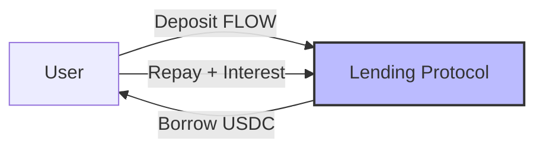
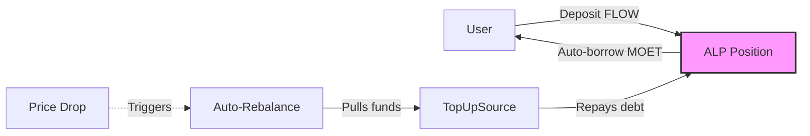
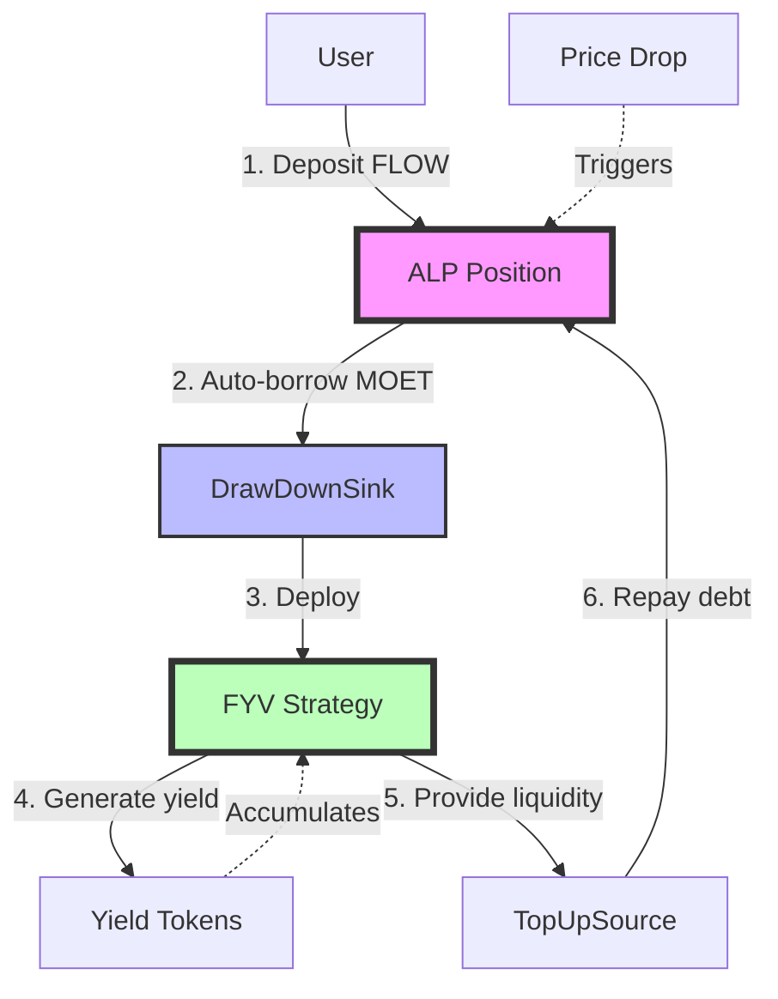

# Understanding FCM Basics

To understand how Flow Credit Market (FCM) works, let's build up from simple lending concepts to FCM's innovative three-component architecture.

:::tip Key Takeaway
FCM = Traditional Lending + Automation + Yield Generation + Liquidation Protection

It's not just "another lending protocol" - it's a complete yield-generating system with automated risk management.
:::


## From Traditional Lending to FCM

### Level 1: Traditional Lending (Aave, Compound)

In traditional DeFi lending protocols:



**How it works**:
1. Deposit collateral (e.g., 1000 FLOW worth $1000)
2. Borrow up to ~75% of collateral value (e.g., $750 USDC)
3. Pay interest on borrowed amount
4. **Your responsibility**: Monitor health factor and manually manage position

**Limitations**: Traditional lending requires you to manually monitor and rebalance positions, quickly add collateral or repay debt if collateral price drops, manually deploy borrowed funds to avoid them sitting idle, and act fast enough to prevent liquidation.

### Level 2: Automated Lending (ALP)

ALP adds automation to traditional lending:



**New features**:
- ✅ **Auto-borrowing**: Automatically borrows optimal amount when you deposit
- ✅ **Auto-rebalancing**: Maintains target health ratio automatically
- ✅ **TopUpSource integration**: Can pull from external sources to prevent liquidation

**Better, but**:
- ⚠️ TopUpSource must have funds available
- ⚠️ Borrowed MOET still needs manual deployment for yield
- ⚠️ Still some manual intervention required

### Level 3: FCM (ALP + FYV + MOET)

FCM completes the automation by adding yield generation:



**Complete automation**:
- ✅ **Auto-borrowing**: Instantly borrow optimal amount
- ✅ **Auto-deployment**: Borrowed MOET flows directly to yield strategies
- ✅ **Auto-compounding**: FYV strategies reinvest yields
- ✅ **Auto-protection**: FYV provides liquidity to prevent liquidations
- ✅ **Auto-everything**: True set-and-forget experience

FCM's innovation is that your generated yield protects your position by maintaining health automatically, requiring no manual intervention as everything happens seamlessly in the background. This creates true capital efficiency where borrowed capital works for you immediately upon deployment.

## Understanding the Three Components

### Component 1: ALP (The Lending Engine)

ALP manages collateral and debt positions with automated rebalancing. You deposit collateral such as FLOW or stFLOW, and the system applies a collateral factor that determines what percentage of your collateral's value you can borrow—for example, a 0.8 collateral factor means you can borrow up to 80% of your collateral's value. The system continuously monitors your health factor, which is the ratio of your collateral to debt and must remain above 1.0 to avoid liquidation. ALP automatically maintains your position at a target health level, typically around 1.3, to provide a safety buffer.

**Example**:

```
Deposit: 1000 FLOW @ $1 = $1000
Collateral Factor: 0.8 (80%)
Effective Collateral: $800

Target Health: 1.3
Max Safe Borrow: $800 / 1.3 ≈ $615.38 MOET

ALP auto-borrows: 615.38 MOET
Position Health: 800 / 615.38 = 1.3 
```

Learn more: [ALP Documentation](../alp/index.md)

### Component 2: FYV (The Yield Engine)

**TracerStrategy** acts as the smart converter that takes your borrowed MOET, converts it into yield-earning tokens, and converts them back to MOET when your position needs protection, handling all the conversion logic between MOET and yield opportunities. **AutoBalancer** acts as the smart wallet that holds and manages your yield tokens, automatically monitoring the value of your yield position and rebalancing your holdings as needed to optimize returns and maintain liquidity. Together, TracerStrategy handles the conversion logic while AutoBalancer handles the holding and management of those yield tokens.

FYV deploys capital into yield-generating strategies and provides liquidity for liquidation prevention. The system uses predefined strategies like TracerStrategy to generate returns, with an AutoBalancer that manages your exposure to yield tokens and handles rebalancing automatically. When ALP borrows MOET on your behalf, the DrawDownSink receives it and deploys it into yield strategies, while the TopUpSource stands ready to provide liquidity back to ALP whenever your position needs debt repayment to maintain health.

**Example strategy (TracerStrategy)**:

```
1. Receive MOET from ALP → DrawDownSink
2. Swap MOET → YieldToken (e.g., LP token, farm token)
3. Hold YieldToken in AutoBalancer
4. Accumulate yield over time
5. When ALP needs funds:
   - Swap YieldToken → MOET
   - Provide via TopUpSource
   - ALP repays debt
```

Learn more: [FYV Documentation](#)

### Component 3: MOET (The Unit of Account)

MOET serves as the currency for all operations within FCM, functioning simultaneously as the borrowed asset, pricing unit, and value transfer medium. As the system's unit of account, all prices are quoted in MOET terms—whether FLOW/MOET or USDC/MOET. MOET is the primary borrowed asset that ALP auto-borrows and FYV receives for deployment. As a synthetic stablecoin with value pegged to maintain stability, MOET acts as the medium of exchange that flows seamlessly between ALP and FYV components. This design standardizes all valuations, simplifies multi-collateral calculations, and provides deep integration with the Flow ecosystem specifically for DeFi operations.

Learn more: [MOET Documentation](#)

## The Capital Flow Cycle

Let's follow $1000 of FLOW through the entire FCM system:

### Phase 1: Initial Deposit and Borrowing

```
You deposit: 1000 FLOW worth $1000
↓
ALP calculates:
  - Effective collateral: $1000 × 0.8 = $800
  - Target health: 1.3
  - Borrow amount: $800 / 1.3 = $615.38 MOET
↓
ALP auto-borrows: 615.38 MOET
↓
MOET flows to: FYV strategy (via DrawDownSink)
↓
FYV swaps: 615.38 MOET → 615.38 YieldToken
↓
Status:
  - Your ALP position: 1000 FLOW collateral, 615.38 MOET debt
  - Your FYV position: 615.38 YieldToken generating yield
  - Health factor: 1.3 ✓
```

### Phase 2: Yield Generation

```
Time passes...
↓
FYV Strategy generates yield:
  - Trading fees from LP positions
  - Farming rewards
  - Interest from lending
↓
Example after 1 month:
  - YieldToken value: 615.38 → 625.00 (+1.5% return)
  - Yield earned: ~$10
↓
FYV holds:
  - Original: 615.38 YieldToken
  - Plus accumulated yield
```

### Phase 3: Price Drop & Auto-Protection

```
FLOW price drops: $1.00 → $0.80 (-20%)
↓
ALP detects:
  - Collateral: 1000 FLOW @ $0.80 = $800 × 0.8 = $640 effective
  - Debt: 615.38 MOET
  - New health: 640 / 615.38 = 1.04 (below min 1.1!)
↓
ALP triggers rebalancing:
  - Calculates required repayment
  - Target debt: $640 / 1.3 = $492.31 MOET
  - Needs to repay: 615.38 - 492.31 = 123.07 MOET
↓
ALP pulls from FYV (TopUpSource):
  - FYV swaps: 123.07 YieldToken → 123.07 MOET
  - Sends MOET to ALP
↓
ALP repays debt:
  - New debt: 492.31 MOET
  - New health: 640 / 492.31 = 1.3 ✓
↓
Status:
  - ALP position: 1000 FLOW, 492.31 MOET debt, HF=1.3
  - FYV position: ~492 YieldToken remaining
  - Liquidation prevented! ✓
```

### Phase 4: Price Recovery

```
FLOW price recovers: $0.80 → $1.00
↓
ALP detects:
  - Collateral: 1000 FLOW @ $1.00 = $1000 × 0.8 = $800 effective
  - Debt: 492.31 MOET
  - New health: 800 / 492.31 = 1.625 (above max 1.5!)
↓
ALP triggers rebalancing:
  - Can borrow more to reach target health
  - Target debt: $800 / 1.3 = $615.38 MOET
  - Can borrow: 615.38 - 492.31 = 123.07 MOET
↓
ALP auto-borrows:
  - Borrows: 123.07 MOET
  - Pushes to FYV (DrawDownSink)
↓
FYV deploys:
  - Swaps: 123.07 MOET → 123.07 YieldToken
  - Back to ~615 YieldToken
↓
Status:
  - ALP position: 1000 FLOW, 615.38 MOET debt, HF=1.3
  - FYV position: ~615 YieldToken generating yield
  - Fully rebalanced and optimized! ✓
```

## Key Benefits Explained

### 1. Yield-Powered Liquidation Prevention

**Traditional protocol**:
```
Price drops → Health factor drops → You must manually:
  1. Monitor the drop
  2. Decide: add collateral or repay debt?
  3. Find liquidity
  4. Execute transaction
  5. Hope you're not liquidated first
```

**FCM**:
```
Price drops → Health factor drops → System automatically:
  1. Detects drop instantly
  2. Calculates exact repayment needed
  3. Pulls from your yield
  4. Repays debt
  5. Restores health

All in one transaction, no intervention needed!
```

### 2. Capital Efficiency

**Without FCM**:
```
Scenario: Have 1000 FLOW, want to generate yield

Option A: Just hold FLOW
  - Capital: $1000 working
  - Opportunity cost: Missing yield opportunities

Option B: Deposit in lending protocol
  - Earn deposit interest: ~3% APY
  - Capital: $1000 working
  - Yield: ~$30/year

Option C: Manual yield farming
  - Borrow against FLOW: ~$750
  - Deploy to farm: Complex, risky
  - Must monitor constantly
  - Risk liquidation
```

**With FCM**:

```
Deposit 1000 FLOW → FCM does everything:
  - Borrow optimal amount: ~$615 MOET
  - Deploy to best yield: Automatic
  - Compound returns: Automatic
  - Prevent liquidation: Automatic
  - Potential yield: 5-15% APY (varies by strategy)

Capital efficiency: Using collateral to earn yield on borrowed funds
Risk management: Yield protects against liquidation
Effort: Set and forget
```

### 3. Composability

Each component has value independently, allowing you to choose the level of integration that matches your needs. You can use ALP alone when you want simple lending and borrowing, have your own yield strategies, or need DeFi Actions integration for custom workflows. You can use FYV alone when you want yield aggregation without leverage, or prefer direct yield farming without the complexity of borrowing. You can use FCM together when you want maximum automation with liquidation protection and optimal capital efficiency through the integrated system.

## Understanding the Math

### Health Factor Calculation

The health factor is the core metric that determines whether your position is safe or at risk of liquidation. It compares the value of your collateral (adjusted by the collateral factor) against the value of your debt.

```
Health Factor = Effective Collateral / Effective Debt

Effective Collateral = Token Amount × Price × Collateral Factor
Effective Debt = Borrowed Amount × Price

Example:
  - 1000 FLOW @ $1 each × 0.8 factor = $800 effective collateral
  - 615.38 MOET @ $1 each = $615.38 effective debt
  - Health Factor = 800 / 615.38 = 1.30
```

### Target Health Ranges

Different health factor values indicate different states of your position, from dangerous (below 1.0) to overcollateralized (above 1.5). Understanding these ranges helps you know when to take action.

```
Health Factor States:

HF < 1.0   → Liquidatable (immediate danger!)
HF = 1.0-1.1 → At risk (very close to liquidation)
HF = 1.1-1.3 → Below target (should rebalance up)
HF = 1.3     → Target (optimal!)
HF = 1.3-1.5 → Above target (can borrow more)
HF > 1.5     → Overcollateralized (should rebalance down)
```

### Borrowing Capacity

This shows how much you can safely borrow while maintaining your target health factor. Borrowing up to this limit ensures you have a safety buffer to protect against price volatility.

```
Maximum Safe Borrow = Effective Collateral / Target Health

Example with target health of 1.3:
  - Effective collateral: $800
  - Max borrow: $800 / 1.3 = $615.38 MOET

Why not borrow more?
  - Need safety buffer for price volatility
  - Target of 1.3 means 30% buffer above liquidation
  - If you borrowed $800, health would be 1.0 (liquidatable immediately!)
```

Learn more: [Mathematical Foundations](./math.md)

## Next Steps

Now that you understand the basics:

1. **Learn the architecture**: [Architecture Overview](./architecture.md)
2. **Understand the math**: [Mathematical Foundations](./math.md)
3. **Explore components**: [ALP](../alp/index.md), [FYV](#), [MOET](#)