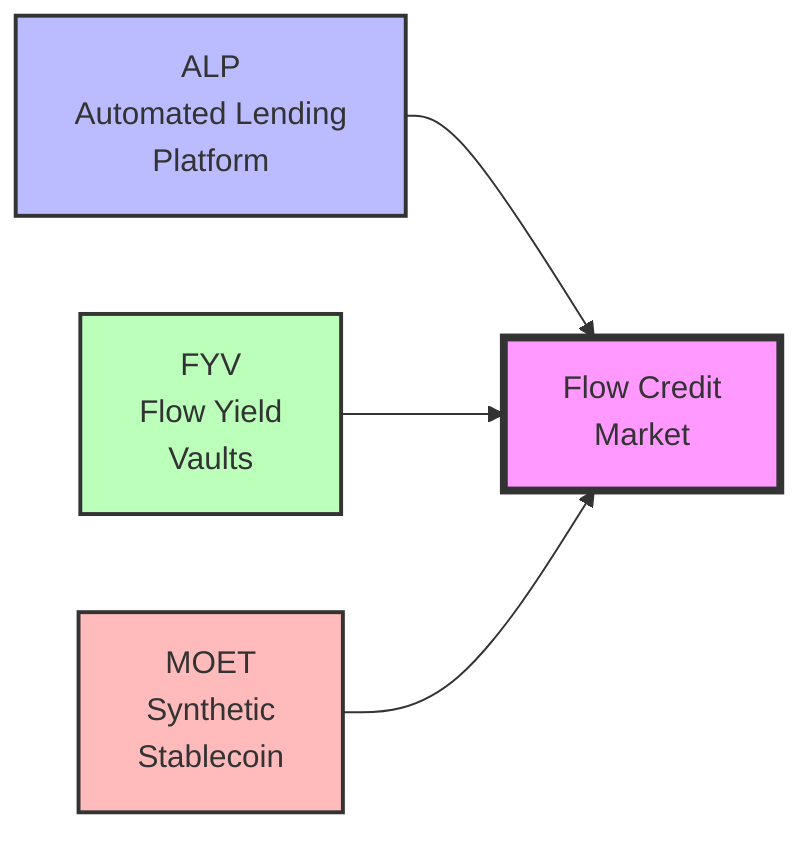
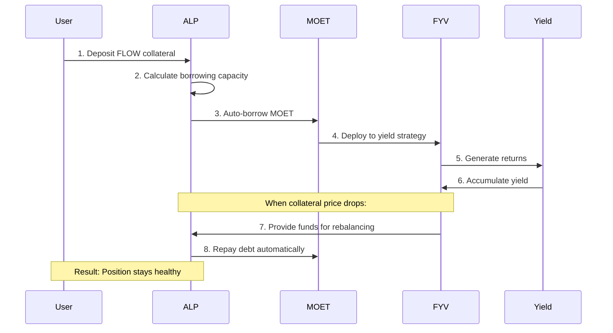

# Flow Credit Market (FCM)

Flow Credit Market (FCM) is a comprehensive DeFi yield platform on Flow that combines automated lending, yield farming strategies, and a synthetic stablecoin to create a capital-efficient system for generating returns on crypto assets.

## What is FCM?

FCM is **not a single protocol** - it's an integrated system composed of three core components working together:

### The Three Components

1. **[ALP (Automated Lending Platform)](../alp/index.md)**: The core lending/borrowing engine
   - Manages collateral deposits and debt positions
   - Provides automated rebalancing to maintain position health
   - Uses DeFi Actions for composability
   - Implements liquidation prevention mechanisms

2. **[FYV (Flow Yield Vaults)](#)**: The yield aggregation layer
   - Deploys borrowed capital into optimal yield strategies
   - Automatically compounds returns
   - Provides liquidity for ALP liquidation prevention
   - Manages risk through auto-balancing

3. **[MOET](#)**: The synthetic stablecoin
   - Serves as the unit of account for all pricing
   - Primary borrowed asset in ALP
   - Medium of exchange between components
   - Maintains stability through over-collateralization

## How the Components Work Together

FCM creates a **yield-generating flywheel** by connecting these three components:

### The Capital Flow

### Step-by-Step Flow

1. **User deposits collateral** (e.g., FLOW tokens) into an ALP position
2. **ALP auto-borrows** MOET against the collateral to reach target health ratio (1.3)
3. **Borrowed MOET flows** to a FYV strategy (via DrawDownSink)
4. **FYV deploys capital** into yield-generating opportunities (farms, LPs, etc.)
5. **Yield accumulates** and compounds automatically
6. **If collateral price drops**: FYV provides liquidity to ALP (via TopUpSource)
7. **ALP repays debt** automatically to prevent liquidation
8. **User keeps position healthy** without manual intervention

## Key Innovations

### 1. Yield-Powered Liquidation Prevention

Unlike traditional lending protocols where you must manually add collateral or repay debt when prices drop, FCM **uses your yield to maintain position health**. Yield from FYV strategies flows back to ALP automatically, ALP pulls from FYV to repay debt when needed, your position stays healthy without manual intervention, and **you earn yield while protecting yourself from liquidation**.

### 2. Automated Capital Efficiency

FCM maximizes your capital efficiency through automation:

- **Auto-borrowing**: Instantly borrow optimal amount when depositing collateral
- **Auto-rebalancing**: Maintain target health ratio (1.1-1.5) automatically
- **Auto-compounding**: FYV strategies reinvest yields
- **Auto-protection**: Pull from yield to prevent liquidations

### 3. Composable Architecture

Each component can be used independently or together. Use **ALP alone** for traditional lending/borrowing, use **FYV alone** for yield aggregation, or use **FCM together** for the complete yield-generating system.

## Why Use FCM?

### For Yield Seekers

FCM allows you to maximize returns by borrowing against collateral and deploying into high-yield strategies, leverage without liquidation risk as yield protects your positions, set and forget through complete automation, and compound returns as yields reinvest automatically.

### For Conservative Users

FCM provides liquidation protection through yield maintaining position health, flexible health targets allowing you to choose your risk tolerance (1.1-1.5), support for multiple collateral types including FLOW, stFLOW, USDC and more, and complete transparency with all logic on-chain and auditable.

### For DeFi Builders

FCM offers composable primitives allowing you to build on ALP, FYV, or both, standard interfaces for integration through DeFi Actions, the ability to create custom FYV strategies through extensible strategy patterns, and all code publicly available as open source.

## Documentation Structure

### Getting Started
- **[Understanding FCM Basics](./basics.md)** - Start here if you're new to FCM
- **[Architecture Overview](./architecture.md)** - How the three components integrate
- **[Mathematical Foundations](./math.md)** - The math behind FCM

### Component Documentation
- **[ALP Documentation](../alp/index.md)** - Deep dive into the lending platform
- **[FYV Documentation](#)** - Yield strategies and vaults
- **[MOET Documentation](#)** - The synthetic stablecoin

### Advanced Topics
- **[Capital Flows](./capital-flows.md)** - How value moves through the system
- **[Risk Management](./risk-management.md)** - Understanding and managing risks
- **[Integration Guide](./integration.md)** - Building on top of FCM

## Quick Start

### As a User

1. **Get collateral**: Acquire FLOW, stFLOW, or other supported tokens
2. **Connect wallet**: Use a Flow-compatible wallet
3. **Create position**: Deposit collateral to start earning
4. **Monitor health**: Track your position via the dashboard

### As a Developer

1. **Explore ALP**: Understand the lending primitives
2. **Study FYV**: Learn about yield strategies
3. **Read DeFi Actions**: Master the composability framework
4. **Build**: Create your own strategies or integrations

## Key Metrics

Understanding these metrics is crucial for using FCM:

- **Health Factor**: Ratio of collateral value to debt (must stay above 1.0)
- **Target Health**: Optimal ratio (typically 1.3)
- **Collateral Factor**: Percentage of collateral value usable for borrowing (e.g., 0.8 = 80%)
- **APY**: Annual Percentage Yield from FYV strategies
- **Utilization Rate**: Percentage of ALP liquidity currently borrowed

## Security & Audits

FCM implements multiple security layers including smart contract audits for all core contracts, oracle safety through multiple price feed sources with staleness checks, multiple liquidation mechanisms to maintain solvency, circuit breakers for emergency pause functionality, and open source code that is publicly reviewable.

## Community & Support

- **GitHub**: [FlowCreditMarket](https://github.com/onflow/FlowCreditMarket) and [FlowYieldVaults](https://github.com/onflow/FlowYieldVaults)
- **Discord**: [Flow Discord](https://discord.gg/flow) - #fcm channel
- **Documentation**: This site
- **Developer Forums**: [Flow Forum](https://forum.onflow.org)

## What's Next?

- **New to FCM?** Start with [Understanding FCM Basics](./basics.md)
- **Want technical details?** Read the [Architecture Overview](./architecture.md)
- **Ready to use it?** Explore [ALP](../alp/index.md) or [FYV](#)
- **Building an integration?** Check the [Integration Guide](./integration.md)

---

:::tip
FCM is designed as a **composable system**. You don't need to use all three components - choose what fits your needs. But when used together, they create a powerful yield-generating machine with automated liquidation protection.
:::
