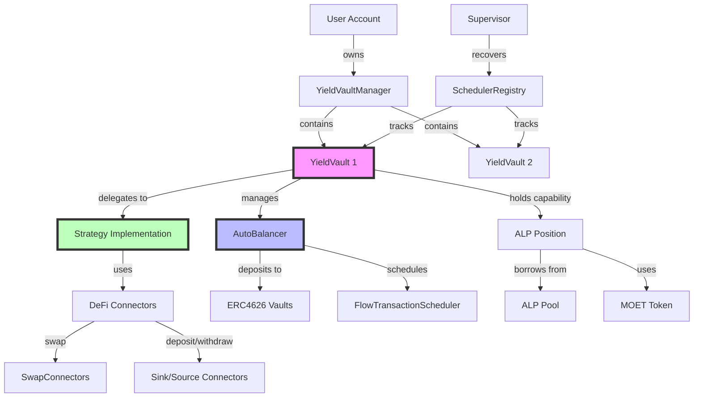
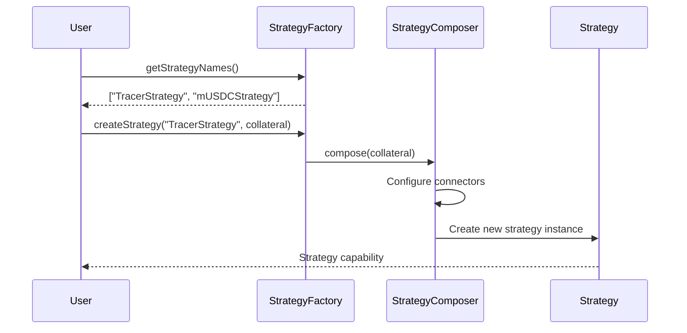
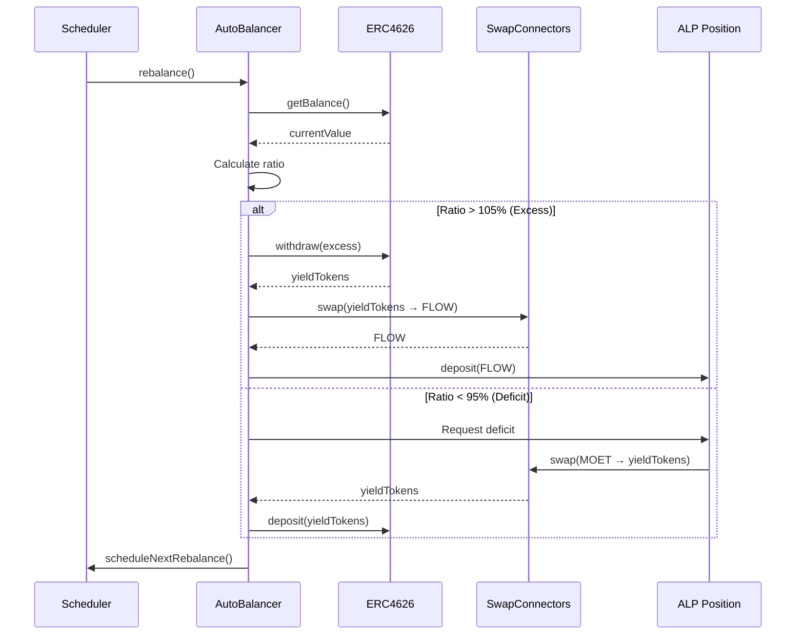
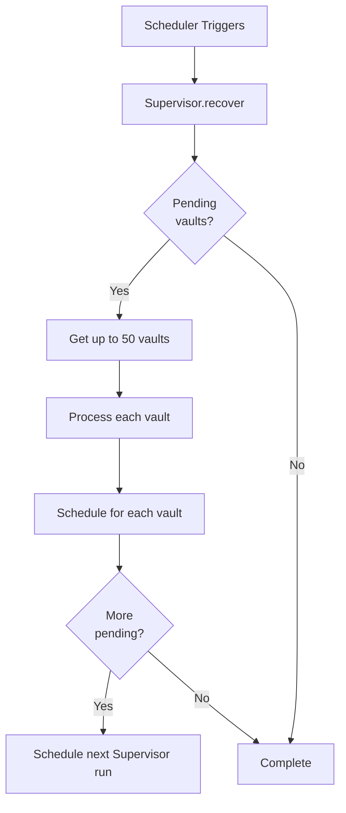

# Architecture Overview

Flow Yield Vaults (FYV) is built on a modular architecture that separates concerns between user position management, yield strategy implementation, and automated rebalancing. This document explains the core components and how they interact to create an automated leveraged yield farming system.

## System Architecture



## Core Components

### YieldVault Resource

The `YieldVault` is the user-facing resource that represents a single yield-generating position.

**What it does**: Each YieldVault tracks user deposits, delegates operations to a Strategy implementation, holds capabilities to interact with AutoBalancer and ALP Position, and provides user interface for deposit, withdraw, and liquidation operations.

**Key fields:**
- `strategy`: Reference to the Strategy implementation
- `autoBalancer`: Capability to the AutoBalancer resource
- `position`: Capability to the ALP Position resource
- `id`: Unique identifier for this vault

**User operations:**
```cadence
// Deposit collateral to start yield farming
vault.deposit(collateralVault: <-flowTokens)

// Withdraw accumulated value
let withdrawn <- vault.withdraw(amount: 100.0)

// Close vault and retrieve all value
let value <- vault.liquidate()
```

### YieldVaultManager

The `YieldVaultManager` is stored in the user's account and manages multiple vaults.

**What it does**: YieldVaultManager stores all vaults owned by a user, provides interfaces for vault creation and access, tracks vault IDs for enumeration, and enables multi-vault management from a single account.

**Example structure:**
```
User Account
└── YieldVaultManager
    ├── YieldVault #42 (TracerStrategy with FLOW collateral)
    ├── YieldVault #43 (mUSDCStrategy with USDC collateral)
    └── YieldVault #44 (TracerStrategy with stFLOW collateral)
```

### Strategy Interface

The Strategy defines how yield is generated and managed.

**What it does**: Strategies implement the core yield logic including deposit (convert collateral → yield tokens), withdrawal (convert yield tokens → collateral), and liquidation (close position and return all value). The Strategy interface keeps vault logic protocol-agnostic, allowing different yield approaches while maintaining consistent user experience.

**Key functions:**
```cadence
pub resource interface Strategy {
    // Initialize position with collateral
    pub fun deposit(collateralVault: @FungibleToken.Vault)

    // Withdraw specified amount
    pub fun withdraw(amount: UFix64): @FungibleToken.Vault

    // Close position and return all value
    pub fun liquidate(): @FungibleToken.Vault

    // Get current position value
    pub fun getBalance(): UFix64
}
```

**Available implementations:**
- **TracerStrategy**: Leveraged yield farming using ALP + ERC4626 vaults
- **mUSDCStrategy**: Cross-chain yield farming via Flow-EVM bridge

Learn more in [Strategies](./strategies.md).

### StrategyComposer & StrategyFactory

The **StrategyComposer** creates configured strategy instances, while the **StrategyFactory** maintains the registry of available composers.

**What it does**: StrategyComposer assembles DeFi Actions components (swap connectors, sink/source connectors) into a complete strategy. StrategyFactory provides a registry where users can discover available strategies and create instances with pre-configured connectors for their chosen yield approach.

**Strategy creation flow:**


### AutoBalancer

The AutoBalancer monitors yield token holdings and triggers rebalancing when thresholds are exceeded.

**What it does**: AutoBalancer holds yield tokens in ERC4626 vaults, monitors value ratio (current holdings vs. historical deposits), triggers rebalancing when ratio exceeds 95%-105% range, withdraws excess profits or requests deficit recovery, and self-schedules next rebalancing execution.

**Rebalancing thresholds:**
```
Ratio = Current Value / Historical Deposit Value

Upper Threshold: 105% → Excess profits, withdraw and deposit to position
Lower Threshold: 95% → Deficit detected, request funds from position
Target Range: 95%-105% → No action needed
```

**Rebalancing flow:**


Learn more in [AutoBalancer](./autobalancer.md).

### ALP Position Integration

Each FYV vault maintains a capability to an ALP Position resource for leveraged borrowing.

**What it does**: The Position holds collateral deposited by the strategy, borrows MOET against the collateral (up to 80% of value), maintains health factor (target: 1.3), and provides liquidity source for deficit recovery.

**Health factor management:**
```
Health Factor = (Collateral Value × Collateral Factor) / Debt Value

Safe Range: 1.1 - 1.5
Target: 1.3 (optimal leverage)
Liquidation Trigger: < 1.0
```

**Position lifecycle:**
1. Strategy deposits FLOW collateral
2. Position borrows MOET (maintaining HF = 1.3)
3. Strategy converts MOET to yield tokens
4. AutoBalancer deposits yield tokens to ERC4626
5. When rebalancing triggers:
   - Excess: Withdraw yield → swap → deposit more collateral
   - Deficit: Borrow more MOET → swap → deposit yield tokens

Learn more: [ALP Documentation](../alp/index.md)

## DeFi Actions Connectors

FYV uses DeFi Actions as composable building blocks for complex yield strategies.

### SwapConnectors

Handle token conversions between MOET, collateral, and yield tokens.

**Available implementations:**
- **UniswapV3SwapConnectors**: Swap via Uniswap V3 pools
- **TeleportCustodySwapConnectors**: Swap via Teleport custody connectors

**Example usage:**
```cadence
// Swap MOET → YieldToken
let yieldTokens <- swapConnector.swap(
    vaultIn: <-moetVault,
    amountOutMin: 95.0  // 5% slippage tolerance
)
```

### Sink/Source Connectors

Handle deposits and withdrawals from yield-bearing protocols.

**ERC4626SinkConnectors**: Deposit to and withdraw from ERC4626-compatible vaults (standard interface for yield-bearing vaults).

**TopUpSource/DrawDownSink**: Bridge between ALP positions and FYV strategies for automated liquidity provision.

**Example usage:**
```cadence
// Deposit to ERC4626 vault
sinkConnector.deposit(vault: <-yieldTokens)

// Withdraw from ERC4626 vault
let withdrawn <- sourceConnector.withdraw(amount: 100.0)
```

Learn more in [DeFi Actions](./defi-actions.md).

## Automated Scheduling System

FYV implements a self-scheduling mechanism for perpetual rebalancing without external coordination.

### Self-Scheduling Mechanism

**Initial setup:**
1. User creates YieldVault
2. Vault creation atomically:
   - Issues capability to AutoBalancer
   - Registers in SchedulerRegistry
   - Schedules first rebalance via FlowTransactionScheduler

**Perpetual execution:**
1. Scheduler executes `rebalance()` at scheduled time
2. AutoBalancer performs rebalancing logic
3. AutoBalancer calls `scheduleNextRebalance()` for 60 seconds later
4. Process repeats indefinitely

**Atomic registration:**
If any step fails during vault creation (capability issue, registration failure, or scheduling error), the entire transaction reverts, ensuring no orphaned or incomplete vaults.

### Supervisor Recovery System

The Supervisor handles vaults that become stuck or fail to self-schedule.

**What it does**: Supervisor scans SchedulerRegistry for pending vaults (max 50 per batch), attempts to re-seed scheduling for stuck vaults, automatically reschedules itself if more work remains, and provides bounded processing to prevent timeout.

**Recovery flow:**


Learn more in [Scheduling System](./scheduling.md).

## Cross-Chain Architecture

FYV supports cross-chain yield opportunities through Flow's EVM bridge.

### Flow-EVM Bridge Integration

**What it does**: FlowEVMBridgeConfig manages token escrow and minting, CadenceOwnedAccounts enable Cadence contracts to control EVM addresses, ERC4626 vaults provide Ethereum-compatible yield opportunities, and DeFi Connectors abstract the bridging complexity.

**Token flow:**
```
Cadence (Flow) → Bridge Locks → EVM Mints → ERC4626 Deposit → Yield Accrual
Yield Accrual → ERC4626 Withdraw → Bridge Burns → Cadence Unlocks → User Receives
```

**Example: mUSDCStrategy**
1. User deposits USDC (Cadence token)
2. Bridge locks USDC in escrow
3. EVM contract mints bridged USDC
4. Strategy deposits to ERC4626 vault on EVM side
5. Yield accrues in EVM vault
6. Rebalancing withdraws from EVM vault
7. Bridge burns EVM tokens and unlocks Cadence tokens
8. Strategy returns tokens to user

Learn more in [Cross-Chain Integration](./cross-chain.md).

## Contract Deployment

FYV consists of five primary contracts deployed on Flow:

| Contract | Purpose |
|----------|---------|
| **FlowYieldVaults** | Main orchestration managing user positions and strategy lifecycle |
| **FlowYieldVaultsStrategies** | Implementation of concrete strategies (TracerStrategy, mUSDCStrategy) |
| **FlowYieldVaultsAutoBalancers** | Rebalancing logic and balance management |
| **FlowYieldVaultsScheduler** | Scheduled transaction management and recovery |
| **FlowYieldVaultsSchedulerRegistry** | Registry tracking all vaults for automated operations |

Additionally, **FlowYieldVaultsClosedBeta** manages access control during beta phase.

**Deployment addresses:**
- **Testnet**: `0xd27920b6384e2a78`
- **Mainnet**: `0xb1d63873c3cc9f79`

## Security Considerations

**Access Control**: Vaults are owned resources stored in user accounts—only the account owner can access vault operations.

**Capability Model**: Strategies hold capabilities to AutoBalancers and Positions, not direct references, enabling revocability and access control.

**Atomic Operations**: Vault creation and registration happen atomically—if any step fails, entire transaction reverts.

**Health Factor Monitoring**: ALP Positions enforce minimum health factors, preventing over-leveraging.

**Slippage Protection**: Swap connectors include `amountOutMin` parameters to prevent sandwich attacks.

**Bounded Processing**: Supervisor processes max 50 vaults per execution to prevent timeout.

## Summary

FYV's architecture achieves automated leveraged yield farming through separation of concerns where YieldVault manages user interface and lifecycle, Strategy implements yield generation logic, AutoBalancer handles continuous optimization, Position provides leveraged borrowing, and Scheduler enables automated execution.

The modular design allows new strategies to be added without changing core vault logic, enabling composability through DeFi Actions components, supporting cross-chain yield through standardized interfaces, and maintaining security through Flow's resource-oriented programming model.

**Key architectural principles:**
1. **Resource ownership**: Users own vaults; vaults own capabilities
2. **Capability-based security**: Limited access through capabilities, not references
3. **Atomic operations**: All-or-nothing transaction guarantees
4. **Self-scheduling**: Perpetual automation without external dependencies
5. **Modularity**: Strategies can be swapped and composed independently

## Next Steps

- **Understand strategies**: Read [Strategies](./strategies.md)
- **Learn rebalancing**: Explore [AutoBalancer](./autobalancer.md)
- **Create a vault**: Follow [Vault Lifecycle](./vault-lifecycle.md)
- **Integrate DeFi Actions**: See [DeFi Actions](./defi-actions.md)

---

:::tip Key Takeaway
FYV's architecture separates user position management (YieldVault) from yield strategy (Strategy) and automated optimization (AutoBalancer). This modularity enables complex yield generation while maintaining clean separation of concerns and allowing new strategies to be added easily.
:::
