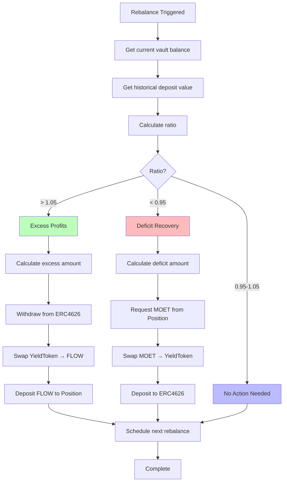
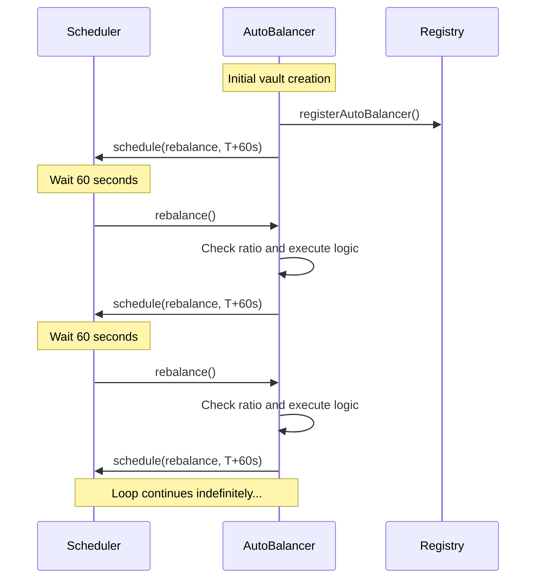

# AutoBalancer

The AutoBalancer is FYV's core optimization engine that continuously monitors yield positions and automatically rebalances when thresholds are exceeded. This document explains how AutoBalancers work, when they trigger, and how they maintain optimal position health.

## What is an AutoBalancer?

An AutoBalancer is a resource that holds yield-bearing tokens in ERC4626 vaults, monitors the ratio between current value and historical deposits, automatically withdraws excess profits or requests deficit recovery, and self-schedules continuous rebalancing at 60-second intervals.

Every YieldVault has an associated AutoBalancer stored in contract storage, managed by the vault's strategy implementation.

## Core Concept: Value Ratio Monitoring

The AutoBalancer tracks two key values to determine when rebalancing is needed:

**Historical Deposit Value**: The cumulative value of all tokens deposited to the ERC4626 vault over time (tracked at deposit time and never changes unless new deposits occur).

**Current Value**: The real-time value of yield tokens held in the ERC4626 vault (increases as yield accrues and decreases if vault experiences losses).

**Value Ratio**:
```
Ratio = Current Value / Historical Deposit Value
```

**Rebalancing triggers**:
```
Ratio > 1.05 (105%) → Excess profits, withdraw surplus
Ratio < 0.95 (95%)  → Deficit detected, request recovery
Ratio 0.95-1.05     → Within target range, no action needed
```

## Rebalancing Mechanics

### Upper Threshold: Excess Profits (Ratio > 105%)

When yield accrues and pushes the ratio above 105%, the AutoBalancer harvests profits.

**What happens:**

1. Calculate excess value above 105% baseline
2. Withdraw excess yield tokens from ERC4626 vault
3. Swap yield tokens to collateral (FLOW) via SwapConnectors
4. Deposit collateral to ALP Position (increases collateral, improves health factor)
5. Update tracking (historical value stays same, current value returns to ~100%)

**Example:**
```
Initial state:
  - Historical deposit value: $1,000
  - Current value: $1,080 (8% yield accrued)
  - Ratio: 1,080 / 1,000 = 1.08 = 108%
  - Threshold exceeded: 108% > 105% ✓

Rebalancing calculation:
  - Target value (105%): $1,000 × 1.05 = $1,050
  - Excess: $1,080 - $1,050 = $30
  - Withdraw: 30 YieldToken from vault

Swap and deposit:
  - Swap 30 YieldToken → 29.7 FLOW (1% slippage)
  - Deposit 29.7 FLOW to Position
  - Position collateral: 1000 → 1029.7 FLOW

After rebalancing:
  - Historical: $1,000 (unchanged)
  - Current: $1,050 (back near target)
  - Ratio: 1,050 / 1,000 = 1.05 = 105%
  - Collateral increased by $29.70
  - Profits locked in as additional safety buffer
```

**Impact on position:**
```
Before rebalancing:
  - Collateral: 1000 FLOW @ $1 = $1,000
  - EC (80% CF): $800
  - Debt: 615.38 MOET
  - HF: 800 / 615.38 = 1.30

After rebalancing:
  - Collateral: 1029.7 FLOW @ $1 = $1,029.70
  - EC (80% CF): $823.76
  - Debt: 615.38 MOET (unchanged)
  - HF: 823.76 / 615.38 = 1.34 (improved!)
  - Safety buffer increased
```

### Lower Threshold: Deficit Recovery (Ratio < 95%)

When the vault experiences losses or value drops below 95%, the AutoBalancer requests recovery funds.

**What happens:**

1. Calculate deficit below 95% baseline
2. Request deficit value from ALP Position
3. Position provides MOET (either from available liquidity or by borrowing more)
4. Swap MOET to yield tokens via SwapConnectors
5. Deposit yield tokens to ERC4626 vault
6. Update tracking (current value returns to ~100%)

**Example:**
```
State after vault loss:
  - Historical deposit value: $1,000
  - Current value: $920 (8% loss in vault)
  - Ratio: 920 / 1,000 = 0.92 = 92%
  - Threshold breached: 92% < 95% ✓

Rebalancing calculation:
  - Target value (95%): $1,000 × 0.95 = $950
  - Deficit: $950 - $920 = $30
  - Request: $30 from Position

Position response:
  - Position has available liquidity: provides 30 MOET
  - OR Position borrows additional 30 MOET if needed
  - Swap 30 MOET → 29.7 YieldToken
  - Deposit 29.7 YieldToken to vault

After rebalancing:
  - Historical: $1,000 (unchanged)
  - Current: $920 + $29.70 = $949.70
  - Ratio: 949.70 / 1,000 = 0.9497 ≈ 95%
  - Deficit recovered
```

**Impact on leveraged positions:**
```
Before deficit recovery:
  - Collateral: 1000 FLOW @ $1 = $1,000
  - Debt: 615.38 MOET
  - Vault value: $920 (loss)
  - Total exposure: $1,000 + $920 = $1,920

After deficit recovery (if Position borrowed more):
  - Collateral: 1000 FLOW (unchanged)
  - Debt: 615.38 + 30 = 645.38 MOET (increased)
  - Vault value: $949.70 (recovered)
  - Total exposure: $1,000 + $949.70 = $1,949.70
  - HF: 800 / 645.38 = 1.24 (slightly lower but still safe)
```

## Rebalancing Flow Diagram



## Self-Scheduling Mechanism

AutoBalancers implement perpetual automation through self-scheduling, eliminating the need for external bots or keepers.

### How It Works

**Initial Schedule**: When a YieldVault is created, the AutoBalancer is registered in the SchedulerRegistry and scheduled for its first execution via FlowTransactionScheduler at T+60 seconds.

**Execution**: At scheduled time, scheduler calls `autoBalancer.rebalance()`. The AutoBalancer performs its rebalancing logic (check ratio, execute if needed).

**Reschedule**: At the end of `rebalance()`, the AutoBalancer calls `scheduleNextRebalance()` to schedule the next execution 60 seconds later.

**Perpetual Loop**: This creates an infinite self-scheduling loop where each execution schedules the next one.

**Sequence diagram:**


### Atomic Registration

Vault creation and AutoBalancer registration happen atomically:

```cadence
transaction createVault() {
    prepare(signer: AuthAccount) {
        // All these steps happen in one transaction
        let vault <- createYieldVault(...)
        let autoBalancer <- createAutoBalancer(...)

        registerInRegistry(autoBalancer)    // Step 1
        scheduleFirstRebalance(autoBalancer) // Step 2

        // If ANY step fails, entire transaction reverts
        // No orphaned or incomplete vaults
    }
}
```

This guarantees that every vault either has a fully functional AutoBalancer with scheduled execution or doesn't exist at all (no partial creation).

## Configuration Parameters

AutoBalancers accept configuration to control their behavior:

```cadence
pub struct AutoBalancerConfig {
    // Rebalancing thresholds
    pub let upperThreshold: UFix64      // Default: 1.05 (105%)
    pub let lowerThreshold: UFix64      // Default: 0.95 (95%)

    // Scheduling
    pub let rebalanceIntervalSeconds: UInt64  // Default: 60

    // Swap protection
    pub let slippageTolerance: UFix64   // Default: 0.01 (1%)

    // ERC4626 vault
    pub let vaultAddress: Address       // Target yield vault
}
```

**Tuning considerations:**

**Tighter thresholds** (e.g., 1.02/0.98): More frequent rebalancing, higher gas costs, more precise optimization, better capital efficiency.

**Wider thresholds** (e.g., 1.10/0.90): Less frequent rebalancing, lower gas costs, more yield variance tolerance, lower capital efficiency.

**Shorter intervals** (e.g., 30s): More responsive to changes, higher gas costs, better for volatile vaults.

**Longer intervals** (e.g., 300s): Less responsive, lower gas costs, better for stable vaults.

## Gas Optimization

AutoBalancers are designed to minimize gas costs while maintaining effectiveness:

**No-Op When In Range**: If ratio is within 95%-105%, the rebalance function returns early without executing swaps or transactions, costing minimal gas.

**Batch Operations**: When rebalancing is needed, all operations (withdraw, swap, deposit) happen in a single transaction.

**Efficient Scheduling**: Uses Flow's native transaction scheduler rather than external keeper networks.

**Bounded Execution**: Each rebalance has deterministic gas cost based on operations performed.

**Example gas costs** (approximate):
```
Rebalance (no action needed): ~0.0001 FLOW
Rebalance (with excess withdrawal): ~0.001 FLOW
Rebalance (with deficit recovery): ~0.0015 FLOW
```

## Monitoring AutoBalancer State

Users can query AutoBalancer state to understand position health:

### Scripts

**Get current ratio:**
```cadence
import FlowYieldVaults from 0xFlowYieldVaults

pub fun main(vaultID: UInt64): UFix64 {
    let vault = FlowYieldVaults.getVault(id: vaultID)
    let autoBalancer = vault.getAutoBalancer()

    let current = autoBalancer.getCurrentValue()
    let historical = autoBalancer.getHistoricalValue()

    return current / historical
}
// Returns: 1.08 (108% ratio)
```

**Get rebalancing history:**
```cadence
pub fun main(vaultID: UInt64): [RebalanceEvent] {
    let vault = FlowYieldVaults.getVault(id: vaultID)
    let autoBalancer = vault.getAutoBalancer()

    return autoBalancer.getRebalanceHistory()
}
// Returns array of past rebalancing events with timestamps and amounts
```

**Check next rebalance time:**
```cadence
pub fun main(vaultID: UInt64): UFix64 {
    let registry = FlowYieldVaults.getSchedulerRegistry()
    return registry.getNextScheduledTime(vaultID: vaultID)
}
// Returns: 1703001234 (Unix timestamp)
```

## Recovery Mechanisms

If an AutoBalancer becomes stuck or fails to self-schedule, the Supervisor provides recovery:

**Supervisor Recovery**: Scans SchedulerRegistry for vaults with pending schedules, attempts to re-seed scheduling for stuck vaults (max 50 per execution), and automatically reschedules itself if more work remains.

**Manual Recovery**: Vault owners can manually trigger rebalancing via `forceRebalance()` transaction if AutoBalancer is stuck.

**Admin Recovery**: Protocol administrators can intervene in case of critical failures using admin capabilities.

Learn more in [Scheduling System](./scheduling.md).

## Advanced: Custom Rebalancing Logic

Developers can implement custom AutoBalancer logic for specialized strategies:

```cadence
pub resource CustomAutoBalancer: AutoBalancerInterface {
    pub fun rebalance() {
        // Custom logic
        // - Different thresholds based on time of day
        // - Multi-vault coordination
        // - Dynamic threshold adjustment
        // - Alternative profit distribution

        // Must call scheduleNextRebalance() at end
        self.scheduleNextRebalance()
    }
}
```

Custom implementations must maintain the self-scheduling mechanism and implement the AutoBalancerInterface and register with SchedulerRegistry.

## Best Practices

**Monitor Ratio**: Keep an eye on your AutoBalancer's value ratio. Frequent rebalancing in one direction indicates systematic vault performance.

**Understand Triggers**: Know your thresholds. If your vault frequently hits 105%, you're generating steady profits. If it hits 95%, the vault may be experiencing losses.

**Gas Awareness**: More frequent rebalancing = more gas costs. Balance responsiveness vs. costs based on your vault size.

**Threshold Tuning**: Larger vaults benefit from tighter thresholds (better optimization). Smaller vaults benefit from wider thresholds (lower gas impact).

**Track History**: Review rebalancing history to understand vault performance patterns and identify optimal strategy configurations.

## Summary

AutoBalancers are FYV's optimization engine that maintain yield positions within target ranges. They monitor value ratios continuously (every 60 seconds), withdraw excess profits above 105% and lock them as collateral, request deficit recovery below 95% to maintain position health, and self-schedule perpetually without external dependencies.

**Key mechanisms:**
- Value ratio monitoring: Current vs. Historical
- Bidirectional rebalancing: Excess profits and deficit recovery
- Self-scheduling: Perpetual 60-second loops
- Atomic registration: All-or-nothing vault creation
- Gas optimization: No-op when within range

## Next Steps

- **Understand scheduling**: Read [Scheduling System](./scheduling.md)
- **Learn about leverage**: Explore [Leveraged Farming](./leveraged-farming.md)
- **Create a vault**: Follow [Vault Lifecycle](./vault-lifecycle.md)
- **DeFi Actions composability**: See [DeFi Actions](./defi-actions.md)

---

:::tip Key Takeaway
AutoBalancers continuously optimize your yield position by harvesting profits when value exceeds 105% and recovering deficits when value drops below 95%. This creates a self-optimizing system that locks in gains and prevents losses without manual intervention.
:::
