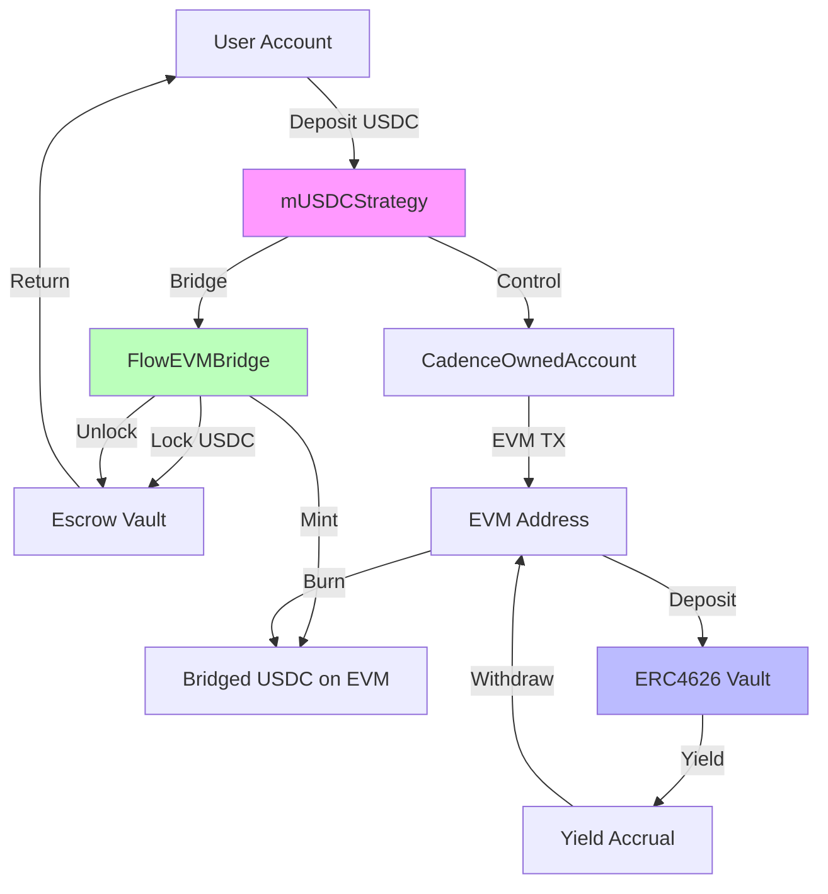
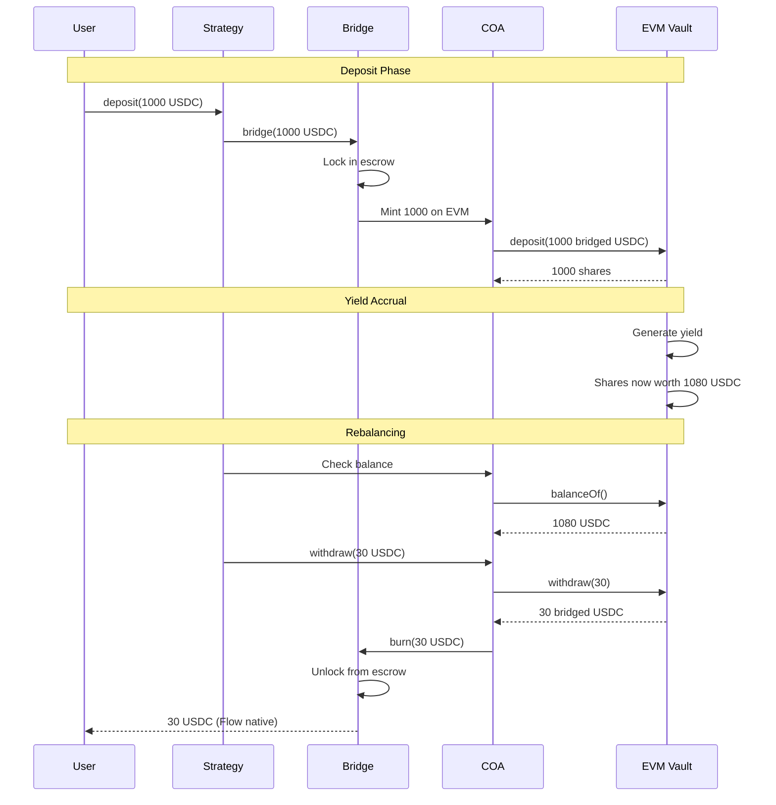

# Cross-Chain Integration

FYV enables access to yield opportunities across multiple blockchains through Flow's EVM bridge. This document explains how cross-chain integration works and how to access Ethereum-compatible yield vaults from Flow.

## Flow-EVM Bridge Overview

Flow's EVM bridge connects Flow's Cadence environment with Ethereum Virtual Machine (EVM) compatible chains, enabling seamless asset transfer and smart contract interaction across ecosystems.

### Bridge Architecture

The bridge consists of several components:

**FlowEVMBridgeConfig**: Manages token escrow and minting configuration, maintains token pair mappings (Flow ↔ EVM), and handles bridge fees and limits.

**CadenceOwnedAccounts (COA)**: Enables Cadence contracts to control EVM addresses, allows Cadence to send EVM transactions, and bridges resource-oriented (Cadence) with account-based (EVM) models.

**Token Escrow**: Locks Flow native tokens when bridging to EVM, mints equivalent bridged tokens on EVM side, and maintains 1:1 backing ratio.

### How Bridging Works

**Flow → EVM (Bridging Out):**
```
1. User deposits USDC (Flow native) to bridge contract
2. Bridge locks USDC in escrow vault
3. Bridge mints equivalent bridged USDC on EVM side
4. EVM contract receives bridged USDC
5. Transaction hash recorded for verification
```

**EVM → Flow (Bridging Back):**
```
1. EVM contract burns bridged USDC
2. Bridge receives burn notification
3. Bridge unlocks equivalent USDC from escrow
4. User receives USDC on Flow
5. Cross-chain operation complete
```

## mUSDCStrategy: Cross-Chain Yield Farming

The mUSDCStrategy leverages the EVM bridge to access Ethereum-compatible ERC4626 yield vaults.

### Strategy Architecture



### Example: Depositing to Cross-Chain Vault

**User deposits 1000 USDC:**

```
Step 1: Bridge to EVM
  - User deposits: 1000 USDC (Flow native)
  - Bridge locks: 1000 USDC in escrow
  - Bridge mints: 1000 bridged USDC on EVM
  - Gas cost: ~0.001 FLOW (bridge fee)

Step 2: COA Transaction
  - Strategy controls EVM address via COA
  - COA approves ERC4626 vault to spend USDC
  - EVM transaction: approve(vault, 1000 USDC)
  - Gas cost: ~0.00015 ETH (paid in bridged FLOW)

Step 3: Deposit to ERC4626
  - COA calls vault.deposit(1000 USDC)
  - Vault mints shares to COA address
  - Shares received: 1000 (1:1 ratio initially)
  - Gas cost: ~0.0002 ETH

Step 4: Track in AutoBalancer
  - AutoBalancer records: Historical value = $1000
  - Scheduling begins: Rebalance every 60s
  - Cross-chain monitoring active

Total setup cost: ~$2-5 (depending on gas prices)
```

### Yield Accrual and Rebalancing

**After yield accrues:**

```
ERC4626 vault generates 8% APY over time:
  - Initial shares: 1000
  - After time: Shares worth 1080 USDC
  - Current value: $1080
  - Historical: $1000
  - Ratio: 1.08 = 108% > 105% threshold

Rebalancing trigger:
  Step 1: Calculate excess
    - Excess: $1080 - $1050 = $30

  Step 2: Withdraw from EVM vault (via COA)
    - COA calls vault.withdraw(30 USDC)
    - EVM transaction gas: ~0.0002 ETH
    - Bridged USDC received at EVM address

  Step 3: Bridge back to Flow
    - COA burns 30 bridged USDC
    - Bridge unlocks 30 Flow USDC
    - Bridge transaction fee: ~0.0005 FLOW

  Step 4: Return to user
    - User can claim or compound
    - Net profit: $30 - gas costs ≈ $29.50
```

## Supported ERC4626 Vaults

mUSDCStrategy can connect to any ERC4626-compliant vault on EVM-compatible chains:

### Mainnet Vaults (Example)

| Vault Name | Address | Asset | APY Range |
|-----------|---------|-------|-----------|
| Yearn USDC | `0x...` | USDC | 5-12% |
| Aave USDC | `0x...` | USDC | 3-8% |
| Compound USDC | `0x...` | USDC | 4-10% |
| Morpho USDC | `0x...` | USDC | 6-15% |

**Note:** Vault addresses configured at strategy deployment time. Contact FYV team for current vault list.

### Vault Selection Criteria

When choosing ERC4626 vaults for cross-chain farming, consider:

**Security Audit**: Vault must have recent professional audit, proven track record, and established protocol reputation.

**Liquidity**: Sufficient liquidity for deposits/withdrawals, low slippage on rebalancing, and reasonable withdrawal limits.

**Yield Stability**: Consistent yield history, low volatility in APY, and transparent yield source.

**Gas Efficiency**: Efficient deposit/withdraw operations, batching support if available, and reasonable gas costs relative to vault size.

**Integration Compatibility**: Full ERC4626 compliance, no special requirements or restrictions, and standard share accounting.

## Gas Cost Considerations

Cross-chain operations incur gas costs on both Flow and EVM sides:

### Cost Breakdown

**Vault Creation (One-Time):**
```
Flow side:
  - Create strategy: ~0.001 FLOW
  - Bridge setup: ~0.001 FLOW
  - Register scheduler: ~0.0005 FLOW
  Total Flow: ~0.0025 FLOW ($0.002 @ $0.80/FLOW)

EVM side:
  - Approve vault: ~0.00015 ETH
  - Initial deposit: ~0.0002 ETH
  Total EVM: ~0.00035 ETH ($0.70 @ $2000/ETH)

Combined one-time cost: ~$0.70
```

**Per Rebalance:**
```
When no action needed (95%-105%):
  - Flow: ~0.0001 FLOW ($0.00008)
  - EVM: $0 (no transaction)
  Total: ~$0.00008

When rebalancing needed:
  - Flow bridge: ~0.0005 FLOW ($0.0004)
  - EVM withdraw: ~0.0002 ETH ($0.40)
  - EVM burn: ~0.00015 ETH ($0.30)
  Total: ~$0.70 per rebalance
```

**Annual Gas Costs (Estimate):**
```
Assumptions:
  - Rebalancing every 60s = 525,600 checks/year
  - 5% trigger rebalancing = 26,280 rebalances/year
  - 95% no action = 499,320 no-ops/year

Costs:
  - No-ops: 499,320 × $0.00008 = $40
  - Rebalances: 26,280 × $0.70 = $18,396

Total annual gas: ~$18,436

For $100K vault: 18.4% of capital (uneconomical!)
For $1M vault: 1.84% of capital (marginal)
For $10M vault: 0.184% of capital (acceptable)
```

**Conclusion:** Cross-chain strategies are most cost-effective for larger vaults ($1M+).

## Bridge Security Considerations

Using the EVM bridge introduces additional security considerations:

### Bridge Risk Factors

**Escrow Security**: Flow tokens locked in bridge escrow contract must be secure, audited, and monitored. Risk: Escrow hack could drain bridged assets.

**Mint/Burn Integrity**: Bridged tokens must maintain 1:1 backing ratio. Risk: Minting without locking could create unbacked tokens.

**Cross-Chain Timing**: Bridge operations aren't instant (typically 1-2 minutes). Risk: Price movements during bridging.

**EVM Vault Security**: ERC4626 vaults on EVM side have independent security models. Risk: Vault exploit affects bridged assets.

**COA Control**: Cadence contract controls EVM address via COA. Risk: COA vulnerability could compromise EVM assets.

### Mitigation Strategies

**Bridge Audits**: Use only audited, established bridge infrastructure and verify escrow contract security.

**Vault Vetting**: Only connect to audited, reputable ERC4626 vaults with proven track records.

**Diversification**: Spread capital across multiple vaults and don't concentrate in single cross-chain vault.

**Monitoring**: Track bridge health metrics and monitor unusual bridge activity.

**Limits**: Implement per-vault and per-user caps to limit exposure.

## Cross-Chain Transaction Flow

Complete cross-chain farming cycle:



## Best Practices

**Vault Size Matters**: Only use cross-chain strategies for larger vaults ($1M+) where gas costs are < 2% of capital.

**Monitor Gas Prices**: Track EVM gas prices and pause rebalancing during high gas periods if needed.

**Understand Bridge Risk**: Cross-chain farming adds bridge security risk on top of vault risk.

**Diversify**: Don't put all capital in cross-chain vaults—balance with native Flow strategies.

**Track Costs**: Monitor actual gas costs vs. yields to ensure profitability.

**Emergency Access**: Understand how to manually withdraw if automation fails.

## Summary

Cross-chain integration via mUSDCStrategy enables access to Ethereum-compatible ERC4626 vaults from Flow, leveraging the Flow-EVM bridge for asset transfer and CadenceOwnedAccounts for EVM control. This unlocks broader yield opportunities while introducing additional gas costs and bridge security considerations.

**Key tradeoffs:**
- **Benefit**: Access to mature Ethereum DeFi yield
- **Cost**: Higher gas fees from cross-chain operations
- **Risk**: Bridge security and cross-chain timing

**Optimal use case:** Large vaults ($1M+) seeking diversified yield sources across chains.

---

:::tip Key Takeaway
Cross-chain yield farming is powerful but gas-intensive. It's most suitable for large vaults where gas costs are a small percentage of capital. For smaller vaults, native Flow strategies like TracerStrategy are more cost-effective.
:::
