# DeFi Actions

DeFi Actions are composable primitives that enable complex DeFi operations through simple, reusable components. FYV leverages DeFi Actions to build sophisticated yield strategies from modular building blocks. This document explains the DeFi Actions framework and how it powers FYV's composability.

## What are DeFi Actions?

DeFi Actions is a framework of composable smart contract components that implement common DeFi operations as standardized interfaces. Rather than building monolithic strategies, developers compose Actions like building blocks to create complex flows.

**Key principles:**
- **Single Responsibility**: Each Action does one thing well
- **Composability**: Actions can be chained and combined
- **Standardized Interfaces**: Consistent APIs across implementations
- **Reusability**: Same Actions used across multiple strategies

## Core Action Types

FYV uses three main categories of DeFi Actions:

### 1. Swap Actions (SwapConnectors)

Convert one token type to another via decentralized exchanges.

**Interface:**
```cadence
pub resource interface SwapConnector {
    // Swap input tokens for output tokens
    pub fun swap(
        vaultIn: @FungibleToken.Vault,
        amountOutMin: UFix64
    ): @FungibleToken.Vault

    // Get expected output for given input
    pub fun quote(amountIn: UFix64): UFix64

    // Get swap route information
    pub fun getRoute(): SwapRoute
}
```

**Implementations:**
- **UniswapV3SwapConnectors**: Swap via Uniswap V3 pools on Flow EVM
- **TeleportCustodySwapConnectors**: Swap via Teleport custody protocol
- **IncrementSwapConnectors**: Swap via Increment DEX

**Example usage:**
```cadence
// Swap MOET → FLOW via Uniswap V3
let swapConnector <- UniswapV3SwapConnectors.createConnector(
    tokenIn: Type<@MOET.Vault>(),
    tokenOut: Type<@FlowToken.Vault>(),
    poolFee: 3000  // 0.3% fee tier
)

let flowVault <- swapConnector.swap(
    vaultIn: <-moetVault,
    amountOutMin: 95.0  // 5% slippage tolerance
)
```

### 2. Sink Actions (SinkConnectors)

Deposit tokens into yield-generating protocols.

**Interface:**
```cadence
pub resource interface SinkConnector {
    // Deposit tokens to yield protocol
    pub fun deposit(vault: @FungibleToken.Vault)

    // Get current deposited balance
    pub fun getBalance(): UFix64

    // Get vault metadata
    pub fun getVaultInfo(): VaultInfo
}
```

**Implementations:**
- **ERC4626SinkConnectors**: Deposit to ERC4626-compliant vaults
- **DrawDownSink**: Bridge to ALP borrowing positions
- **StakingSinkConnectors**: Stake tokens in staking protocols

**Example usage:**
```cadence
// Deposit to ERC4626 vault
let sinkConnector <- ERC4626SinkConnectors.createConnector(
    vaultAddress: 0x123...,  // ERC4626 vault address
    tokenType: Type<@YieldToken.Vault>()
)

sinkConnector.deposit(vault: <-yieldTokens)
// Tokens now earning yield in ERC4626 vault
```

### 3. Source Actions (SourceConnectors)

Withdraw tokens from yield-generating protocols.

**Interface:**
```cadence
pub resource interface SourceConnector {
    // Withdraw specified amount
    pub fun withdraw(amount: UFix64): @FungibleToken.Vault

    // Withdraw all available balance
    pub fun withdrawAll(): @FungibleToken.Vault

    // Get available withdrawal amount
    pub fun getAvailableBalance(): UFix64
}
```

**Implementations:**
- **ERC4626SourceConnectors**: Withdraw from ERC4626 vaults
- **TopUpSource**: Provide liquidity from ALP positions
- **UnstakingSourceConnectors**: Unstake from staking protocols

**Example usage:**
```cadence
// Withdraw from ERC4626 vault
let sourceConnector <- ERC4626SourceConnectors.createConnector(
    vaultAddress: 0x123...,
    tokenType: Type<@YieldToken.Vault>()
)

let withdrawn <- sourceConnector.withdraw(amount: 100.0)
// Yield tokens withdrawn from vault
```

## Action Composition

The power of DeFi Actions comes from composition—chaining multiple Actions to create complex flows.

### Example: TracerStrategy Composition

TracerStrategy composes five Actions to implement leveraged yield farming:

**1. Borrow Action** (DrawDownSink):
```cadence
// Borrow MOET from ALP position
let borrowAction <- DrawDownSink.create(positionCap: positionCapability)
borrowAction.deposit(vault: <-initialCollateral)
// Position auto-borrows MOET
```

**2. Swap Action #1** (MOET → YieldToken):
```cadence
// Convert borrowed MOET to yield tokens
let swapAction1 <- UniswapV3SwapConnectors.createConnector(
    tokenIn: Type<@MOET.Vault>(),
    tokenOut: Type<@YieldToken.Vault>(),
    poolFee: 3000
)

let yieldTokens <- swapAction1.swap(
    vaultIn: <-moetVault,
    amountOutMin: 95.0
)
```

**3. Sink Action** (YieldToken → ERC4626):
```cadence
// Deposit yield tokens to earn
let sinkAction <- ERC4626SinkConnectors.createConnector(
    vaultAddress: 0x789...,
    tokenType: Type<@YieldToken.Vault>()
)

sinkAction.deposit(vault: <-yieldTokens)
// Now earning yield
```

**4. Source Action** (ERC4626 → YieldToken):
```cadence
// Withdraw when rebalancing needed
let sourceAction <- ERC4626SourceConnectors.createConnector(
    vaultAddress: 0x789...,
    tokenType: Type<@YieldToken.Vault>()
)

let withdrawn <- sourceAction.withdraw(amount: excessAmount)
```

**5. Swap Action #2** (YieldToken → FLOW):
```cadence
// Convert back to collateral
let swapAction2 <- UniswapV3SwapConnectors.createConnector(
    tokenIn: Type<@YieldToken.Vault>(),
    tokenOut: Type<@FlowToken.Vault>(),
    poolFee: 3000
)

let flowCollateral <- swapAction2.swap(
    vaultIn: <-withdrawn,
    amountOutMin: 95.0
)
// Deposit back to position as additional collateral
```

### Composition Diagram

```mermaid
graph LR
    Collateral[FLOW Collateral] -->|1. Deposit| Borrow[DrawDownSink]
    Borrow -->|2. Borrow| MOET[MOET Tokens]
    MOET -->|3. Swap| Swap1[UniswapV3Swap]
    Swap1 -->|4. Convert| Yield[YieldTokens]
    Yield -->|5. Deposit| Sink[ERC4626Sink]
    Sink -->|6. Earn| Vault[ERC4626 Vault]

    Vault -->|7. Withdraw| Source[ERC4626Source]
    Source -->|8. Convert| Swap2[UniswapV3Swap]
    Swap2 -->|9. Return| Collateral

    style Borrow fill:#f9f
    style Swap1 fill:#bfb
    style Sink fill:#bbf
    style Source fill:#bbf
    style Swap2 fill:#bfb
```



## Strategy Composer Pattern

The **StrategyComposer** pattern assembles Actions into complete strategies:

```cadence
pub resource StrategyComposer {
    // Action components
    access(self) let borrowAction: @DrawDownSink
    access(self) let swapToYieldAction: @SwapConnector
    access(self) let sinkAction: @SinkConnector
    access(self) let sourceAction: @SourceConnector
    access(self) let swapToCollateralAction: @SwapConnector

    // Compose into strategy
    pub fun composeStrategy(): @Strategy {
        let strategy <- create TracerStrategy(
            borrowAction: <-self.borrowAction,
            swapToYield: <-self.swapToYieldAction,
            sink: <-self.sinkAction,
            source: <-self.sourceAction,
            swapToCollateral: <-self.swapToCollateralAction
        )

        return <-strategy
    }
}
```

**Benefits of this pattern:**
- **Flexibility**: Swap any Action implementation without changing strategy logic
- **Testability**: Mock Actions for testing strategies in isolation
- **Reusability**: Same Actions used across multiple strategies
- **Upgradability**: Replace Actions with improved versions

## Creating Custom Strategies

Developers can create custom strategies by composing different Actions:

### Example: Conservative Stablecoin Strategy

```cadence
pub resource ConservativeStrategy {
    // Simplified strategy: just deposit to yield vault
    access(self) let sinkAction: @ERC4626SinkConnector
    access(self) let sourceAction: @ERC4626SourceConnector

    pub fun deposit(vault: @FungibleToken.Vault) {
        // Direct deposit, no borrowing or swapping
        self.sinkAction.deposit(vault: <-vault)
    }

    pub fun withdraw(amount: UFix64): @FungibleToken.Vault {
        // Direct withdrawal
        return <-self.sourceAction.withdraw(amount: amount)
    }

    pub fun getBalance(): UFix64 {
        return self.sinkAction.getBalance()
    }
}
```

### Example: Multi-Vault Strategy

```cadence
pub resource MultiVaultStrategy {
    // Diversify across multiple vaults
    access(self) let vaults: @{String: SinkConnector}

    pub fun deposit(vault: @FungibleToken.Vault) {
        let amount = vault.balance

        // Split across 3 vaults
        let vault1Amount = amount * 0.4
        let vault2Amount = amount * 0.3
        let vault3Amount = amount * 0.3

        let vault1 <- vault.withdraw(amount: vault1Amount)
        let vault2 <- vault.withdraw(amount: vault2Amount)
        let vault3 <- vault

        self.vaults["vault1"]?.deposit(vault: <-vault1)
        self.vaults["vault2"]?.deposit(vault: <-vault2)
        self.vaults["vault3"]?.deposit(vault: <-vault3)
    }
}
```

## Action Registry

The **ActionRegistry** maintains available Action implementations:

```cadence
pub contract ActionRegistry {
    // Registry of available Actions
    access(contract) var swapConnectors: {String: Type}
    access(contract) var sinkConnectors: {String: Type}
    access(contract) var sourceConnectors: {String: Type}

    // Register new Action
    pub fun registerSwapConnector(name: String, type: Type) {
        self.swapConnectors[name] = type
    }

    // Get available Actions
    pub fun getAvailableSwapConnectors(): [String] {
        return self.swapConnectors.keys
    }

    // Create Action instance
    pub fun createSwapConnector(name: String, config: {String: AnyStruct}): @SwapConnector {
        let connectorType = self.swapConnectors[name]
            ?? panic("Connector not found")

        return <-create connectorType(config: config)
    }
}
```

**Benefits:**
- **Discovery**: Users can enumerate available Actions
- **Versioning**: Multiple versions of same Action can coexist
- **Governance**: Community can vote on adding new Actions

## Advanced Composition Patterns

### 1. Sequential Composition

Chain Actions in sequence:

```cadence
// FLOW → MOET → YieldToken → ERC4626
let result <- action1.execute(input: <-flowVault)
  |> action2.execute(input: <-result)
  |> action3.execute(input: <-result)
  |> action4.execute(input: <-result)
```

### 2. Parallel Composition

Execute multiple Actions concurrently:

```cadence
// Deposit to 3 vaults simultaneously
async {
    vault1.deposit(vault: <-split1)
    vault2.deposit(vault: <-split2)
    vault3.deposit(vault: <-split3)
}
```

### 3. Conditional Composition

Choose Actions based on conditions:

```cadence
if ratio > 1.05 {
    // Withdraw and swap
    let withdrawn <- sourceAction.withdraw(amount: excess)
    let collateral <- swapAction.swap(vaultIn: <-withdrawn)
} else if ratio < 0.95 {
    // Borrow and swap
    let borrowed <- borrowAction.borrow(amount: deficit)
    let yieldTokens <- swapAction.swap(vaultIn: <-borrowed)
}
```

### 4. Recursive Composition

Actions that contain other Actions:

```cadence
pub resource CompositeAction: SwapConnector {
    // Multi-hop swap composed of single-hop swaps
    access(self) let hop1: @SwapConnector
    access(self) let hop2: @SwapConnector

    pub fun swap(vaultIn: @FungibleToken.Vault): @FungibleToken.Vault {
        let intermediate <- self.hop1.swap(vaultIn: <-vaultIn)
        return <-self.hop2.swap(vaultIn: <-intermediate)
    }
}
```

## Best Practices

**Keep Actions Small**: Each Action should have single, clear responsibility.

**Use Interfaces**: Depend on Action interfaces, not concrete implementations.

**Handle Failures**: Implement proper error handling and revert logic.

**Document Dependencies**: Clearly specify required Action sequences.

**Version Actions**: Track Action versions for compatibility.

**Test Composition**: Unit test Actions individually, integration test compositions.

## Summary

DeFi Actions provide the composability framework that powers FYV's flexibility through modular Actions for swaps, deposits, and withdrawals, standardized interfaces enabling interchangeability, composition patterns supporting complex strategies, and the registry system allowing Action discovery and versioning.

**Key components:**
- **SwapConnectors**: Token conversion via DEXes
- **SinkConnectors**: Deposits to yield protocols
- **SourceConnectors**: Withdrawals from yield protocols
- **StrategyComposer**: Assembles Actions into strategies
- **ActionRegistry**: Discovers and versions Actions

---

:::tip Key Takeaway
DeFi Actions are like LEGO blocks for DeFi strategies. By composing simple, reusable Actions, FYV enables sophisticated yield farming flows while maintaining clean separation of concerns and allowing easy customization.
:::
