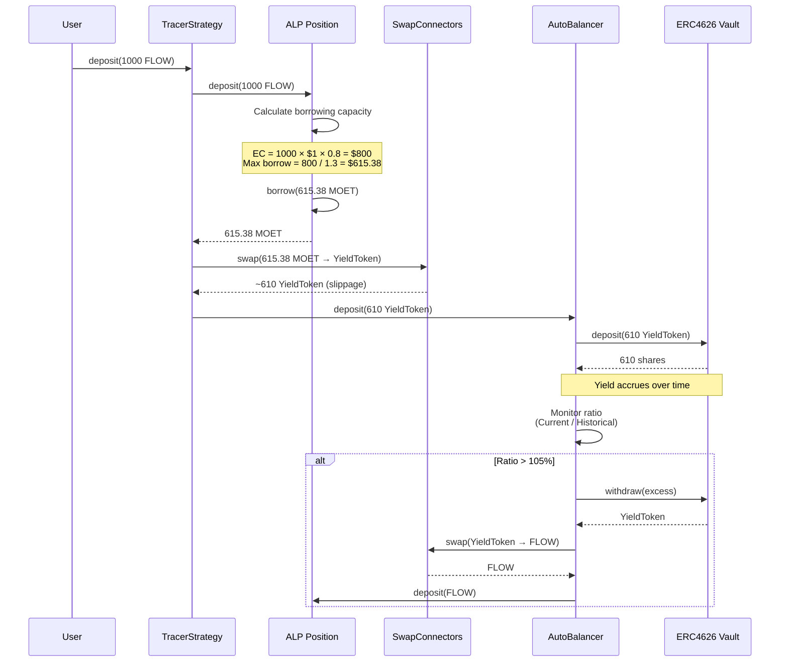
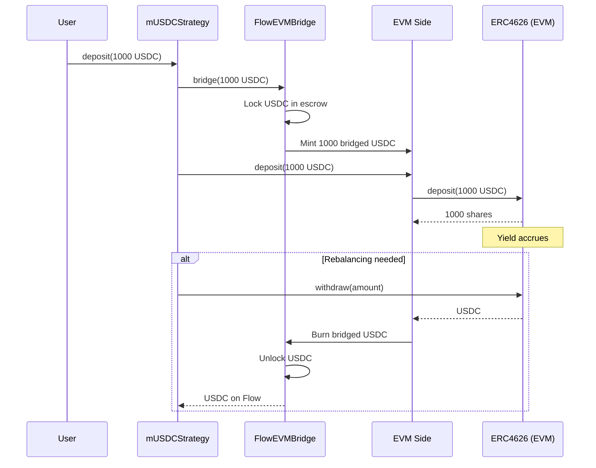

# Yield Strategies

Strategies in FYV define how yield is generated from deposited collateral. Each strategy implements a specific approach to converting collateral into yield-bearing positions, managing those positions, and handling withdrawals. This document explains the available strategies and how they work.

## Strategy Interface

All strategies implement the `Strategy` interface, which provides a consistent API regardless of the underlying yield mechanism.

```cadence
pub resource interface Strategy {
    // Initialize position with collateral deposit
    pub fun deposit(collateralVault: @FungibleToken.Vault)

    // Withdraw specified amount of value
    pub fun withdraw(amount: UFix64): @FungibleToken.Vault

    // Close position and return all accumulated value
    pub fun liquidate(): @FungibleToken.Vault

    // Get current position value
    pub fun getBalance(): UFix64
}
```

This interface enables YieldVaults to remain strategy-agnostic, allowing users to switch strategies or compose multiple strategies without changing vault logic.

## TracerStrategy

TracerStrategy is the flagship strategy that implements automated leveraged yield farming by bridging ALP lending positions with external DeFi yield opportunities.

### How It Works

TracerStrategy combines three components to create leveraged yield:

**ALP Position** (Collateral & Borrowing): Deposits collateral (FLOW, stFLOW, etc.) to ALP, borrows MOET against collateral up to 80% of value, and maintains health factor at target of 1.3.

**Swap Connectors** (Token Conversion): Converts MOET to yield-bearing tokens (LP tokens, farm tokens), converts yield tokens back to FLOW for rebalancing, and provides slippage protection on all swaps.

**AutoBalancer** (Yield Management): Deposits yield tokens to ERC4626 vaults, monitors value and triggers rebalancing at 95%-105% thresholds, and automatically manages position health.

### Capital Flow Diagram



### Example: Leveraged Farming with 1000 FLOW

Let's walk through a complete TracerStrategy lifecycle:

**Initial Deposit:**
```
User deposits: 1000 FLOW @ $1.00 = $1,000

Step 1: Deposit to ALP Position
  - Collateral: 1000 FLOW
  - Collateral Factor: 0.8 (80%)
  - Effective Collateral: $1,000 × 0.8 = $800

Step 2: Calculate borrowing at target HF = 1.3
  - Target Debt = EC / Target HF = $800 / 1.3 = $615.38
  - Position borrows: 615.38 MOET

Step 3: Swap MOET → YieldToken
  - Swap 615.38 MOET via Uniswap V3
  - Receive ~610 YieldToken (assuming 1% slippage)
  - Slippage protection: min 608.92 YieldToken (1% tolerance)

Step 4: Deposit to ERC4626 Vault
  - AutoBalancer deposits 610 YieldToken
  - Receives 610 vault shares
  - Historical deposit value: $610 (tracked for rebalancing)

Position Summary:
  - Collateral: 1000 FLOW ($1,000)
  - Debt: 615.38 MOET ($615.38)
  - Yield Tokens: 610 ($610 equivalent)
  - Health Factor: 800 / 615.38 = 1.30 ✓
  - Effective Exposure: $1,000 collateral + $610 yield = $1,610
  - Leverage: 1.61x
```

**After Yield Accrues (10% APY over time):**
```
ERC4626 vault generates yield:
  - Initial: 610 YieldToken
  - After yield: 671 YieldToken (+10%)
  - Current value: $671

Rebalancing check:
  - Current: $671
  - Historical: $610
  - Ratio: 671 / 610 = 1.10 = 110%
  - Threshold exceeded! (> 105%)

Rebalancing action:
  - Excess: $671 - $610 = $61
  - Withdraw 61 YieldToken from vault
  - Swap 61 YieldToken → ~60.4 FLOW
  - Deposit 60.4 FLOW to position as additional collateral

After rebalancing:
  - Collateral: 1060.4 FLOW ($1,060.40)
  - Debt: 615.38 MOET (unchanged)
  - Yield Tokens: 610 (back to historical baseline)
  - Health Factor: (1060.4 × 0.8) / 615.38 = 1.38
  - Result: Profits locked in as additional collateral
```

### Configuration Parameters

TracerStrategy accepts the following configuration:

```cadence
pub struct TracerStrategyConfig {
    // ALP position parameters
    pub let targetHealthFactor: UFix64      // Default: 1.3
    pub let collateralFactor: UFix64        // Token-specific (0.8 for FLOW)

    // AutoBalancer thresholds
    pub let upperRebalanceThreshold: UFix64 // Default: 1.05 (105%)
    pub let lowerRebalanceThreshold: UFix64 // Default: 0.95 (95%)

    // Swap connector configuration
    pub let swapSlippageTolerance: UFix64   // Default: 0.01 (1%)

    // ERC4626 vault address
    pub let vaultAddress: Address           // Target yield vault

    // Rebalancing frequency
    pub let rebalanceIntervalSeconds: UInt64 // Default: 60
}
```

### Risk Considerations

**Liquidation Risk**: If FLOW price drops significantly, health factor could fall below 1.0, triggering liquidation. The target HF of 1.3 provides a 30% buffer.

**Smart Contract Risk**: Relies on ERC4626 vault security and ALP lending pool security.

**Slippage Risk**: Large swaps may experience higher slippage than configured tolerance, causing transaction revert.

**Yield Volatility**: ERC4626 vault yields fluctuate based on market conditions. Negative yield would trigger deficit rebalancing.

**Impermanent Loss** (if using LP tokens): LP token strategies may experience impermanent loss relative to holding underlying assets.

## mUSDCStrategy

mUSDCStrategy enables cross-chain yield farming by bridging USDC from Flow to EVM-compatible chains and depositing into ERC4626 vaults.

### How It Works

mUSDCStrategy uses Flow's EVM bridge to access Ethereum-based yield opportunities:

**Bridge Locking**: Locks USDC in Flow bridge escrow, mints bridged USDC on EVM side, and maintains 1:1 backing.

**EVM Deployment**: CadenceOwnedAccount controls EVM address, deposits bridged USDC to ERC4626 vault, and accrues yield in EVM vault.

**Yield Management**: AutoBalancer monitors EVM vault balance, triggers rebalancing at thresholds, and bridges tokens back to Flow when needed.

### Capital Flow



### Example: Cross-Chain Yield

```
User deposits: 1000 USDC (Flow native)

Step 1: Bridge to EVM
  - Lock 1000 USDC in Flow bridge contract
  - Mint 1000 bridged USDC on EVM side
  - Transaction hash: 0x123... (tracked for verification)

Step 2: Deposit to EVM Vault
  - CadenceOwnedAccount deposits to ERC4626 vault
  - Vault address: 0x789... (configured)
  - Receive 1000 vault shares

Step 3: Yield Accrual (8% APY on EVM side)
  - After time: 1080 shares value
  - Ratio: 1080 / 1000 = 1.08 = 108%
  - Exceeds 105% threshold

Step 4: Rebalancing
  - Withdraw 80 USDC from EVM vault
  - Burn 80 bridged USDC on EVM
  - Unlock 80 USDC on Flow
  - User can claim or compound
```

### Cross-Chain Considerations

**Bridge Security**: Relies on Flow-EVM bridge security and escrow mechanisms.

**Gas Costs**: EVM transactions require gas fees paid in bridged FLOW.

**Bridge Latency**: Cross-chain operations take longer than native Flow transactions (typically 1-2 minutes).

**EVM Vault Risk**: Subject to risks of the specific EVM vault implementation.

**Exchange Rate Peg**: Bridged USDC maintains 1:1 peg with Flow USDC through bridge mechanics.

## Strategy Comparison

| Feature | TracerStrategy | mUSDCStrategy |
|---------|----------------|---------------|
| **Leverage** | Yes (via ALP borrowing) | No (direct deposit) |
| **Chain** | Flow native | Flow → EVM bridge |
| **Complexity** | High (multi-step) | Medium (bridge + deposit) |
| **Gas Costs** | Low (Flow only) | Higher (Flow + EVM) |
| **Yield Source** | ERC4626 on Flow EVM | ERC4626 on external EVM |
| **Collateral** | FLOW, stFLOW, etc. | USDC |
| **Liquidation Risk** | Yes (borrowed position) | No (no borrowing) |
| **Target Users** | Higher risk/reward | Conservative yield farmers |

## Creating a Strategy Instance

To use a strategy, create it via the StrategyFactory:

```cadence
import FlowYieldVaults from 0xFlowYieldVaults
import FungibleToken from 0xFungibleToken

transaction {
    prepare(signer: AuthAccount) {
        // Get strategy factory
        let factory = FlowYieldVaults.getStrategyFactory()

        // Check available strategies
        let strategies = factory.getStrategyNames()
        // Returns: ["TracerStrategy", "mUSDCStrategy"]

        // Create TracerStrategy instance
        let strategy <- factory.createStrategy(
            strategyName: "TracerStrategy",
            collateralType: Type<@FlowToken.Vault>()
        )

        // Create vault with strategy
        let manager = signer.borrow<&FlowYieldVaults.YieldVaultManager>(
            from: FlowYieldVaults.YieldVaultManagerStoragePath
        ) ?? panic("Manager not found")

        manager.createVault(strategy: <-strategy)
    }
}
```

## Strategy Lifecycle

All strategies follow a consistent lifecycle:

**1. Initialization**: Strategy created via StrategyFactory with configured connectors, AutoBalancer created and linked, ALP Position created (for leveraged strategies), and strategy registered in SchedulerRegistry.

**2. Deposit Phase**: User deposits collateral, strategy converts to yield-bearing position, AutoBalancer tracks initial value, and first rebalance scheduled.

**3. Active Phase**: Yield accrues in target vaults, AutoBalancer monitors continuously (every 60 seconds), rebalancing triggers at thresholds, and profits are locked or deficits recovered.

**4. Withdrawal**: User requests withdrawal, strategy converts yield tokens back to collateral (via swaps), AutoBalancer withdraws from vaults as needed, and user receives collateral tokens.

**5. Liquidation**: User closes vault, strategy liquidates all positions (closes ALP position for leveraged strategies), converts all value to collateral, and returns final value to user.

## Best Practices

**Start Conservative**: Begin with smaller amounts to understand strategy behavior before committing large capital.

**Monitor Health Factor** (TracerStrategy): Keep health factor well above 1.1 to avoid liquidation risk. The default 1.3 target provides good buffer.

**Understand Rebalancing**: Rebalancing frequency and thresholds impact gas costs vs. optimization. Default 60-second interval with 95%-105% thresholds balance efficiency.

**Consider Gas Costs** (mUSDCStrategy): EVM transactions cost more than Flow native operations. Factor gas into yield calculations.

**Diversify Strategies**: Use multiple vaults with different strategies to spread risk across yield sources.

**Track Performance**: Monitor actual yields vs. expectations. ERC4626 vault yields vary with market conditions.

## Advanced: Custom Strategies

Developers can create custom strategies by implementing the Strategy interface and registering a StrategyComposer with the factory. Custom strategies can leverage unique yield sources, implement different risk profiles, use alternative rebalancing logic, or combine multiple yield mechanisms.

See [DeFi Actions](./defi-actions.md) for details on composing custom strategies.

## Summary

FYV strategies transform collateral into yield through different approaches: **TracerStrategy** uses leveraged borrowing and yield farming for amplified returns, while **mUSDCStrategy** provides cross-chain access to EVM yield opportunities. Both strategies leverage AutoBalancer for continuous optimization and maintain consistent interfaces through the Strategy pattern.

**Key concepts:**
- All strategies implement the same interface for consistency
- TracerStrategy achieves 1.6x+ leverage through ALP integration
- mUSDCStrategy bridges to EVM for broader yield access
- AutoBalancer handles continuous optimization for all strategies
- Configuration parameters control risk/reward tradeoffs

## Next Steps

- **Understand rebalancing**: Read [AutoBalancer](./autobalancer.md)
- **Learn leverage mechanics**: Explore [Leveraged Farming](./leveraged-farming.md)
- **Create your first vault**: Follow [Vault Lifecycle](./vault-lifecycle.md)
- **Cross-chain details**: See [Cross-Chain Integration](./cross-chain.md)

---

:::tip Key Takeaway
TracerStrategy amplifies returns through leverage (1.6x+ exposure) but carries liquidation risk. mUSDCStrategy provides conservative cross-chain yield without leverage. Choose based on your risk tolerance and yield goals.
:::
