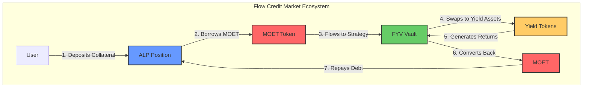

# MOET - FlowCreditMarket USD

MOET (FlowCreditMarket USD) is a synthetic stablecoin that serves as the backbone of the [Flow Credit Market (FCM)](../fcm/index.md) ecosystem. It functions as the unit of account, primary borrowed asset, and value transfer medium between [ALP](../alp/index.md) and [FYV](../flow-yield-vaults/index.md).

:::warning Current Status
The current MOET implementation is explicitly marked as a "mock version for testing purposes." Production deployment will require additional stability mechanisms, decentralized governance, and enhanced economic controls.
:::

## What is MOET?

MOET is a protocol debt token designed to enable capital-efficient lending and yield generation within FCM. Unlike traditional stablecoins backed by fiat reserves or crypto collateral held in separate vaults, MOET is directly integrated into the lending protocol itself, with every MOET token representing active debt backed by over-collateralized positions in ALP.

**Key Characteristics:**

- **Synthetic Stablecoin**: Designed to maintain a 1:1 peg with USD through over-collateralization
- **Protocol Debt Token**: Every MOET in circulation represents borrowed value backed by collateral
- **Unit of Account**: All asset prices in FCM are quoted in MOET terms
- **Capital Efficiency Medium**: Enables seamless value transfer between ALP and FYV for automated yield generation

## How MOET Fits into FCM



MOET serves three critical roles in the FCM ecosystem:

1. **Borrowing Asset in ALP**: Users deposit collateral (FLOW, stFLOW, USDC, wBTC, wETH) and borrow MOET against it. The amount they can borrow is determined by collateral factors and target health ratios, ensuring all MOET is over-collateralized.

2. **Yield Medium in FYV**: Borrowed MOET flows into Flow Yield Vaults where it's converted to yield-bearing assets. The yield generated helps maintain ALP position health during market volatility, creating a self-sustaining liquidation prevention mechanism.

3. **Unit of Account**: All collateral prices are quoted in MOET terms (FLOW/MOET, USDC/MOET, etc.), simplifying multi-collateral calculations and creating a consistent pricing framework across the entire system.

## Core Features

### Mint-and-Burn Model

MOET supply is dynamic and directly tied to protocol debt:

- **Minting**: New MOET tokens are created when users borrow from ALP positions
- **Burning**: MOET tokens are destroyed when users repay debt or close positions
- **Supply = Total Outstanding Debt**: The total MOET supply always equals the sum of all debt across all positions

This direct coupling ensures MOET supply naturally responds to lending demand without requiring external interventions.

### Over-Collateralization

Every MOET token is backed by collateral worth significantly more than $1:

```
Example Position:
├── Collateral: 1000 FLOW @ $1.00 = $1,000
├── Collateral Factor: 0.8 (80%)
├── Effective Collateral: $800
├── Target Health: 1.3
├── Max Borrow: $800 / 1.3 = 615.38 MOET
└── Collateralization Ratio: $1,000 / $615.38 = 162.5%
```

With collateral factors of 0.8 and target health of 1.3, positions maintain approximately 162.5% collateralization, providing substantial safety margin against price volatility.

### Automated Capital Flows

MOET moves automatically between system components through [DeFi Actions](../../blockchain-development-tutorials/forte/flow-actions/index.md):

- **DrawDownSink**: Channels borrowed MOET from ALP to FYV strategies for yield generation
- **TopUpSource**: Returns MOET (or yield tokens convertible to MOET) from FYV back to ALP for debt repayment
- **No Manual Intervention**: The entire flow operates autonomously based on position health targets

## Why MOET Matters

### For Analysts

Understanding MOET is critical for analyzing FCM's mechanics and risk profile:

- **Debt Tracking**: MOET supply metrics reveal total system leverage and borrowing activity
- **Collateralization Analysis**: MOET/collateral ratios indicate system health and liquidation risks
- **Capital Efficiency**: MOET enables borrowed capital to immediately generate yield, improving returns
- **Systemic Risk**: MOET peg stability is crucial - depeg scenarios could trigger cascading liquidations

### For the FCM System

MOET solves key challenges in decentralized lending:

- **Composability**: Standard FungibleToken interface enables seamless integration with DeFi protocols
- **Capital Efficiency**: Borrowed MOET doesn't sit idle - it actively generates yield in FYV
- **Unified Pricing**: MOET-denominated prices simplify complex multi-collateral calculations
- **Automated Risk Management**: MOET flows enable automatic liquidation prevention through yield generation

## Technical Implementation

**Contract Details:**
- **Contract Name**: MOET
- **Standard**: Flow FungibleToken + FungibleTokenMetadataViews
- **Symbol**: MOET
- **Full Name**: FlowCreditMarket USD

**Deployed Addresses:**

Testnet:
- Cadence: [`0xd27920b6384e2a78`](https://testnet.flowscan.io/contract/A.d27920b6384e2a78.MOET)
- EVM: [`0x51f5cc5f50afb81e8f23c926080fa38c3024b238`](https://evm-testnet.flowscan.io/address/0x51f5cc5f50afb81e8f23c926080fa38c3024b238)

Mainnet:
- Cadence: `0x6b00ff876c299c61`

## Documentation Structure

This documentation is organized to provide progressive understanding of MOET:

- **[Core Concepts](./basics.md)**: Essential mechanics for understanding how MOET works
- **[Tokenomics](./tokenomics.md)**: Supply dynamics, minting/burning, and interest rate models
- **[System Integration](./integration.md)**: How MOET connects ALP, FYV, and FCM components
- **[Stability Mechanisms](./stability.md)**: Over-collateralization, oracles, and risk management

## Getting Started

To understand MOET's role in FCM:

1. **Start with [Core Concepts](./basics.md)** to learn the fundamental mechanics
2. **Review [Tokenomics](./tokenomics.md)** to understand supply management and economics
3. **Explore [System Integration](./integration.md)** to see how MOET enables FCM's unique features
4. **Study [Stability Mechanisms](./stability.md)** to assess risks and safety measures

For practical usage examples, see [ALP Documentation](../alp/index.md) and [FYV Documentation](../flow-yield-vaults/index.md).

## Key Resources

- **GitHub Repository**: [FlowCreditMarket](https://github.com/onflow/FlowCreditMarket)
- **Contract Source**: `/cadence/contracts/MOET.cdc`
- **DeepWiki**: [FlowCreditMarket Overview](https://deepwiki.com/onflow/FlowCreditMarket/1-overview)
- **Parent Documentation**: [FCM Overview](../fcm/index.md)
