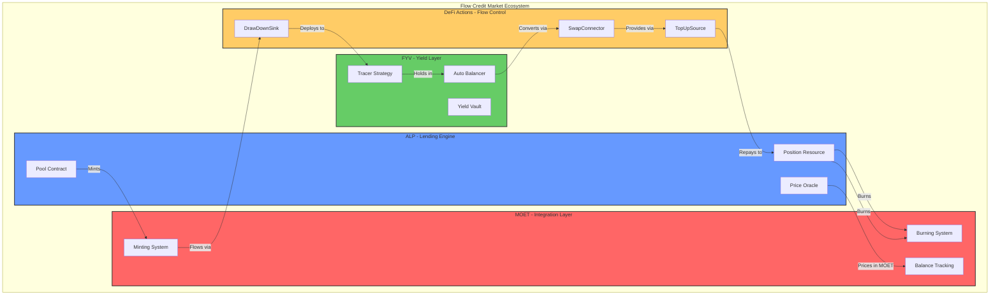

# MOET System Integration

This document explains how MOET connects and enables seamless interactions between ALP, FYV, and the broader FCM ecosystem.

## Overview of Integration Architecture

MOET serves as the **integration layer** that binds together FCM's components, enabling automated capital flows and coordinated risk management:



## MOET in ALP (Automated Lending Platform)

### Primary Borrowed Asset

MOET is the default and primary borrowed asset in ALP, with all lending operations centered around it.

**Pool Configuration:**

```cadence
// ALP Pool initialization (simplified)
init() {
    self.defaultToken = Type<@MOET.Vault>
    self.supportedTokens = {
        Type<@MOET.Vault>: TokenState,
        Type<@FlowToken.Vault>: TokenState,
        // ... other collateral types
    }
}
```

**Why MOET as Default:**

1. **Unified Denomination**: Simplifies multi-collateral accounting
2. **Capital Efficiency**: Borrowed MOET immediately deployable to yield
3. **Composability**: Standard FungibleToken interface enables DeFi integration
4. **Liquidation Simplicity**: Single debt token reduces liquidation complexity

### Borrowing Flow

**Step-by-Step Integration:**

```
User Action: Deposit 1000 FLOW Collateral

Step 1: Collateral Locked
├── User calls: Pool.deposit(collateral: <-flowVault, pushToDrawDownSink: true)
├── Pool receives: 1000 FLOW tokens
├── Position created: positionID = 123
└── Collateral stored in: Pool reserves

Step 2: Borrow Capacity Calculated
├── Oracle fetches: FLOW/MOET price = 1.0
├── Collateral value: 1000 × 1.0 = 1000 MOET
├── Collateral factor: 0.8
├── Effective collateral: 1000 × 0.8 = 800 MOET
├── Target health: 1.3
└── Max borrow: 800 / 1.3 = 615.38 MOET

Step 3: MOET Minted
├── Pool calls: MOETMinter.mintTokens(615.38)
├── Minter creates: 615.38 new MOET
├── Vault returned to: Pool
├── Total supply: Increased by 615.38
└── Event emitted: TokensMinted(amount: 615.38, positionID: 123)

Step 4: Debt Recorded
├── Position.debt.scaledBalance: 615.38
├── Position.debt.index: Current interest index (I₀)
├── Position.health: 1.30
└── Position state: {collateral: 1000 FLOW, debt: 615.38 MOET}

Step 5: MOET Distribution
├── If pushToDrawDownSink = true:
│   ├── Pool deposits: <-moetVault into DrawDownSink
│   ├── Sink forwards to: FYV strategy
│   └── Automatic yield deployment
└── If pushToDrawDownSink = false:
    ├── Pool sends: <-moetVault to user's wallet
    └── User manually deploys MOET
```

### Unit of Account in Pricing

All collateral assets are priced in MOET terms through the oracle system.

**Oracle Interface:**

```cadence
access(all) resource interface PriceOracle {
    // Returns price of token denominated in MOET
    access(all) fun getPrice(token: Type): UFix64
}
```

**Price Examples:**

```
Oracle Price Feeds (in MOET):
├── FLOW/MOET: 1.0 (1 FLOW = 1 MOET)
├── stFLOW/MOET: 1.05 (liquid staking premium)
├── USDC/MOET: 1.0 (stablecoin parity)
├── wBTC/MOET: 65,000.0 (Bitcoin price)
└── wETH/MOET: 3,500.0 (Ethereum price)

Assumption: 1 MOET = 1 USD
```

**Health Factor Calculation Using MOET Prices:**

```
Multi-Collateral Position:
├── Collateral 1: 500 FLOW @ 1.0 MOET each
│   ├── Value: 500 MOET
│   ├── CF: 0.8
│   └── Effective: 400 MOET
├── Collateral 2: 100 stFLOW @ 1.05 MOET each
│   ├── Value: 105 MOET
│   ├── CF: 0.85
│   └── Effective: 89.25 MOET
├── Collateral 3: 1000 USDC @ 1.0 MOET each
│   ├── Value: 1000 MOET
│   ├── CF: 0.9
│   └── Effective: 900 MOET
├── Total Effective Collateral: 1,389.25 MOET
├── Total Debt: 1,068.65 MOET
└── Health Factor: 1,389.25 / 1,068.65 = 1.30 ✓

Benefits:
├── All values in common denomination
├── No currency conversion needed
├── Efficient on-chain computation
└── Real-time health monitoring simplified
```

### Liquidation Process

MOET integration enables efficient liquidation through standardized debt repayment.

**Liquidation Flow:**

```
Underwater Position Detected:
├── Position 123: HF = 0.85 < 1.0
├── Collateral: 1000 FLOW @ $0.70 = $700 (MOET terms)
├── Effective collateral: $700 × 0.8 = $560 MOET
├── Debt: 700 MOET
└── Liquidatable: Yes

Liquidator Action:
Step 1: Liquidator Prepares
├── Liquidator has: 300 MOET in wallet
├── Calls: Pool.liquidate(positionID: 123, repayAmount: 300 MOET)
└── Goal: Seize collateral at profit

Step 2: Debt Repayment
├── Pool receives: 300 MOET from liquidator
├── Position debt reduced: 700 → 400 MOET
├── Pool burns: 300 MOET (automatic on vault destruction)
└── Supply reduced: 300 MOET

Step 3: Collateral Seizure
├── Formula: CollateralSeized = (DebtRepaid × (1 + Bonus)) / PriceCollateral
├── Calculation: (300 × 1.05) / 0.70 = 450 FLOW
├── Transfer: 450 FLOW to liquidator
└── Remaining collateral: 1000 - 450 = 550 FLOW

Step 4: Position Update
├── New collateral: 550 FLOW @ $0.70 = $385
├── New effective collateral: $385 × 0.8 = $308
├── New debt: 400 MOET
├── New HF: $308 / $400 = 0.77 (still liquidatable)
└── Further liquidations possible

Liquidator Profit:
├── Paid: 300 MOET ($300)
├── Received: 450 FLOW worth $315
├── Profit: $315 - $300 = $15 (5%)
└── Incentivizes holding MOET for liquidations
```

### Automated Rebalancing

MOET enables automatic position adjustments through health factor monitoring.

**Over-Collateralized Rebalancing (HF > 1.5):**

```
Initial State:
├── Collateral: 1000 FLOW @ $1.00 = $1,000
├── Effective collateral: $800 MOET
├── Debt: 615.38 MOET
├── HF: 1.30
└── Status: Optimal

Price Increase Event:
├── FLOW price: $1.00 → $1.50 (+50%)
├── New collateral value: $1,500
├── New effective collateral: $1,500 × 0.8 = $1,200 MOET
├── Debt unchanged: 615.38 MOET
├── New HF: $1,200 / 615.38 = 1.95 > 1.5 ⚠️
└── Trigger: Auto-borrow more

Automated Response:
├── Target HF: 1.3
├── Target debt: $1,200 / 1.3 = $923.08 MOET
├── Additional borrow: $923.08 - 615.38 = $307.70 MOET
├── Pool mints: 307.70 MOET
├── MOET flows via DrawDownSink to: FYV
├── Debt updated: 615.38 → 923.08 MOET
├── HF restored: $1,200 / 923.08 = 1.30 ✓
└── Extra capital deployed: 307.70 MOET earning yield

Benefits:
├── Maximizes capital efficiency automatically
├── No user intervention required
├── More MOET generating yield
└── Higher overall returns
```

**Under-Collateralized Rebalancing (HF < 1.1):**

```
Initial State:
├── Collateral: 1000 FLOW @ $1.00 = $1,000
├── Effective collateral: $800 MOET
├── Debt: 615.38 MOET
├── HF: 1.30
└── Status: Optimal

Price Decrease Event:
├── FLOW price: $1.00 → $0.85 (-15%)
├── New collateral value: $850
├── New effective collateral: $850 × 0.8 = $680 MOET
├── Debt unchanged: 615.38 MOET
├── New HF: $680 / 615.38 = 1.11 < 1.1 ⚠️
└── Trigger: Auto-repay debt

Automated Response:
├── Target HF: 1.3
├── Target debt: $680 / 1.3 = $523.08 MOET
├── Must repay: 615.38 - $523.08 = $92.30 MOET
├── Pool pulls from TopUpSource: 92.30 MOET (from FYV)
├── Pool burns: 92.30 MOET
├── Debt updated: 615.38 → 523.08 MOET
├── HF restored: $680 / 523.08 = 1.30 ✓
└── Position protected from liquidation

Benefits:
├── Prevents liquidation automatically
├── Utilizes yield earned in FYV
├── No user intervention required
└── Maintains position health
```

## MOET in FYV (Flow Yield Vaults)

### Yield Deployment Medium

MOET serves as the capital source for FYV yield strategies, enabling leveraged yield farming.

**TracerStrategy Integration:**

```
Capital Flow: ALP → MOET → FYV → Yield Assets

Step 1: Receive MOET
├── FYV receives: 615.38 MOET from ALP (via DrawDownSink)
├── Strategy: TracerStrategy
└── Goal: Generate yield > borrowing cost

Step 2: Convert to Yield Assets
├── SwapConnector activated
├── Swap: 615.38 MOET → 615.38 LP tokens
├── LP tokens: e.g., FLOW/USDC liquidity pair
└── Yield sources: Trading fees + liquidity rewards

Step 3: Hold in AutoBalancer
├── AutoBalancer receives: 615.38 LP tokens
├── Target value ratio: 100% (1.0)
├── Acceptable range: 95%-105%
└── Continuously monitors value growth

Step 4: Yield Accumulation
├── LP tokens earn: Trading fees
├── After 30 days: 615.38 LP → 640 LP
├── Value growth: +4% (monthly yield)
└── Yield ready for: Rebalancing or withdrawal
```

### Value Ratio Monitoring

FYV tracks the ratio of yield assets to borrowed MOET for rebalancing decisions.

**Value Ratio Formula:**

```
ValueRatio = Current LP Value (in MOET) / Initial MOET Borrowed

Example:
├── Initial borrow: 615.38 MOET
├── Current LP value: 640 MOET (after yield)
├── Value ratio: 640 / 615.38 = 1.04 (104%)
└── Status: Within acceptable range (95%-105%)
```

**Rebalancing Thresholds:**

```
Value Ratio Conditions:

Case 1: Ratio < 95% (Deficit - Price Drop or Loss)
├── Current value: 584.61 MOET (95% × 615.38)
├── Problem: Insufficient value to cover debt
├── Action: System alerts, may need external capital
└── Risk: Position may become liquidatable

Case 2: Ratio 95%-105% (Optimal - Balanced)
├── Current value: 584.61 - 646.15 MOET
├── Status: Healthy range
├── Action: No rebalancing needed
└── Continue: Generating yield

Case 3: Ratio > 105% (Surplus - Excess Yield)
├── Current value: 646.15+ MOET (>105% × 615.38)
├── Profit: Excess beyond debt coverage
├── Action: Harvest profit, reinvest or compound
└── Opportunity: Increase leverage or take profit
```

### Liquidation Prevention

FYV provides MOET back to ALP through TopUpSource when positions need protection.

**TopUpSource Flow:**

```
Trigger: ALP Position HF Drops Below 1.1

Step 1: ALP Requests Liquidity
├── ALP detects: HF = 1.05 < 1.1
├── Required MOET: 92.30 to restore HF to 1.3
├── ALP calls: TopUpSource.withdraw(92.30, Type<@MOET.Vault>)
└── TopUpSource connected to: FYV strategy

Step 2: FYV Prepares MOET
├── FYV checks: LP balance = 640 tokens
├── Required conversion: 92.30 MOET
├── Calculate LP needed: 92.30 LP (assuming 1:1 ratio)
└── FYV has sufficient: 640 > 92.30 ✓

Step 3: Convert Yield to MOET
├── FYV calls: SwapConnector.swap(92.30 LP → MOET)
├── LP tokens sold: 92.30
├── MOET received: 92.30
└── Remaining LP: 640 - 92.30 = 547.7

Step 4: Provide to ALP
├── FYV transfers: 92.30 MOET via TopUpSource
├── ALP receives: 92.30 MOET
├── ALP repays position debt: 615.38 → 523.08 MOET
├── Pool burns: 92.30 MOET
└── HF restored: 1.30 ✓

Result:
├── Position saved from liquidation
├── FYV still has: 547.7 LP generating yield
├── System maintains: Health and composability
└── User retains: All collateral
```

### Yield Compounding

FYV can reinvest excess yield back into strategies using MOET as the medium.

**Compounding Scenario:**

```
Initial Strategy:
├── Borrowed: 615.38 MOET
├── LP tokens: 615.38
├── After 3 months yield: 688 LP (+11.8%)
├── Value ratio: 688 / 615.38 = 1.118 (111.8%)
└── Excess: 72.62 LP above 105% threshold

Compounding Decision:
Option 1: Harvest Profit
├── Convert excess: 72.62 LP → 72.62 MOET
├── Repay debt: Reduce from 615.38 to 542.76 MOET
├── Improve HF: From 1.30 to higher
└── Lower risk: Less leverage

Option 2: Compound (Increase Leverage)
├── Keep excess: 72.62 LP in strategy
├── Borrow more: Request ALP to increase leverage
├── Additional MOET: Based on new LP value
├── Higher exposure: More LP, more yield
└── Higher risk: Increased leverage

Option 3: Take Profit
├── Convert excess: 72.62 LP → 72.62 MOET
├── Withdraw to wallet: 72.62 MOET
├── Realize gains: Lock in profit
└── Maintain position: Continue with base amount
```

## DeFi Actions: Connecting ALP and FYV

### DrawDownSink (ALP → FYV)

DrawDownSink channels borrowed MOET from ALP positions into FYV strategies.

**Interface:**

```cadence
access(all) resource interface Sink {
    access(all) fun deposit(vault: @{FungibleToken.Vault})
}
```

**Implementation in FYV:**

```cadence
// TracerStrategy implements Sink
access(all) resource TracerStrategy: Sink {
    access(all) fun deposit(vault: @{FungibleToken.Vault}) {
        // Receive MOET from ALP
        let moet <- vault as! @MOET.Vault

        // Convert to yield asset
        let lpTokens <- self.swapConnector.swap(from: <-moet, to: Type<@LPToken.Vault>)

        // Deposit into AutoBalancer
        self.autoBalancer.deposit(<-lpTokens)

        // Update tracking
        self.totalBorrowed = self.totalBorrowed + moet.balance
    }
}
```

**Usage Flow:**

```
ALP Position Configuration:
├── User sets: position.drawDownSink = TracerStrategy capability
├── On borrow: ALP calls drawDownSink.deposit(<-moetVault)
└── MOET flows: ALP → TracerStrategy automatically

Example:
├── Position borrows: 615.38 MOET
├── DrawDownSink receives: 615.38 MOET
├── TracerStrategy swaps: MOET → LP tokens
├── AutoBalancer holds: 615.38 LP
└── Yield generation: Begins immediately
```

### TopUpSource (FYV → ALP)

TopUpSource provides MOET from FYV back to ALP for debt repayment and liquidation prevention.

**Interface:**

```cadence
access(all) resource interface Source {
    access(all) fun withdraw(amount: UFix64, type: Type): @{FungibleToken.Vault}
}
```

**Implementation in FYV:**

```cadence
// TracerStrategy implements Source
access(all) resource TracerStrategy: Source {
    access(all) fun withdraw(amount: UFix64, type: Type): @{FungibleToken.Vault} {
        // Verify type is MOET
        assert(type == Type<@MOET.Vault>(), message: "Only MOET withdrawals supported")

        // Calculate LP tokens needed
        let lpNeeded = amount // Assuming 1:1 ratio for simplicity

        // Withdraw from AutoBalancer
        let lpTokens <- self.autoBalancer.withdraw(lpNeeded)

        // Convert to MOET
        let moet <- self.swapConnector.swap(from: <-lpTokens, to: Type<@MOET.Vault>)

        // Update tracking
        self.totalWithdrawn = self.totalWithdrawn + amount

        // Return MOET to ALP
        return <- (moet as! @{FungibleToken.Vault})
    }
}
```

**Usage Flow:**

```
ALP Position Configuration:
├── User sets: position.topUpSource = TracerStrategy capability
├── On low HF: ALP calls topUpSource.withdraw(amount, type)
└── MOET flows: TracerStrategy → ALP automatically

Example:
├── HF drops to: 1.05
├── Required MOET: 92.30
├── TopUpSource provides: 92.30 MOET (converted from LP)
├── ALP repays: 92.30 MOET debt
├── HF restored: 1.30
└── Liquidation prevented
```

### SwapConnector (Token Conversion)

SwapConnector enables MOET ↔ Yield Asset conversions within FYV strategies.

**Interface:**

```cadence
access(all) resource interface SwapConnector {
    access(all) fun swap(
        from: @{FungibleToken.Vault},
        to: Type
    ): @{FungibleToken.Vault}
}
```

**Bidirectional Swaps:**

```
MOET → Yield Asset (Deployment):
├── Input: 615.38 MOET vault
├── Target: LP token (e.g., FLOW/USDC pair)
├── Swap via: DEX (e.g., IncrementFi)
├── Output: 615.38 LP tokens
└── Use: Deployed to yield vault

Yield Asset → MOET (Withdrawal):
├── Input: 92.30 LP tokens
├── Target: MOET
├── Swap via: DEX
├── Output: 92.30 MOET
└── Use: Debt repayment to ALP
```

**Implementation Example:**

```cadence
// DEX-based SwapConnector
access(all) resource DEXSwapConnector: SwapConnector {
    access(all) fun swap(from: @{FungibleToken.Vault}, to: Type): @{FungibleToken.Vault} {
        // Route to appropriate DEX pool
        let pool = self.getPool(fromType: from.getType(), toType: to)

        // Execute swap
        let output <- pool.swap(input: <-from, minOutput: self.calculateSlippage())

        // Return swapped tokens
        return <-output
    }

    access(self) fun getPool(fromType: Type, toType: Type): &Pool {
        // Find optimal pool for this pair
        return &self.pools[fromType]![toType]! as &Pool
    }
}
```

## Complete Integration Example

### End-to-End User Journey

```
Day 1: Position Creation
├── User deposits: 1000 FLOW
├── ALP mints: 615.38 MOET
├── MOET flows via DrawDownSink to: FYV
├── FYV swaps: MOET → 615.38 LP tokens
├── LP held in: AutoBalancer
└── Position state: 1000 FLOW collateral, 615.38 MOET debt, HF = 1.30

Days 2-30: Yield Generation
├── LP tokens earn: Trading fees + rewards
├── LP value grows: 615.38 → 640 LP (+4%)
├── MOET debt accrues interest: 615.38 → 620.51 (+0.83% monthly)
├── Net position value: 640 - 620.51 = 19.49 MOET profit
└── Value ratio: 640 / 620.51 = 1.031 (103.1%, healthy)

Day 15: Price Drop Event
├── FLOW price drops: $1.00 → $0.88 (-12%)
├── Collateral value: $880
├── Effective collateral: $880 × 0.8 = $704 MOET
├── Debt: 617.50 MOET (with partial interest)
├── HF: 704 / 617.50 = 1.14 > 1.1 ✓
└── No action: Still above minimum threshold

Day 20: Further Price Drop
├── FLOW price drops: $0.88 → $0.82 (-7% more, -18% total)
├── Collateral value: $820
├── Effective collateral: $820 × 0.8 = $656 MOET
├── Debt: 618.50 MOET
├── HF: 656 / 618.50 = 1.06 < 1.1 ⚠️
└── Trigger: Auto-rebalancing

Auto-Rebalancing:
├── Target HF: 1.3
├── Target debt: 656 / 1.3 = 504.62 MOET
├── Repay amount: 618.50 - 504.62 = 113.88 MOET
├── FYV provides via TopUpSource: 113.88 MOET
│   ├── Convert LP: 113.88 LP → 113.88 MOET
│   └── Remaining LP: 640 - 113.88 = 526.12 LP
├── ALP burns: 113.88 MOET
├── New debt: 504.62 MOET
├── New HF: 656 / 504.62 = 1.30 ✓
└── Position protected!

Days 21-30: Recovery
├── FLOW price recovers: $0.82 → $0.95 (+16%)
├── Collateral value: $950
├── Effective collateral: $950 × 0.8 = $760 MOET
├── Debt: 507.50 MOET (with interest)
├── HF: 760 / 507.50 = 1.50 (at threshold)
└── No auto-borrow: Exactly at 1.5

Day 30: Position Closure
├── LP value: 526.12 LP worth $547.35
├── Convert all LP: 526.12 LP → 547.35 MOET
├── Total debt: 507.50 MOET
├── Repay: 507.50 MOET to ALP
├── ALP burns: 507.50 MOET
├── Excess MOET: 547.35 - 507.50 = 39.85 MOET
├── Withdraw collateral: 1000 FLOW
└── Final profit: 39.85 MOET ($39.85 on $1,000 = 3.98% monthly ROI)
```

### Integration Benefits

**For Users:**

1. **Seamless Capital Flow**: MOET moves automatically between components
2. **Automated Protection**: Yield protects positions without manual intervention
3. **Maximized Returns**: Borrowed capital immediately deployed to yield
4. **Simplified UX**: Single deposit action triggers entire flow

**For Protocol:**

1. **Capital Efficiency**: No idle MOET sitting in wallets
2. **Reduced Liquidations**: Auto-rebalancing prevents most liquidations
3. **Composability**: MOET enables third-party integrations
4. **Scalability**: Standardized interfaces support multiple strategies

**For Ecosystem:**

1. **Unified Liquidity**: MOET creates common liquidity layer
2. **DeFi Composability**: Standard token enables broader integrations
3. **Innovation**: Developers can build new strategies using MOET
4. **Network Effects**: More users → more liquidity → better yields

## Technical Implementation Details

### Contract Interactions

**Key Contract Calls:**

```cadence
// ALP borrows MOET for user
pub fun borrow(amount: UFix64): @MOET.Vault {
    // Mint MOET
    let moet <- MOETMinter.mintTokens(amount: amount)

    // Update position debt
    self.debt.scaledBalance = self.debt.scaledBalance + amount

    // Push to DrawDownSink if configured
    if let sink = self.drawDownSink {
        sink.deposit(vault: <-moet)
        return <- MOET.createEmptyVault() // Return empty vault
    }

    // Otherwise return MOET to user
    return <- moet
}

// ALP repays MOET debt
pub fun repay(vault: @MOET.Vault) {
    // Record repaid amount
    let repaidAmount = vault.balance

    // Update position debt
    self.debt.scaledBalance = self.debt.scaledBalance - repaidAmount

    // Burn MOET (automatic on destroy)
    destroy vault // Triggers burnCallback()
}

// FYV provides MOET for debt repayment
pub fun provideForRepayment(): @MOET.Vault {
    // Calculate needed amount
    let neededAmount = self.calculateRepaymentAmount()

    // Withdraw from strategy
    let moet <- self.strategy.withdraw(amount: neededAmount, type: Type<@MOET.Vault>())

    // Return MOET for ALP repayment
    return <- (moet as! @MOET.Vault)
}
```

### Event Emissions

**Tracking MOET Flows:**

```cadence
// Emitted when MOET is minted
pub event TokensMinted(amount: UFix64, positionID: UInt64, mintedBy: Address)

// Emitted when MOET is burned
pub event TokensBurned(amount: UFix64, burnedFrom: UInt64)

// Emitted when MOET flows to DrawDownSink
pub event MOETDeployed(amount: UFix64, from: UInt64, to: Address, strategy: String)

// Emitted when MOET provided via TopUpSource
pub event MOETWithdrawn(amount: UFix64, from: Address, to: UInt64, reason: String)

// Emitted when MOET swapped
pub event MOETSwapped(amount: UFix64, direction: String, pool: Address)
```

**Analytics Use Cases:**

```
Monitor Total Supply:
├── Track: TokensMinted events
├── Track: TokensBurned events
├── Calculate: Supply = Mints - Burns
└── Analyze: Supply growth trends

Monitor Capital Flows:
├── Track: MOETDeployed events (ALP → FYV)
├── Track: MOETWithdrawn events (FYV → ALP)
├── Calculate: Net flow = Deployed - Withdrawn
└── Analyze: Capital efficiency metrics

Monitor Liquidation Activity:
├── Track: TokensBurned with reason = "liquidation"
├── Calculate: Liquidation volume
├── Analyze: System health indicators
└── Alert: Liquidation cascades
```

## Next Steps

- **[Stability Mechanisms](./stability.md)**: Understand how MOET maintains its peg and manages risk
- **[ALP Documentation](../alp/index.md)**: Deep dive into ALP's lending mechanics
- **[FYV Documentation](../flow-yield-vaults/index.md)**: Explore FYV yield strategies
- **[DeFi Actions](../../blockchain-development-tutorials/forte/flow-actions/index.md)**: Learn about the composability framework
