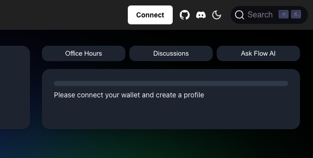
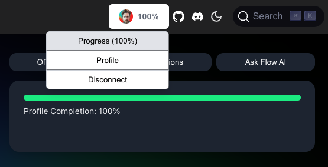
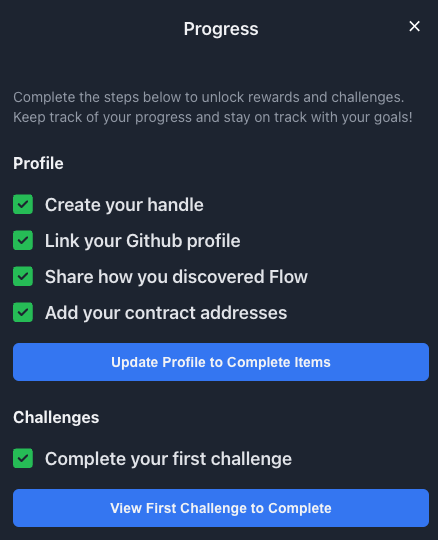

The Developer Profile is the beginning of Flow's developer recognition and learning platform where builders can create profiles, track their learning journey, complete challenges, and showcase their contributions to the Flow ecosystem.

It's fully onchain!

:::tip

The Developer Profile is currently in alpha. Please let us know what you think!

:::

## What is the Developer Profile?

The Developer Profile is a platform designed to help developers:

- Create and manage their Flow builder profiles
- Track their learning progress through structured paths
- Complete challenges and earn recognition
- Connect with other builders in the ecosystem
- Showcase their projects and contributions

Currently, the Developer Profile is in alpha. You can:

- Create your profile
- Share your GitHub handle
- Add your deployed contract addresses
- Complete the First Challenge

## Getting Started

The Developer Profile is accessed by logging in with your wallet. Click the "Connect Button" in the top right.

:::tip

The Developer Profile is on Flow Cadence. You'll need to use a wallet that supports Cadence transactions, such as the [Flow Wallet] or [Blocto].

:::

Once connected, you can see your progress by clicking `Progress` in the dropdown menu.

### 1. Create Your Profile

Click `Profile` in the dropdown menu.

- Choose a unique handle
- Add your Github handle
- Add your deployed contract addresses
- Share how you discovered Flow

### 2. Complete the First Challenge

**After** you've created your profile, you can complete the first challenge.

Click `Progress` in the dropdown menu.

Click the button at the bottom of the page.

Complete the challenge!

## Next Steps

We'll be updating the Developer Profile with new features and challenges. Check back soon!

<!-- Reference-style links, will not render on the page. -->

[Flow Wallet]: https://wallet.flow.com/
[Blocto]: https://blocto.app/
