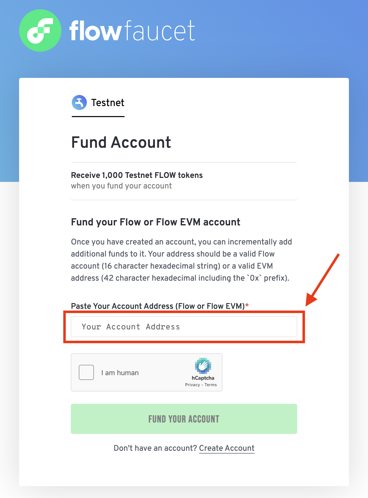
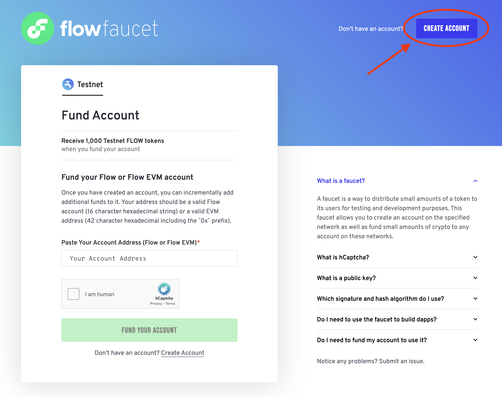
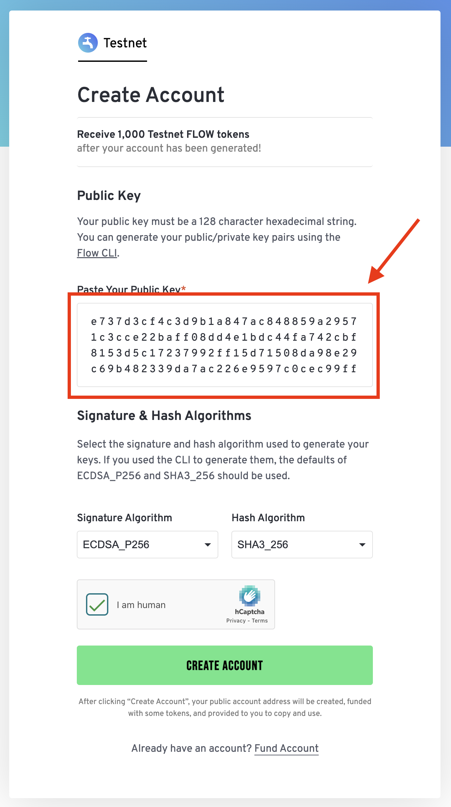
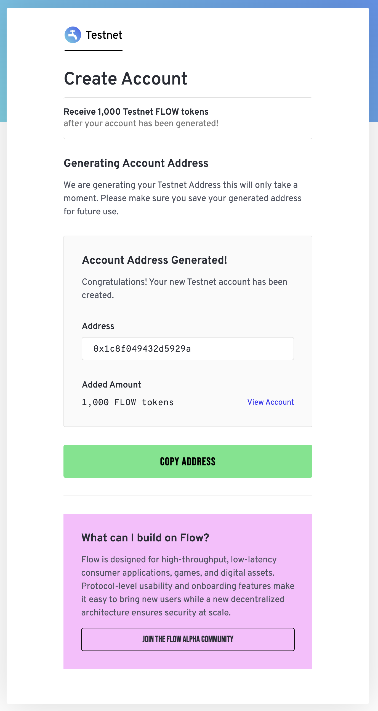

# Faucets

Network Faucets provide free Flow tokens for testing purposes, functioning like taps that dispense tokens. They are valuable tools for experimenting with Flow without the need to purchase tokens.

<div class="cards">

## Flow Faucet

[Flow Faucet](https://faucet.flow.com/fund-account) is a dedicated tool that provides a seamless way to acquire small amounts of Flow tokens for testing and development purposes on the Flow blockchain's testnet environment.

### Supported Networks

- [Testnet](https://faucet.flow.com/fund-account)

## LearnWeb3 Flow Faucet

[LearnWeb3 Flow Faucet](https://learnweb3.io/faucets/flow) is a community faucet tool that provides a seamless way to acquire small amounts of Flow tokens for testing and development purposes on the Flow blockchain's testnet environment.

### Supported Networks

- [Testnet](https://learnweb3.io/faucets/flow)

</div>

## Using Flow Faucet

### Funding Your Account

If you already have a Flow account, you can fund it directly from the Faucet's landing page. Simply paste the address of the account you want to fund, complete the CAPTCHA, and click "Fund Your Account."



After a few seconds, you'll see your account's FLOW balance as a confirmation. Note, the Faucet will automatically determine if the address you paste is a Flow or EVM address and will fund the account accordingly.

### Creating a Flow Account

#### Generate a Key Pair

To create a Flow-native account, you'll need to generate a key pair. You can do this most easily [Flow CLI](../blockchain-development-tutorials/cadence/getting-started/cadence-environment-setup.md) with the [`keys generate` command](../build/tools/flow-cli/keys/generate-keys.md)

```sh
flow keys generate
```

You'll receive a private key and a public key pair with default `ECDSA_P256` signature and `SHA3_256` hash algorithms.

```sh
❯ flow keys generate

🔴️ Store private key safely and don't share with anyone!
Private Key 		 <PRIVATE_KEY>
Public Key 		 <PUBLIC_KEY>
Mnemonic 		 <MNEMONIC_PHRASE>
Derivation Path 	 m/44'/539'/0'/0/0
Signature Algorithm 	 ECDSA_P256
```

You can then use the public key to create a new Flow account on the Faucet. Copy the resulting public key for the next step.

#### Create a Flow-Native Account

From the Faucet's landing page, click on the "Create Account" button. You'll be prompted to enter your public key. Paste the public key you generated using the Flow CLI and click "Create Account."

:::tip

Know that there is a distinction between Flow native accounts and EVM accounts. Native accounts allow you to interact with the Cadence runtime, while EVM accounts are used for interacting with Flow's EVM. To create an EVM account, you can use EVM tooling to generate an Ethereum Owned Account (EOA) and simply fund the associated address. Alternatively, you can create an EVM account controlled by your Flow native account - known as a Cadence Owned Account (COA) - in which case you'll need a Flow native account and should continue with the steps below.

For more information interacting with EVM via COAs, see the [Interacting With COAs documentation](../blockchain-development-tutorials/cross-vm-apps/interacting-with-coa.md).

:::



You can then paste your public key into the input field, complete the CAPTCHA, and click "Create Account."



You'll be met with a confirmation screen, showing your Flow account address and the funded balance.



#### Using your Flow Account

Once your account has been created, you can add the account to your `flow.json` configuration file under the `accounts` attribute, like so:

```json
{
  "accounts": {
    "testnet-dev-account": {
      "address": "<YOUR_ADDRESS>",
      "key": "<PRIVATE_KEY>"
    }
  }
}
```

:::warning

If you plan on using your flow.json in a production environment, you'll want to look at alternative methods to manage your keys more securely, at minimum using environment variables instead of storing your account private keys in plain text. See [How to Securely Use CLI](../build/tools/flow-cli/flow.json/security.md) for more information on alternate key management strategies and how to configure them in your `flow.json` file.

:::

After adding your account to your `flow.json` file, you're ready to use your account in your project. You can now deploy contracts, run transactions, and interact with the Flow blockchain using your new account.
