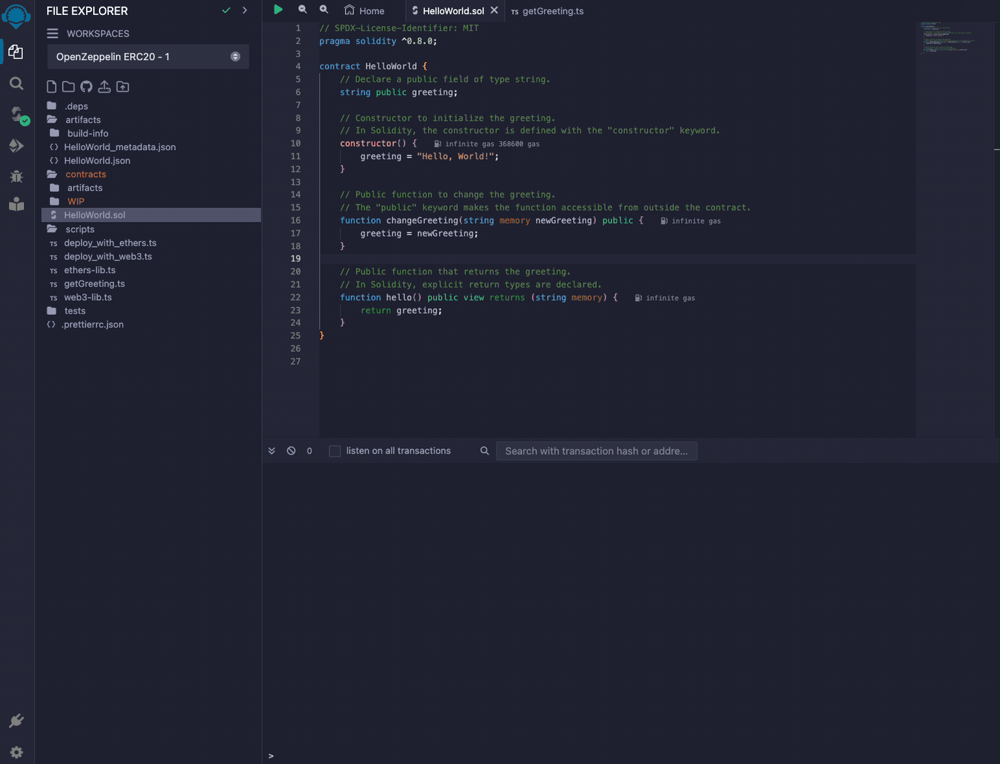

# Using Remix

Remix is an open-source, web-based development environment tailored for EVM smart contract development. It provides developers with a comprehensive suite of tools to write, deploy, and test smart contracts in Solidity. More Information [Remix](https://remix.ethereum.org/)

## Add Flow EVM Network to metamask


Navigate to [Using EVM](../../../using.mdx) page to find the convenient button to add Flow EVM network information to your metamask.

## Fund your Flow EVM account


Navigate to the Flow EVM Faucet, [Crescendo PreviewNet Faucet](https://previewnet-faucet.onflow.org/fund-account) to get Flow in order to deploy a smart contract


## Deploying a Smart Contract using Remix


### HelloWorld Smart Contract
```solidity
// SPDX-License-Identifier: MIT
pragma solidity ^0.8.0;

contract HelloWorld {
    // Declare a public field of type string.
    string public greeting;

    // Constructor to initialize the greeting.
    // In Solidity, the constructor is defined with the "constructor" keyword.
    constructor() {
        greeting = "Hello, World!";
    }

    // Public function to change the greeting.
    // The "public" keyword makes the function accessible from outside the contract.
    function changeGreeting(string memory newGreeting) public {
        greeting = newGreeting;
    }

    // Public function that returns the greeting.
    // In Solidity, explicit return types are declared.
    function hello() public view returns (string memory) {
        return greeting;
    }
}


```

### Steps to deploy HelloWorld smart contract. 
Using Remix:
1. Create a file named HelloWorld.sol
2. Select Solidity Compiler and compile HelloWorld.sol
3. Select Deploy & Run Transactions 
4. Make sure to select `Injected Provider - Metamask` in Environment dropdown
5. Deploy the HelloWorld smart contract

## Calling deployed Smart Contract using Remix


### Using Ethersjs to call HelloWorld smart contract

```javascript
// Import ethers from the ethers.js library
const { ethers } = require('ethers');

// Define the contract ABI
const contractABI = [
    "function hello() public view returns (string memory)"
];

// Define the contract address
const contractAddress = "0x8a120383e6057b1f3aef4fa9b89c2f1b0a695926";

// Connect to the Ethereum network
// This example uses the default provider from ethers.js, which connects to the Ethereum mainnet.
// For a testnet or custom RPC, use ethers.getDefaultProvider('networkName') or new ethers.providers.JsonRpcProvider(url)
  const provider = new ethers.providers.Web3Provider(window?.ethereum);
              

// Create a new contract instance
const contract = new ethers.Contract(contractAddress, contractABI, provider);

// Call the hello function of the contract
async function getGreeting() {
    const greeting = await contract.hello();
    console.log(greeting);
}

// Execute the function
getGreeting();

```

1. Create a new file under `scripts`
2. Paste in above JavaScript code
3. Click on green play button
4. Verify the greeting is "Hello World!"

Use the steps below to change the greeting and retrieve the greeting again.

## Updating deployed Smart Contract



Steps to update the HelloWorld smart contract greeting
1. Select the HelloWorld.sol file
2. Select the `Deploy and Run Transaction` page
3. Make sure to select `Injected Provider - Metamask` in Environment dropdown
4. Type a new greeting in the text input next to `changeGreeting` orange button
5. Click on the `changeGreeting` orange button 
6. Sign the Metamask transaction
7. Verify the greeting has changed by running the JavaScript above.

## Flow EVM Block explorer 

### Coming Soon 