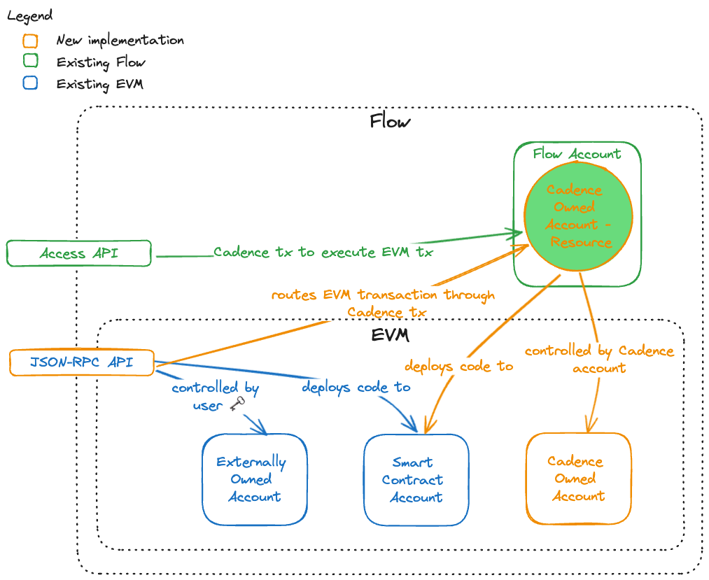

:::info

Are you a Cadence developer looking for information about Accounts on Cadence? If so, check out the Cadence specific documentation [here](../../build/basics/accounts.md)

:::

# Accounts

There are three types of accounts on FlowEVM.

1. Externally owned account (EOA)
2. Contract account 

EOAs and Contract accounts on FlowEVM function the same as on other EVM networks. Read more about EOAs and contract accounts on the [ethereum docs](https://ethereum.org/developers/docs/accounts).

Finally, 

3. Cadence owned accounts.

## Cadence Owned Accounts

Cadence owned accounts are a new account type on FlowEVM. They function similar to contract accounts, as they are not key controlled and have an address assigned to them upon creation. 

Cadence owned accounts are created on FlowEVM through the cadence VM bridge. When a cadence owned account is created, a cadence resource is created which controls it. This resource will typically be stored in a cadence account which 'owns' the FlowEVM cadence owned account (hence, 'cadence owned account'). Transactions upon the cadence owned account on FlowEVM occur by executing a method available on it's corresponding resource in Cadence.

For more information on cadence owned accounts, see the [FlowEVM FLIP](https://github.com/onflow/flips/pull/225/files)

