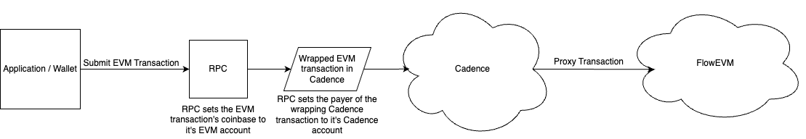

:::info

Are you a Cadence developer looking for information about Accounts on Cadence? If so, check out the Cadence specific documentation [here](../../build/basics/fees.md)

:::

# Fees

Transactions on FlowEVM use the FLOW token as the gas currency. For externally owned accounts (EOAs), the interface for paying gas on FlowEVM functions the same as other EVM networks.

## Technical Details

Transactions on FlowEVM are executed through Cadence, which uses FLOW token for gas. Therefore, each transaction on FlowEVM has it's gas cost paid by the payer of the Cadence transaction that executes it. The account signing as the payer of the Cadence transaction therefore pays for gas of underlying FlowEVM transactions.

For transactions that are submitted to a FlowEVM RPC node, the RPC node wraps the EVM transaction in a Cadence transaction and signs that transaction as the Payer. The coinbase of the EVM transaction is set by the RPC node to an address it maintains, therefore billing the cost of the transaction to the address executing it.

