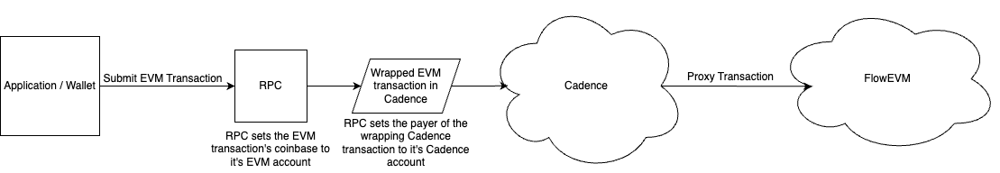

:::info

Are you a Cadence developer looking for information about fees on Cadence? If so, check out the Cadence specific documentation [here](../../build/basics/fees.md)

:::

# Fees

Transactions on Flow on EVM use the FLOW token as the gas currency. For [Externally Owned Accounts (EOAs)](./accounts.md), the interface for paying gas on EVM functions the same as other EVM networks.

## Technical Details

Transactions on FlowEVM are executed through Cadence, which uses FLOW token for gas. Therefore, each Flow EVM transaction has its gas cost paid by the payer of the Cadence transaction that executes it. The account signing as the payer of the Cadence transaction therefore pays for gas of underlying EVM transactions.

For transactions that are submitted to an EVM RPC node, the RPC node wraps the EVM transaction in a Cadence transaction and signs that transaction as the Payer. The coinbase of the EVM transaction is set by the RPC node to an address it maintains, therefore billing the cost of the transaction to the address executing it.

For details on how gas fees work on FlowEVM, check out this [forum post](https://forum.flow.com/t/transaction-fees-on-flow-on-evm-previewnet/5751)
