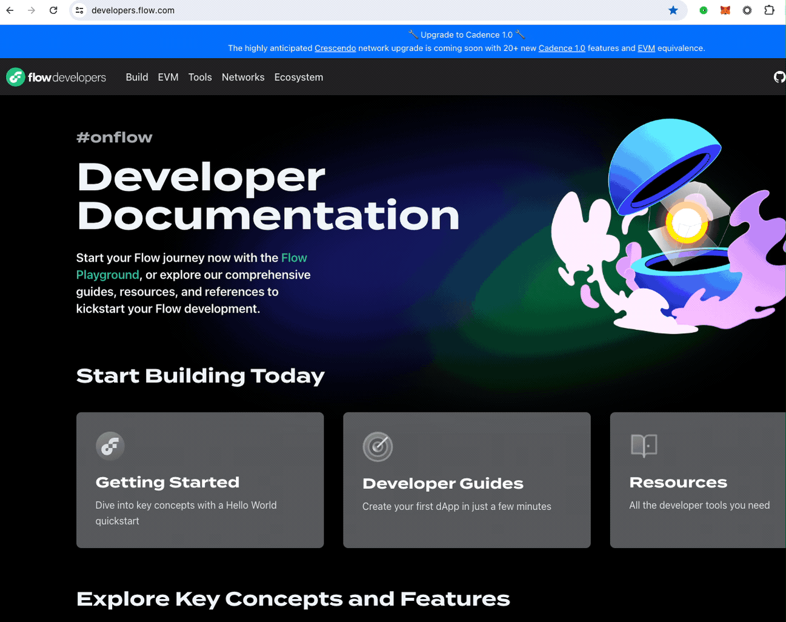
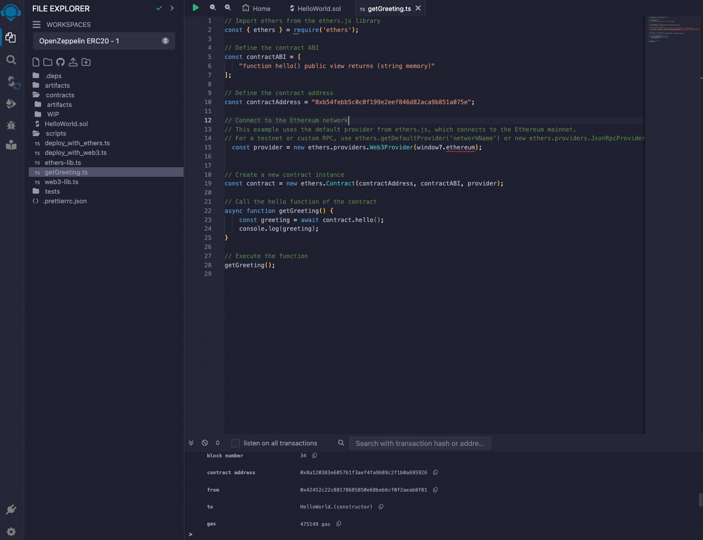
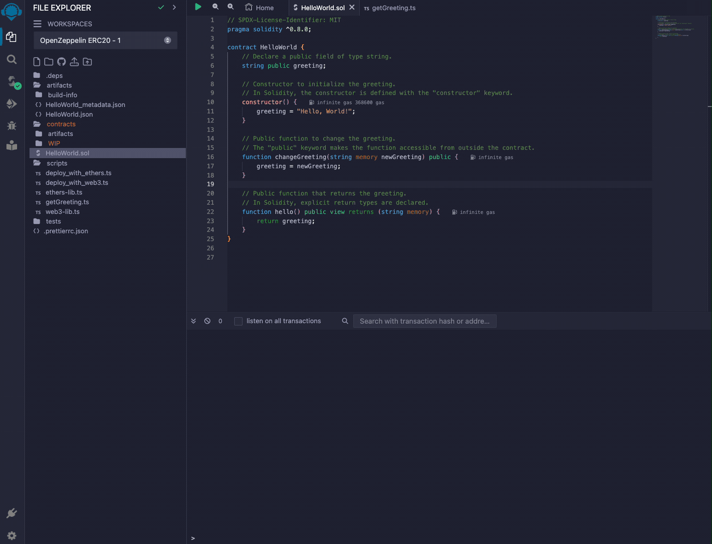

# Using Remix

Remix is an open-source, web-based development environment tailored for EVM smart contract development. It offers developers a comprehensive suite of tools for writing, deploying, and testing smart contracts in Solidity. For more information, visit [Remix](https://remix.ethereum.org/).

## Add the Flow Network to MetaMask



Navigate to the [Using EVM](../../../using.mdx) page to find the button to add the Flow network information to your metamask.

## Fund Your Flow Account

Navigate to the [Flow Previewnet Faucet](https://previewnet-faucet.onflow.org/fund-account) to obtain FLOW tokens necessary for deploying a smart contract.

## Deploying a Smart Contract Using Remix


### HelloWorld Smart Contract
```solidity
// SPDX-License-Identifier: MIT
pragma solidity ^0.8.0;

contract HelloWorld {
    // Declare a public field of type string.
    string public greeting;

    // Constructor to initialize the greeting.
    // In Solidity, the constructor is defined with the "constructor" keyword.
    constructor() {
        greeting = "Hello, World!";
    }

    // Public function to change the greeting.
    // The "public" keyword makes the function accessible from outside the contract.
    function changeGreeting(string memory newGreeting) public {
        greeting = newGreeting;
    }

    // Public function that returns the greeting.
    // In Solidity, explicit return types are declared.
    function hello() public view returns (string memory) {
        return greeting;
    }
}


```

### Steps to Deploy the HelloWorld Smart Contract

1. Create a file named `HelloWorld.sol`.
2. Select Solidity Compiler and compile `HelloWorld.sol`.
3. Select Deploy & Run Transactions.
4. Make sure to select `Injected Provider - Metamask` in Environment dropdown.
5. Deploy the `HelloWorld` smart contract.

## Calling the Deployed Smart Contract



### Using Ethers.js to Call the HelloWorld Smart Contract

```javascript
// Import ethers from the ethers.js library
const { ethers } = require('ethers');

// Define the contract ABI
const contractABI = [
    "function hello() public view returns (string memory)"
];

// Define the contract address
const contractAddress = "0x8a120383e6057b1f3aef4fa9b89c2f1b0a695926";

// Connect to the Ethereum network
// This example uses the default provider from ethers.js, which connects to the Ethereum mainnet.
// For a testnet or custom RPC, use ethers.getDefaultProvider('networkName') or new ethers.providers.JsonRpcProvider(url)
  const provider = new ethers.providers.Web3Provider(window?.ethereum);
              

// Create a new contract instance
const contract = new ethers.Contract(contractAddress, contractABI, provider);

// Call the hello function of the contract
async function getGreeting() {
    const greeting = await contract.hello();
    console.log(greeting);
}

// Execute the function
getGreeting();
```

1. Create a new file under `scripts`.
2. Paste in above JavaScript code.
3. Click on green play button.
4. Verify the greeting is "Hello World!"

Follow the steps below to change the greeting and retrieve the new greeting.

## Updating the Deployed Smart Contract



1. Select the `HelloWorld.sol` file.
2. Select the `Deploy and Run Transaction` page.
3. Make sure to select `Injected Provider - Metamask` in Environment dropdown.
4. Type a new greeting in the text input next to orange `changeGreeting` button.
5. Click on the orange `changeGreeting` button.
6. Sign the Metamask transaction.
7. Verify the greeting has changed by running the JavaScript above.

## Flow Previewnet Block Explorer 

### Coming Soon 
