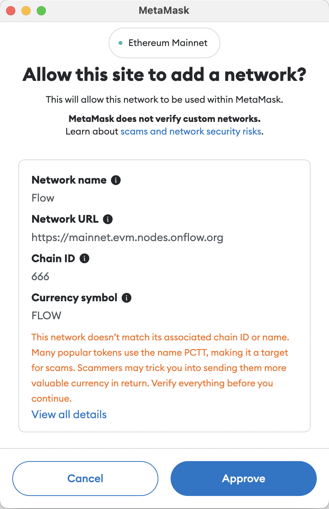

# Wallets & Configurations

This document shows how to integrate the FlowEVM Network programmatically with your Dapp via MetaMask.

## Metamask

Integrating additional networks into MetaMask can pose challenges for users who lack technical expertise and may lead to errors. Simplifying this process can greatly enhance user onboarding for your application. This guide demonstrates how to create a straightforward button within your frontend application to streamline the addition of the Berachain network to MetaMask.

### EIP-3035 & MetaMask

[EIP-3035](https://eips.ethereum.org/EIPS/eip-3085) is an Ethereum Improvement Proposal that defines an RPC method for adding Ethereum-compatible chains to wallet applications. Since March 2021 MetaMask has implemented that EIP as part of their MetaMask [Custom Networks API](https://consensys.io/blog/connect-users-to-layer-2-networks-with-the-metamask-custom-networks-api).

### Network configuration

To add the FlowEVM network to Metamask, we need to add the following network confgiuration:

#### Previewnet Network

```js
export const FLOWEVM_PREVIEWNET_PARAMS = {
    chainId: '0x286',
    chainName: 'Flow',
    rpcUrls: ['https://previewnet.evm.nodes.onflow.org'],
    nativeCurrency: {
        name: 'Flow',
        symbol: 'FLOW',
        decimals: 18,
    },
    blockExplorerUrls: ['https://previewnet.flowdiver.io'],
}
```

### Adding the Network

To add this configuration to MetaMask, we must call the `wallet_addEthereumChain` method which is exposed by the web3 provider.

```js
function addFlowEvmNetwork() {
  injected.getProvider().then((provider) => {
    provider
      .request({
        method: "wallet_addEthereumChain",
        params: [FLOWEVM_PREVIEWNET_PARAMS],
      })
      .catch((error: any) => {
        console.log(error)
      })
  })
}
```

The variable, `injected`, is initialized as a `web3-react/injected-connector` used to interface with MetaMask APIs. Usage for other popular web frameworks is similar.

The typical usage would be to expose this button if you get errors when attempting to connect to MetaMask (i.e. `Wrong Network` or `Error Connecting`).

### User Experience

Users who first come to your dApp's website will need to first approve a connection to Metamask.  After doing this, if you don't detect a successful Web3 network connection, you may present a dialog asking them to add the FlowEVM network to their wallet.



After they approve, your app be connected to the FlowEVM network. 

By using this approach to add the FlowEVM network to Metamask, you can avoid manual user data entry and ensure that users are ready to interact with your dApp!