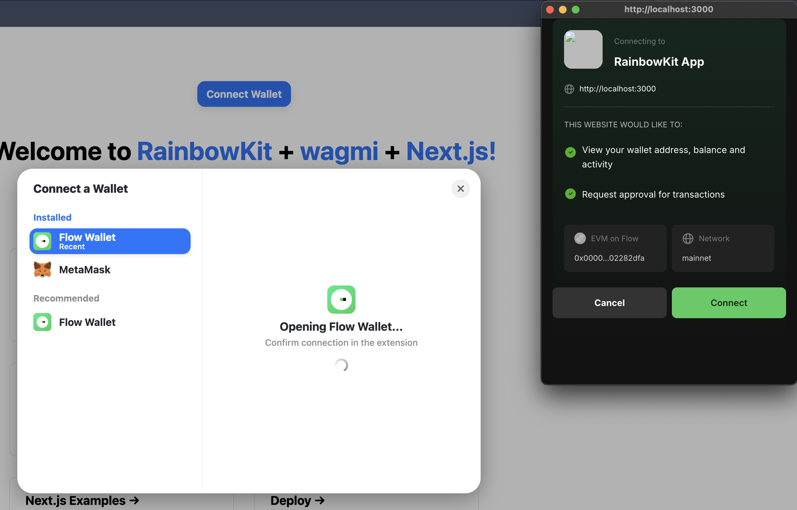
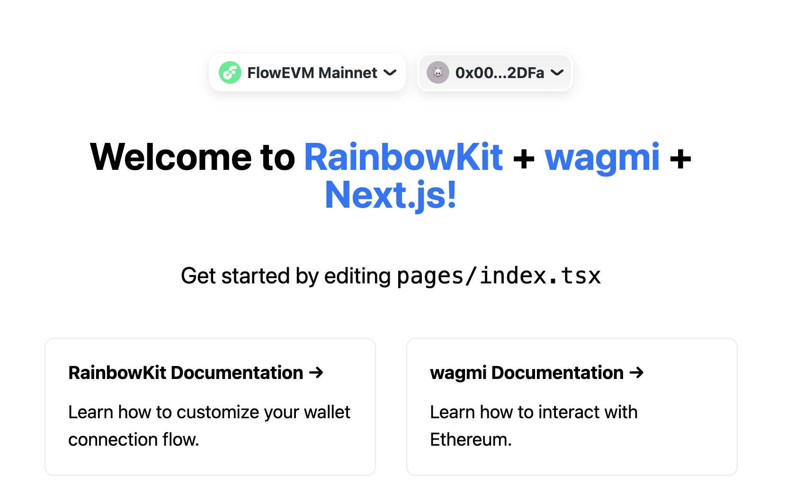

Integrating Flow Wallet with [RainbowKit][1] allows users to seamlessly connect their Flow accounts through one of the most popular wallet connection interfaces.

This guide walks you through the process of defining Flow Wallet as a custom wallet in RainbowKit and testing the integration. You can follow along by setting up a new RainbowKit project or use the code in this guide to integrate these steps into your existing dApp.

## Objectives

After completing this guide, you'll be able to:
- Create a custom Flow Wallet connector compatible with RainbowKit's interface
- Configure your Wagmi setup to support Flow Wallet connections
- Implement a complete wallet connection flow for Flow blockchain users
- Test and verify the Flow Wallet integration in your dApp

## Prerequisites

### Next.js and Modern Frontend Development

The RainbowKit starter is built on Next.js, so familiarity with React, hooks, and modern frontend development will help you follow along.

## A Flow Wallet 

To use Flow Wallet with RainbowKit, install the Flow Wallet browser extension from the [Chrome Web Store][2].

Once installed, set up your wallet by creating or importing an account. For quick access, pin the extension to your browser toolbar.

## Setting Up Your Environment

### Initial Setup

The RainbowKit starter is built on Next.js, following its standard project structure and conventions. Create a new project or ensure your existing one has the necessary dependencies:

```bash
$ npm init @rainbow-me/rainbowkit@latest
$ cd my-rainbowkit-app
$ npm run dev
```

The [RainbowKit](https://www.rainbowkit.com/) components will be available throughout your application via the provided wrapper components.

### Creating the Flow Wallet Connector
The first major step is defining the Flow Wallet connector. Create a new file called `flowWallet.ts` in `src/flowWallet.ts` to house the wallet configuration:

```tsx
/* src/flowWallet.ts */ 
import { Wallet, getWalletConnectConnector } from '@rainbow-me/rainbowkit';

export interface MyWalletOptions {
  projectId: string;
}

export const flowWallet = ({ projectId }: MyWalletOptions): Wallet => ({
  id: 'flow-wallet',
  name: 'Flow Wallet',
  iconUrl: 'https://lilico.app/logo_mobile.png',
  iconBackground: '#41CC5D',
  downloadUrls: {
    android: 'https://play.google.com/store/apps/details?id=com.flowfoundation.wallet',
    ios: 'https://apps.apple.com/ca/app/flow-wallet-nfts-and-crypto/id6478996750',
    chrome: 'https://chromewebstore.google.com/detail/flow-wallet/hpclkefagolihohboafpheddmmgdffjm',
    qrCode: 'https://link.lilico.app',
  },
  mobile: {
    getUri: (uri: string) => `https://fcw-link.lilico.app/wc?uri=${encodeURIComponent(uri)}`,
  },
  qrCode: {
    getUri: (uri: string) => uri,
    instructions: {
      learnMoreUrl: 'https://wallet.flow.com',
      steps: [
        {
          description: 'We recommend putting Flow Wallet on your home screen for faster access to your wallet.',
          step: 'install',
          title: 'Open the Flow Wallet app',
        },
        {
          description: 'You can find the scan button on home page, a connection prompt will appear for you to connect your wallet.',
          step: 'scan',
          title: 'Tap the scan button',
        },
      ],
    },
  },
  extension: {
    instructions: {
      learnMoreUrl: 'https://wallet.flow.com',
      steps: [
        {
          description: 'We recommend pinning Flow Wallet to your taskbar for quicker access to your wallet.',
          step: 'install',
          title: 'Install the Flow Wallet extension',
        },
        {
          description: 'Be sure to back up your wallet using a secure method. Never share your secret phrase with anyone.',
          step: 'create',
          title: 'Create or Import a Wallet',
        },
        {
          description: 'Once you set up your wallet, click below to refresh the browser and load up the extension.',
          step: 'refresh',
          title: 'Refresh your browser',
        },
      ],
    },
  },
  createConnector: getWalletConnectConnector({ projectId }),
});
```

### Configuring Wagmi Integration

Next, update your Wagmi configuration to include Flow Wallet support. Modify your `wagmi.ts` file:

```tsx
/* src/wagmi.ts */ 
'use client';

import { connectorsForWallets } from '@rainbow-me/rainbowkit';
import { createConfig, http } from 'wagmi';
import { mainnet, flowMainnet } from 'viem/chains';
import { flowWallet } from './flowWallet';

/*
We can leave this as is for the tutorial but it should be
replaced with your own project ID for production use.
*/
const projectId = 'YOUR_PROJECT_ID'; 

const connectors = connectorsForWallets(
  [
    {
      groupName: 'Recommended',
      wallets: [flowWallet]
    },
  ],
  {
    appName: 'RainbowKit App',
    projectId,
  }
);

export const config = createConfig({
  connectors,
  chains: [flowMainnet, mainnet],
  ssr: true,
  transports: {
    [flowMainnet.id]: http(),
    [mainnet.id]: http(),
  },
});
```

:::info

WalletConnect Project ID

Every dApp that relies on WalletConnect now needs to obtain a projectId from [WalletConnect Cloud (now rebranded as reown)](https://cloud.reown.com/sign-in). This is absolutely free and only takes a few minutes.

To get a Project ID, sign up at WalletConnect Cloud, create a new project, and copy the generated ID into the `projectId` variable in the `wagmi.ts` file.

:::

## Testing Your Integration

After implementing the Flow Wallet connector and configuring Wagmi, follow these steps to verify that the integration works correctly in your dApp:

1. **Click "Connect Wallet"** – Open your application and click the "Connect Wallet" button.
2. **Check for Flow Wallet** – Ensure Flow Wallet appears as an option in the RainbowKit wallet selection modal.
	- If you haven't installed the browser extension and set up your wallet yet, you can find install it via the [Chrome Web Store][2].
3. **Connect the Wallet** – Click on Flow Wallet in the selection modal. If using the browser extension, open it and press "Connect."



4. **Verify Connection** – Confirm that your Flow Wallet is now connected and visible in your dApp's UI.



## Conclusion

In this tutorial, you learned how to integrate Flow Wallet with [RainbowKit](https://www.rainbowkit.com/), creating a seamless wallet connection experience for your users. You should now be able to:
- Create a custom Flow Wallet connector compatible with RainbowKit's interface
- Configure your Wagmi setup to support Flow Wallet connections
- Implement a complete wallet connection flow for Flow blockchain users
- Test and verify the Flow Wallet integration in your dApp

Now that you've completed this tutorial, you're ready to enhance your dApp with additional Flow blockchain features such as token transfers, NFT minting, and smart contract interactions.

[1]: https://www.rainbowkit.com/
[2]: https://chromewebstore.google.com/detail/flow-wallet/hpclkefagolihohboafpheddmmgdffjm?hl=en