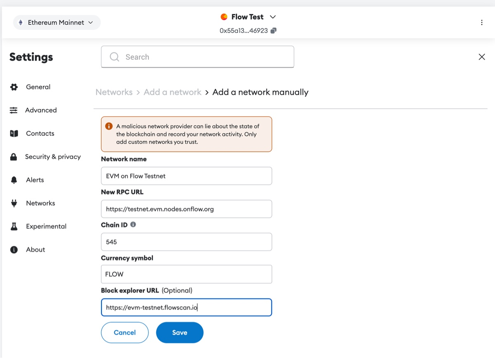
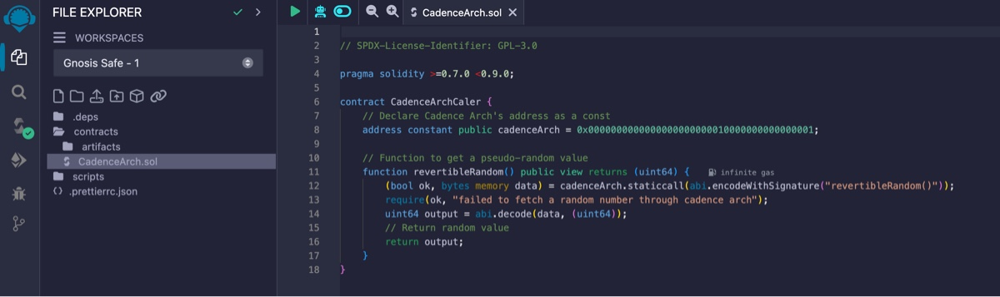
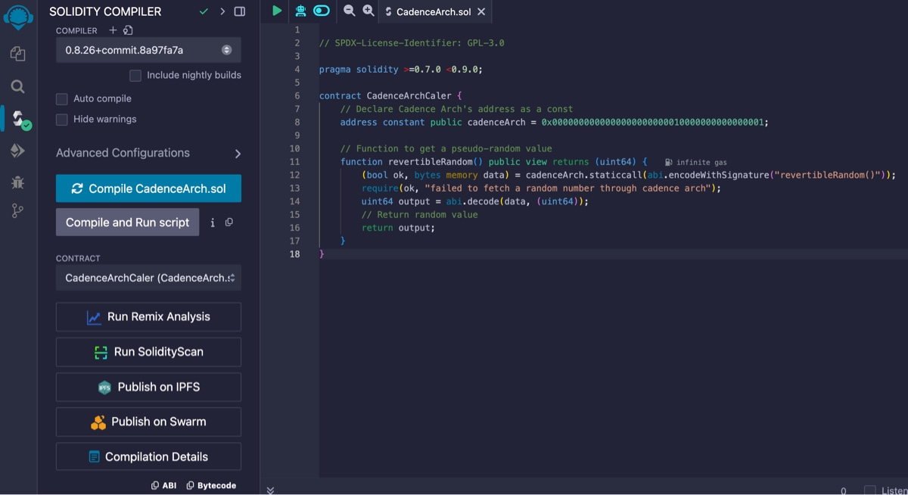
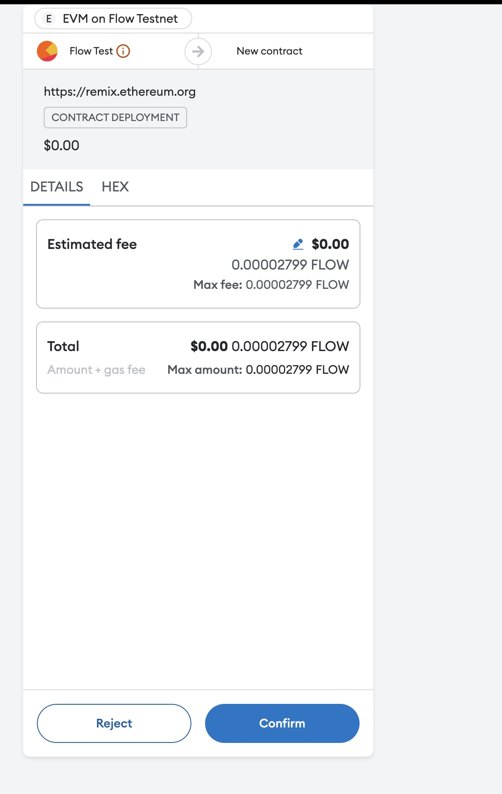
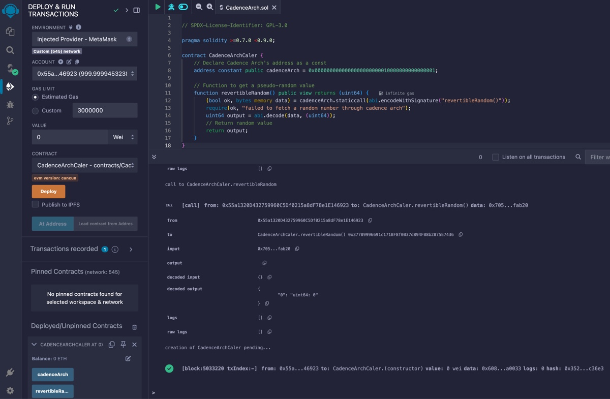
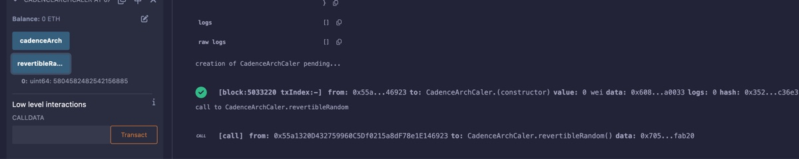

## **Introduction**

Flow provides secure, native on-chain randomness that developers can leverage through Cadence Arch, a precompiled contract available on the Flow EVM environment. This guide will walk through how Solidity developers can use Cadence Arch to access Flow’s verifiable randomness using Solidity.

### **What is Cadence Arch?**

[Cadence Arch](https://github.com/onflow/flips/blob/main/protocol/20231116-evm-support.md#cadence-arch) is a precompiled smart contract that allows Solidity developers on Flow EVM to interact with Flow’s randomness and other network features like block height. This contract can be accessed using its specific address, and Solidity developers can make static calls to retrieve random values and other information.

---

## **Prerequisites**

- Basic Solidity knowledge.
- Installed Metamask extension.
- Remix IDE for compilation and deployment.
- Flow EVM Testnet setup in Metamask.

## **Network Information for Flow EVM**

| **Parameter**       | **Value**                                                                     |
| ------------------- | ----------------------------------------------------------------------------- |
| **Network Name**    | EVM on Flow Testnet                                                           |
| **RPC Endpoint**    | [https://testnet.evm.nodes.onflow.org](https://testnet.evm.nodes.onflow.org/) |
| **Chain ID**        | 545                                                                           |
| **Currency Symbol** | FLOW                                                                          |
| **Block Explorer**  | [https://evm-testnet.flowscan.io](https://evm-testnet.flowscan.io/)           |

## **Steps to Connect Flow EVM Testnet to Metamask**

1. Open Metamask and click **Networks** -> **Add Network**.
2. Enter the following details:
   - **Network Name**: EVM on Flow Testnet
   - **RPC URL**: `https://testnet.evm.nodes.onflow.org`
   - **Chain ID**: `545`
   - **Currency Symbol**: `FLOW`
   - **Block Explorer**: `https://evm-testnet.flowscan.io`
3. Click **Save** and switch to the Flow EVM Testnet.



## **Obtaining FLOW for Testnet**

You can fund your account with testnet FLOW using the [Flow Faucet](https://testnet-faucet.onflow.org/fund-account). Enter your Flow-EVM testnet address, and you’ll receive testnet FLOW tokens to interact with smart contracts.

---

## **Solidity Code Example: Retrieving Random Numbers**

Below is a simple Solidity contract that interacts with the Cadence Arch contract to retrieve a pseudo-random number.

```solidity
// SPDX-License-Identifier: GPL-3.0
pragma solidity >=0.7.0 <0.9.0;

contract CadenceArchCaller {
    // Address of the Cadence Arch contract
    address constant public cadenceArch = 0x0000000000000000000000010000000000000001;

    // Function to fetch a pseudo-random value
    function revertibleRandom() public view returns (uint64) {
        // Static call to the Cadence Arch contract's revertibleRandom function
        (bool ok, bytes memory data) = cadenceArch.staticcall(abi.encodeWithSignature("revertibleRandom()"));
        require(ok, "Failed to fetch a random number through Cadence Arch");
        uint64 output = abi.decode(data, (uint64));
        // Return the random value
        return output;
    }
}

```

### **Explanation of the Contract**

1. **Cadence Arch Address**:

   The `cadenceArch` variable stores the address of the Cadence Arch precompiled contract (`0x0000000000000000000000010000000000000001`), which is constant across Flow EVM.

2. **Revertible Random**:

   The `revertibleRandom()` function makes a static call to the `revertibleRandom()` function to fetch a pseudo-random number. If the call is successful, it decodes the result as a `uint64` random value.

---

## **Deploying and Testing the Contract**

### Compile and Deploy the Contract

1. Open Remix IDE.
2. Create a new file and paste the Solidity code above.



3. Compile the contract by selecting the appropriate Solidity compiler version (0.8.x).



4. Connect Remix to your Metamask wallet (with Flow EVM testnet) by selecting **Injected Web3** as the environment.



5. Deploy the contract.



### Call revertibleRandom

After deployment, you can interact with the contract to retrieve a random number.

Call the `revertibleRandom()` function in the left sidebar on the deployed contract. This will fetch a pseudo-random number generated by Flow’s secure PRG (Pseudorandom Generator).



The result will be a `uint64` random number generated on Flow EVM.

---

## **Generating Random Numbers in a Range**

For use-cases like games and lotteries, it’s useful to generate a random number within a specified range, the following example shows how to get a value between a min and max number.

```solidity
// SPDX-License-Identifier: GPL-3.0
pragma solidity >=0.7.0 <0.9.0;

contract RandomInRange {
address constant public cadenceArch = 0x0000000000000000000000010000000000000001;

// Generate a random number between min and max
function getRandomInRange(uint64 min, uint64 max) public view returns (uint64) {
    // Static call to the Cadence Arch contract's revertibleRandom function
    (bool ok, bytes memory data) = cadenceArch.staticcall(abi.encodeWithSignature("revertibleRandom()"));
    require(ok, "Failed to fetch a random number through Cadence Arch");
    uint64 randomNumber = abi.decode(data, (uint64));

    // Return the number in the specified range
    return (randomNumber % (max + 1 - min)) + min;
	}
}
```

## **Secure Randomness with Commit-Reveal Scheme in Solidity**

The **`revertibleRandom()`** function can be directly used to generate a pseudo-random number. However, in certain situations, especially involving untrusted users, this function exposes a vulnerability: the ability of a transaction to **revert after seeing the random result**.

**The Issue with Using `revertibleRandom()` Directly:**

- When an untrusted party calls a contract function that uses `revertibleRandom()`, they receive the random number **during the transaction execution**.
- **Post-selection** is the ability of the caller to abort the transaction if the random outcome is unfavorable. In this case, the user could choose to revert the transaction (for example, if they lose a bet) and attempt to call the function again in hopes of a better outcome.
- This can lead to a form of **transaction reversion attack**, where the randomness can be exploited to repeatedly attempt transactions until a favorable result is obtained.

**Example Attack Scenario**:

Consider a decentralized coin toss using `revertibleRandom()`:

- A malicious user could interact with the smart contract and immediately check whether they won.
- If they lost the bet, they could programmatically revert the transaction before it is finalized.
- This allows the user to retry and reattempt the random process multiple times until they win, undermining the fairness of the system.

**Time-Locked Randomness with Commit-Reveal**

The **commit-reveal scheme** solves the post-selection problem by splitting the random process into two phases:

1. **Commit Phase**: The user commits to a hidden guess (via a hash of their guess and a nonce) **before** the randomness is revealed. This locks the user into their guess without revealing it to the smart contract or anyone else.
2. **Reveal Phase**: After the randomness is securely generated and made public (e.g., using `revertibleRandom()` or another source), the user can then reveal their guess and nonce to complete the process.

**Why This Is More Secure**

- **No Post-Selection**: In the commit phase, the user cannot manipulate the random number because they are committed to their bet or action without knowing the outcome. Once they’ve committed, they are locked into their choice.
- **Time Delay Between Commitment and Reveal**: By forcing the randomness to be generated after the commitment is made, users cannot use any immediate information about the random number to influence their decision.
- **Immutable Commitment**: The use of a cryptographic hash (such as SHA-256) ensures that the user cannot change their guess after seeing the randomness. They must reveal the exact nonce and guess used during the commitment phase to verify the validity of their reveal.

### **Commit-Reveal Scheme Example for a Random Coin Toss**

Here is a Solidity implementation of a coin toss game using a secure commit-reveal scheme, where participants bet on the outcome (heads or tails), and randomness is fetched from the **Cadence Arch** contract.

```solidity
// SPDX-License-Identifier: GPL-3.0
pragma solidity >=0.7.0 <0.9.0;

contract SecureCoinToss {
    address constant public cadenceArch = 0x0000000000000000000000010000000000000001;

    struct Bet {
        uint256 amount;
        bytes32 commitment;
        bool revealed;
        uint64 result;
    }

    mapping(address => Bet) public bets;

    // Step 1: Commit the bet by submitting a hash (commit phase)
    function commitBet(bytes32 commitment) public payable {
        require(msg.value > 0, "Bet amount must be greater than zero");
        require(bets[msg.sender].amount == 0, "Already committed a bet");

        bets[msg.sender] = Bet({
            amount: msg.value,
            commitment: commitment,
            revealed: false,
            result: 0
        });
    }

    // Step 2: Reveal the bet by providing the preimage (reveal phase)
    function revealBet(uint64 nonce, uint64 guess) public {
        Bet storage bet = bets[msg.sender];
        require(bet.amount > 0, "No bet to reveal");
        require(!bet.revealed, "Bet already revealed");

        // Check that the commitment matches the hash
        require(keccak256(abi.encodePacked(nonce, guess)) == bet.commitment, "Invalid commitment");

        // Fetch a secure random number from Cadence Arch
        (bool ok, bytes memory data) = cadenceArch.staticcall(abi.encodeWithSignature("revertibleRandom()"));
        require(ok, "Failed to fetch a random number");
        uint64 randomNumber = abi.decode(data, (uint64));

        // Determine the result (0 = loss, 1 = win)
        bet.result = randomNumber % 2;
        bet.revealed = true;

        // Pay the winner double the bet amount if they won
        if (bet.result == guess) {
            payable(msg.sender).transfer(bet.amount * 2);
        }
    }

    // To reset and clean up after the reveal
    function resetBet() public {
        require(bets[msg.sender].revealed, "Bet not yet revealed");
        delete bets[msg.sender];
    }

    // Helper function to generate the commitment hash (off-chain or in Remix)
    function getHash(uint64 nonce, uint64 guess) public pure returns (bytes32) {
        return keccak256(abi.encodePacked(nonce, guess));
    }
}

```

---

### **Steps to Interact With the Coin Toss Contract**

**Step 1: Commit Phase**

You need to generate a **commitment hash** from a nonce (random number) and your guess (0 for heads, 1 for tails).

1. Call the `getHash` function to generate the commitment hash:

   ```solidity
   getHash(12345, 1);  // nonce: 12345, guess: 1 (tails)
   ```

   Example Output: `0x5f5766a7a5d18bb9a9c3040a7b672c5c8f4860018ebd5a11f1678f11f2326c44`.

2. Call **`commitBet(bytes32 commitment)`**:
   - Input the generated commitment hash into the **commitBet** function.
   - Enter the amount of **FLOW** to bet in the **Value input box** in Remix.
   - Example: Enter `1` to bet **1 FLOW**.

**Step 2: Reveal Phase**

1. Call **`revealBet(uint64 nonce, uint64 guess)`** to reveal your bet:

   ```solidity
   revealBet(12345, 1);  // nonce: 12345, guess: 1 (tails)
   ```

2. The contract will fetch a secure random number from **Cadence Arch** and determine whether you won or lost based on the outcome (0 for heads, 1 for tails).

## Read More

For further details on Flow’s randomness and secure development practices, check out the [Flow Randomness Documentation](https://developers.flow.com/build/advanced-concepts/randomness).

_This documentation was contributed by Noah Naizir, a community developer._
