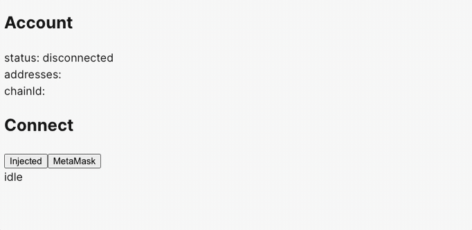
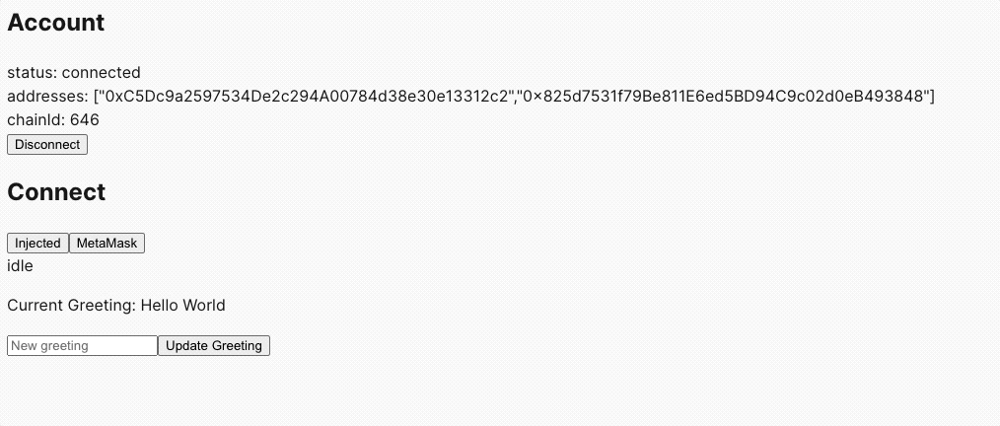

:::info
Make sure to use `viem` version `2.9.6` or greater. This version contains flow EVM networks
:::

# Using viem

Flow networks have been added to viem chain definitions [viem networks](https://github.com/wevm/viem/tree/main/src/chains/definitions). This allows for convenient flow network configuration when using viem and wagmi.

## Viem Flow Config

The configuration below uses Flow Testnet. Since this configuration is already in viem various properties are already set, like block explorer and json-rpc endpoint. See how this configuration is used in a nextjs wagmi web application below.

```javascript
import { http, createConfig } from '@wagmi/core';
import { flowTestnet } from '@wagmi/core/chains';
import { injected } from '@wagmi/connectors';

export const config = createConfig({
  chains: [flowTestnet],
  connectors: [injected()],
  transports: {
    [flowTestnet.id]: http(),
  },
});
```

# Using Next.js and Wagmi

This tutorial will guide you through creating a simple web application, connect to an EVM capable wallet and interact with the "HelloWorld" smart contract to get and set greetings. We will not dive into managing transactions.

## Prerequisites

- Node.js installed on your machine
- A code editor (e.g., Visual Studio Code)
- Basic knowledge of React and Next.js

## Step 1: Setting Up the Next.js Project

This tutorial will be following [Wagmi getting-started manual tutorial](https://wagmi.sh/react/getting-started)
First, let's create a Wagmi project named `flow-evm-wagmi`. We will use npm but you are welcome to use yarn or bun.

```bash
npm create wagmi@latest

# project name flow-evm-wagmi
# Select 'React' then 'next'

```

After Wagmi automatic installation procedure.

```bash
cd flow-evm-wagmi
npm install
```

## Step 2: Configuring Wagmi and Connecting the Wallet

Make sure you have Metamask installed and Flow network configured. [Metamask and Flow blockchain](/evm/using).
Wagmi needs to know what networks to be aware of. Let's configure to use Flow Testnet by updating config.ts file with the following:

```javascript
import { http, createConfig } from '@wagmi/core';
import { flowTestnet } from '@wagmi/core/chains';
import { injected } from '@wagmi/connectors';

export const config = createConfig({
  chains: [flowTestnet],
  connectors: [injected()],
  transports: {
    [flowTestnet.id]: http(),
  },
});
```

By default Wagmi configures many wallets, MetaMask, Coinbase Wallet, and WalletConnect as wallet providers. Above we simplify the code to only be interested in the Injected Provider, which we are interested in Metamask. Verify `page.tsx` code looks like the following.

```javascript
'use client'

import { useAccount, useConnect, useDisconnect } from 'wagmi'

function App() {
  const account = useAccount()
  const { connectors, connect, status, error } = useConnect()
  const { disconnect } = useDisconnect()

  return (
    <>
      <div>
        <h2>Account</h2>

        <div>
          status: {account.status}
          <br />
          addresses: {JSON.stringify(account.addresses)}
          <br />
          chainId: {account.chainId}
        </div>

        {account.status === 'connected' && (
          <button type="button" onClick={() => disconnect()}>
            Disconnect
          </button>
        )}
      </div>

      <div>
        <h2>Connect</h2>
        {connectors.map((connector) => (
          <button
            key={connector.uid}
            onClick={() => connect({ connector })}
            type="button"
          >
            {connector.name}
          </button>
        ))}
        <div>{status}</div>
        <div>{error?.message}</div>
      </div>
    </>
  )
}

export default App

```



This step relies on an already deployed HelloWorld contract. See [Using Remix](./remix.md) to deploy a smart contract on flow evm blockchain.
Create or edit the simple `page.tsx` file in the app directory to have better styles, that's beyond this tutorial. We will modify `page.txs` to add a new `HelloWorld.tsx`. Replace `YOUR_CONTRACT_ADDRESS` with your deployed address.

## Step 3: Creating the Interface for HelloWorld Contract

Now, let's create a component to interact with the HelloWorld contract. Assume your contract is already deployed, and you have its address and ABI.

- Create a new file, HelloWorld.ts, in the components directory.
- Use Wagmi's hooks to read from and write to the smart contract:

```javascript
import { useState } from 'react';
import {
  useContractRead,
  useContractWrite,
  useAccount,
  useConnect,
} from 'wagmi';
import contractABI from './HelloWorldABI.json'; // Import your contract's ABI

const contractAddress = 'YOUR_CONTRACT_ADDRESS';

const HelloWorld = () => {
  const [newGreeting, setNewGreeting] = useState('');
  const { address, isConnected } = useAccount();
  const { connect } = useConnect();

  const { data: greeting } = useContractRead({
    addressOrName: contractAddress,
    contractInterface: contractABI,
    functionName: 'hello',
  });

  const { write: changeGreeting } = useContractWrite({
    addressOrName: contractAddress,
    contractInterface: contractABI,
    functionName: 'changeGreeting',
    args: [newGreeting],
  });

  if (!isConnected) {
    return <button onClick={() => connect()}>Connect Wallet</button>;
  }

  return (
    <div>
      <p>Current Greeting: {greeting}</p>
      <input
        value={newGreeting}
        onChange={(e) => setNewGreeting(e.target.value)}
        placeholder="New greeting"
      />
      <button onClick={() => changeGreeting()}>Update Greeting</button>
    </div>
  );
};

export default HelloWorld;
```

Reminder: aReplace YOUR_CONTRACT_ADDRESS with the actual address of your deployed HelloWorld contract.

Also notice you need the HelloWorld contract ABI, save this to a new file called `HelloWorld.json` in the app directory.

```json
{
  "abi": [
    {
      "inputs": [],
      "stateMutability": "nonpayable",
      "type": "constructor"
    },
    {
      "inputs": [
        {
          "internalType": "string",
          "name": "newGreeting",
          "type": "string"
        }
      ],
      "name": "changeGreeting",
      "outputs": [],
      "stateMutability": "nonpayable",
      "type": "function"
    },
    {
      "inputs": [],
      "name": "greeting",
      "outputs": [
        {
          "internalType": "string",
          "name": "",
          "type": "string"
        }
      ],
      "stateMutability": "view",
      "type": "function"
    },
    {
      "inputs": [],
      "name": "hello",
      "outputs": [
        {
          "internalType": "string",
          "name": "",
          "type": "string"
        }
      ],
      "stateMutability": "view",
      "type": "function"
    }
  ]
}
```

## Step 4: Integrating the HelloWorld Component

Finally, import and use the HelloWorld component in your `pages.tsx`, throw it at the bottom of the render section.

```javascript
import HelloWorld from './helloWorld'

 // put at the bottom of the Connect section.
     <div>
        <h2>Connect</h2>
        {connectors.map((connector) => (
          <button
            key={connector.uid}
            onClick={() => connect({ connector })}
            type="button"
          >
            {connector.name}
          </button>
        ))}
        <div>{status}</div>
        <div>{error?.message}</div>
      </div>

    // 👇👇👇👇👇👇👇👇👇👇👇
    <div>
      <HelloWorld />
    </div>

```

Now, you have a functional App that can connect to Metamask, display the current greeting from the "HelloWorld" smart contract, and update the greeting.

Test it by updating the greeting, signing a transaction in your Metamask then wait a minute then refresh the website. Handling transactions are outside of this tutorial. We'll leave that as a future task. [Checkout Wagmi documentation](https://wagmi.sh/react/getting-started)


