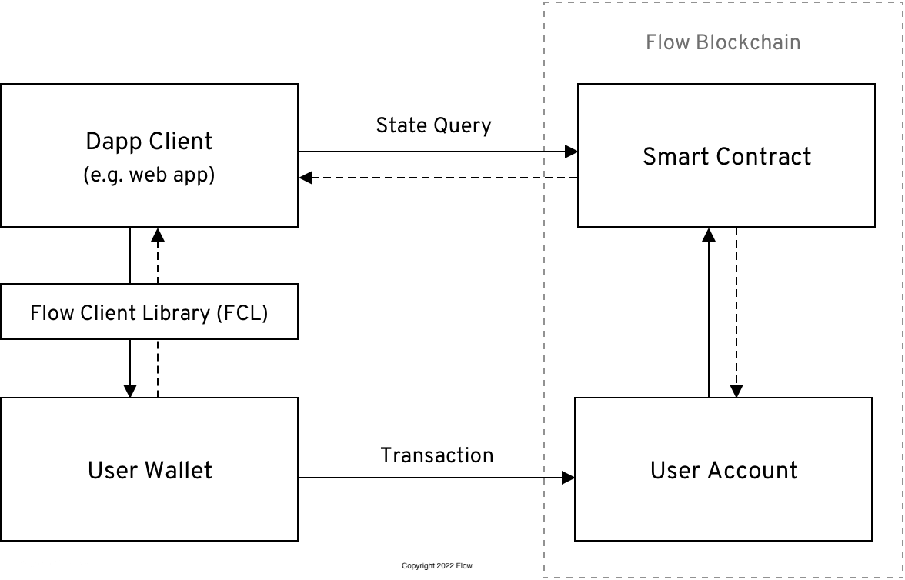
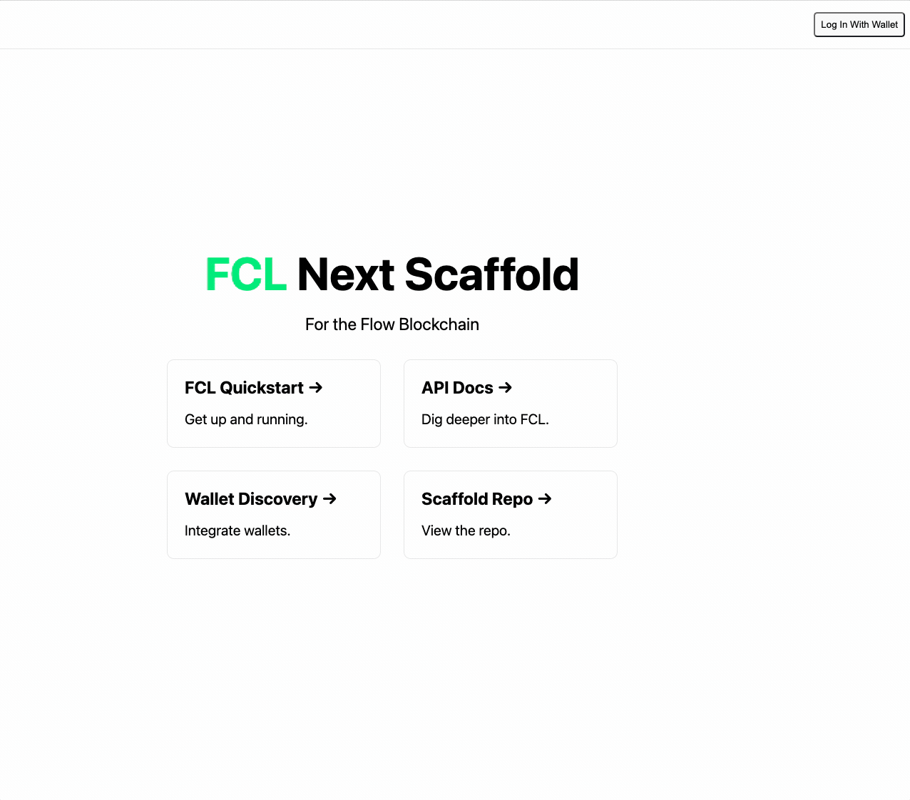
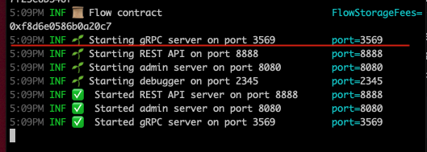
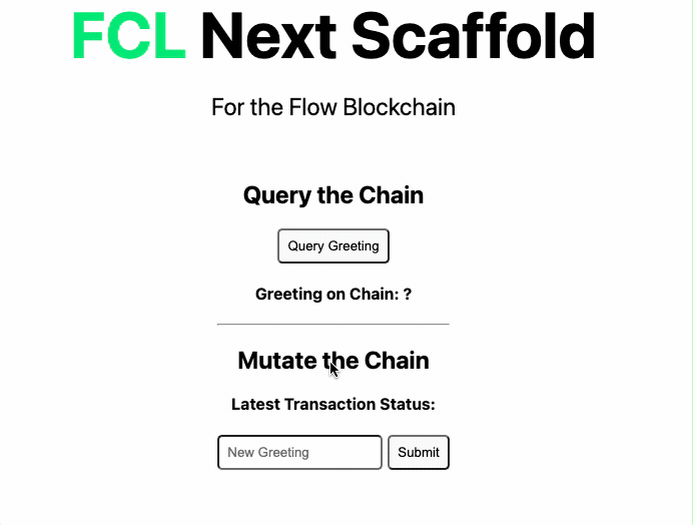
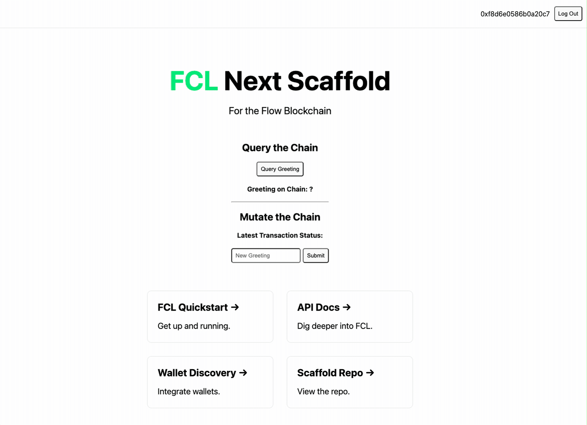

# Flow App Quickstart

---

This guide is a simple walkthrough to get started building a web3 dapp using the Flow Client Library (FCL).

<Callout type="info">
 If you are looking for a scalfolds, check out [scaffolds availabe in the Flow CLI](../tooling/flow-cli/super-commands.md#using-scaffolds).
</Callout>

## Video Walkthrough

This simple guide uses the "Hello World" scaffold, it is meant to provide all the code needed to get a web application up and running.


## Before You Start

Make sure you have Flow CLI installed. [installation instructions](../tooling/flow-cli/install.md).

## Introduction



<Callout type="info">
FCL (aka Flow Client Library) wraps the logic needed to communicate with the flow blockchain. It's a npm package, [More Information](../tooling/fcl-js)
</Callout>

This guide assumes a good understanding of React. The concepts are easy to understand and apply to other libraries and framework. A strong understanding of Cadence (Flow's smart contract language) is not required. More information on Cadence, [learning the Cadence language](../cadence/intro.md).

This guide will interact with an existing smart contract on Flow's testnet known as the [Profile Contract](https://testnet.flowscan.org/contract/A.ba1132bc08f82fe2.Profile). This contract will create a new profile and edit the profile information. 

### FCL concepts covered:

- [Installation](#installation)
- [Configuration](#configuration)
- [Authentication](#authentication)
- [Querying the Blockchain](#querying-the-blockchain)
- [Initializing an Account](#initializing-an-account)
- [Mutating the Blockchain](#mutating-the-blockchain)

For more help, [Discord](https://discord.gg/flow). See links at the end of this article for diving deeper into building on Flow.

## Installation

The first step is to generate a React app using Next.js and [create-next-app](https://nextjs.org/docs/api-reference/create-next-app). From your terminal, run the following:

```sh
npx create-next-app@latest flow-app
cd flow-app
```

## Configuration

### Setting up Flow

Using the Flow CLI scaffold, create a basic hello world web project. This will create a new `flow.json` file in the hello-world folder. This file will contain the Flow configuration for your project.

```sh
 flow setup hello-world --scaffold
 # select scaffold 5
 cd hello-world
 npm install
```

We don't recommend keeping private keys in your `flow.json`, notice that flow cli already moved the emulator private key to a `emulator.key` file and point to it using the [key/location pattern](/tooling/flow-cli/flow.json/security.md#private-account-configuration-file). This file should be added to your .gitignore file, so it won't be committed to your repository. 

We won't be using emulator and running contracts locally in this quickstart, but FCL will complain if it finds private keys in your `flow.json` file.

Your `flow.json` file should look like this:

```
{
	"networks": {
		"emulator": "127.0.0.1:3569",
		"mainnet": "access.mainnet.nodes.onflow.org:9000",
		"sandboxnet": "access.sandboxnet.nodes.onflow.org:9000",
		"testnet": "access.devnet.nodes.onflow.org:9000"
	},
	"accounts": {
		"emulator-account": {
			"address": "f8d6e0586b0a20c7",
			"key": {
				"type": "file",
				"location": "./emulator.key"
			}
		}
	}
}
```

<Callout type="info">
The flow.json file is used to keep track of deployed contracts and accounts. [More Information](../tooling/fcl-js/api#using-flowjson)
</Callout>


### Configuring FCL

Next, notice @onflow/fcl has been added to the package.json and the web application is read to be run. 

<Callout type="info">
There are a lot of benefits to getting familiar with existing Flow CLI scaffolds. For example the hello-world scaffold already has fcl configuration settings to run on local emulator. 
</Callout>


The `hello-world` web application comes with convenience npm commands to facilitate a quick start. The following command will preform: 
 1. Start emulator
 2. Start dev wallet
 3. Start web app

<Callout type="info">
Emulator is a local blockchain [More Information](../tooling/emulator). Emulator has all the features as testnet and mainnet blockchains 
</Callout>

```sh
npm run dev:local
```

Now that your app is running. FYI, fcl loads the configuration in `config/fcl.ts` This file contains configuration information for FCL, such as what Access Node and wallet discovery endpoint and which network to use (e.g. testnet or a local emulator). 

The `accessNode.api` key specifies the address of a Flow access node. There are publically available access nodes, but have to rate limit. Alternatively, applications might want to run an Observer node [Run a Node](./runningNode.mdx).
`discovery.wallet` is an address that points to a service that lists FCL compatible wallets. Flow's FCL Discovery service is a service that FCL wallet providers can be added to, and be made 'discoverable' to any application that uses the `discovery.wallet` endpoint.

Also, notice that package.json uses `NEXT_PUBLIC_FLOW_NETWORK=local` for `dev` command, this is used to set the network in `config/fcl.ts`.
<Callout type="info">
Learn more about [configuring Discovery](/tooling/fcl-js/discovery.mdx) or [setting configuration values](/tooling/fcl-js/api.md#setting-configuration-values).
</Callout>


The main page for Next.js apps is located in `pages/index.js`. So let's finish configuring our dapp by going in the `pages/` directory and importing the config file into the top of our `index.js` file. We'll then swap out the default component in `index.js` to look like this:

```jsx
import Head from 'next/head'
import styles from '../styles/Home.module.css'
import Links from '../components/Links'
import Container from '../components/Container'
import useCurrentUser from '../hooks/useCurrentUser'

export default function Home() {
  const { loggedIn } = useCurrentUser()

  return (
    <div className={styles.container}>

      <Head>
        <title>FCL Next Scaffold</title>
        <meta name="description" content="FCL Next Scaffold for the Flow Blockchain" />
        <link rel="icon" href="/favicon.ico" />
      </Head>

      <main className={styles.main}>
        <h1 className={styles.title}>
          <a href="https://developers.flow.com/tools/fcl-js">FCL</a> Next Scaffold
        </h1>

        <p className={styles.description}>
          For the Flow Blockchain
        </p>

        {loggedIn && <Container />}

        <Links />

      </main>
    </div>
  )
}


```

Now we're ready to start talking to Flow! 
<Callout type="warning">
The web app will run but there are no contracts deployed to local emulator. This is a step in `Querying the Blockchain` section. 
</Callout>

## Authentication



Note: in above code `useCurrentUser` is used to determine if there is a user logged in. 

There are two methods to allow the user to login. `fcl.logIn()` or `fcl.authenticate()` [More Information on, authenticate](../tooling/fcl-js/api#authenticate)

In `components/Navbar.tsx` a button wires up the authentication method `fcl.authenticate()`. It is used to bring up the list of supported wallets. See below

Once authenticated, FCL has a hook  `const user = useCurrentUser()` to get the user data, when user is signed in `loggedIn` is true. For more information on the `currentUser`, read more [here](/tooling/fcl-js/api.md#current-user).

```jsx
import Head from 'next/head'import * as fcl from '@onflow/fcl'
import useCurrentUser from '../hooks/useCurrentUser'
import navbarStyles from '../styles/Navbar.module.css'
import elementStyles from '../styles/Elements.module.css'

export default function Navbar() {
  const user = useCurrentUser()

  return (
    <div className={navbarStyles.navbar}>
      {!user.loggedIn && 
        <button 
          onClick={fcl.authenticate} 
          className={elementStyles.button}>
          Log In With Wallet
        </button>
      }
      {user.loggedIn && 
        (
          <>
            <div className={navbarStyles.address}>{ user?.addr }</div>
            <button 
              onClick={fcl.unauthenticate} 
              className={elementStyles.button}>
              Log Out
            </button>
          </>
        )
      }
    </div>
  )
}

```

You should now be able to log in or sign up a user and unauthenticate them. Upon logging in or signing up your users will see a popup where they can choose between wallet providers. Choose the `dev wallet` to use the same account that deployed the `HelloWorld` contract, this is needed for mutation. Upon completing authentication, you'll see the component change and the user's wallet address appear on the screen if you've completed this properly.

<Callout type="info">
More on wallets, [Lilico wallet](https://lilico.app/) is a flow wallet. [Flow Wallets](../tooling/wallets)
</Callout>

## Deploying project contracts

Hello World scaffold does come with a Cadence contract. You will notice `HelloWorld.cdc` has been deployed when running `npm run dev:local`. Look at hello-world package.json to see the commands that get run, `flow dev` deploys contracts.
In the `flow.json` make sure the emulator endpoint is correct. Look at the terminal the emulator is running, 



1. Make sure the emulator is using the same port as `gRPC` and 
2. Configure `deployment` to add mapping of contract to account. 
```json
  ...
	"networks": {
		"emulator": "127.0.0.1:3569",
    ...
  },
	"deployments": {
		"emulator": {
			"default": [
				"HelloWorld"
			]
		}	
}	

```

Verify that `flow.json` updates with HelloWorld contract information, `contracts` has the `HelloWorld` contract and `deployments` shows that `HelloWorld` has been deployed.


```json
{
	"contracts": {
		"HelloWorld": "cadence/contracts/HelloWorld.cdc"
	},
	"networks": {
		"emulator": "127.0.0.1:3569",
		"mainnet": "access.mainnet.nodes.onflow.org:9000",
		"testnet": "access.devnet.nodes.onflow.org:9000"
	},
	"accounts": {
		"default": {
			"address": "01cf0e2f2f715450",
			"key": "..."
		},
		"emulator-account": {
			"address": "f8d6e0586b0a20c7",
			"key": {
				"type": "file",
				"location": "./emulator.key"
			}
		}
	},
	"deployments": {
		"emulator": {
			"default": [
				"HelloWorld"
			]
		}
	}
}
```

## Query Flow Contract

Now that all pieces are in place. UI can query `HelloWorld` contract.





The script that queries the Hello World contract is located `hello-world/cadence/scripts/ReadHelloWorld.cdc`

```cadence
import "HelloWorld"

pub fun main(): String {
  return HelloWorld.greeting
}
```

In `components/Container.tsx` file, `fcl.query` is used to set the Cadence script and query the contract.

```jsx

  const queryChain = async () => {
    const res = await fcl.query({
      cadence: ReadHelloWorld
    })

    setChainGreeting(res)
  }
```

It is that simple!

## Mutating the Blockchain

Update the `HelloWorld` contract greeting. Notice that Greeting gets changed when the transaction gets processed.




In `components/Container.tsx` file, the `mutateGreeting` method `fcl.mutate` sends UpdateHelloWorld cadence which triggers a transaction that the user signs.

```javascript
 const mutateGreeting = async (event) => {
    event.preventDefault()

    if (!userGreetingInput.length) {
      throw new Error('Please add a new greeting string.')
    }

    const transactionId = await fcl.mutate({
      cadence: UpdateHelloWorld,
      args: (arg, t) => [arg(userGreetingInput, t.String)],
    })

    setLastTransactionId(transactionId)
  }

```

This guide covers flow-cli commands that make deploying contracts simple and using `fcl` to querying and mutating a contract. 

## More information

That's it! You now have a shippable Flow dapp that can auth, query, init accounts, and mutate the chain. This is just the beginning. There is so much more to know. Next steps:

**Cadence**
- [Cadence Playground Tutorials](/cadence/tutorial/01-first-steps.mdx)
- [Cadence Hello World Video](https://www.youtube.com/watch?v=pRz7EzrWchs)
- [Why Cadence?](https://www.onflow.org/post/flow-blockchain-cadence-programming-language-resources-assets)

**FCL Scaffolds**
- [FCL Next TypeScript Scaffold](https://github.com/chasefleming/fcl-next-scaffold)
- [FCL React Native Scaffold](https://github.com/jribbink/fcl-react-native-scaffold)

**Full Stack NFT Marketplace Example**
- [Beginner Example: CryptoDappy](https://github.com/bebner/crypto-dappy)
- [Advanced Example: Kitty Items](https://github.com/onflow/kitty-items)

**More FCL**
- [FCL API Quick Reference](/tooling/fcl-js/api)
- [More on Scripts](/tooling/fcl-js/scripts.mdx)
- [More on Transactions](/tooling/fcl-js/transactions.mdx)
- [User Signatures](/tooling/fcl-js/user-signatures.mdx)
- [Proving Account Ownership](/tooling/fcl-js/proving-authentication.mdx)

**Other**
- [Flow Developer Onboarding Guide](/tutorials/intro.md)
