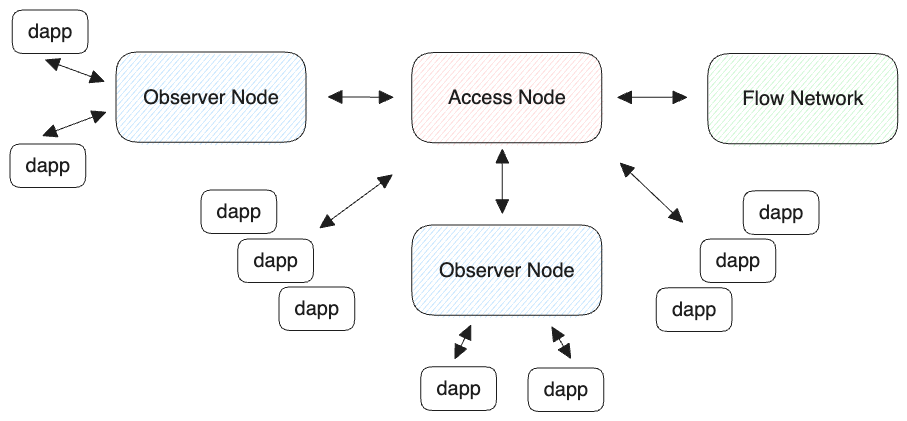

# Running an Observer Node

There are community access nodes available to use, but they are rate limited. Alternative to an Access node, anyone can run their own observer node. This is a good option if you want to have untrottled access to current flow blockchain data.

## Setup

First make sure your node has the needed resources, here are the requirements, as per the [Observer Node Documentation](../concepts/nodes/node-operation/observer-node#running-an-observer-node) 

## Running

For highly used dapps with lots of user activity, it might be necessary to run your own observer node. Here are the step by step instructions to [run an observer node](../concepts/nodes/node-operation/observer-node#steps-to-run-an-observer-node). The benefit is that you don't have to stake FLOW and you don't have to register your node. Also, already mentioned you have untrottled access to the blockchain data.

<Callout type="info">
Observer nodes does not need to be staked. Transactions are relayed to an access node upstream.
</Callout>

