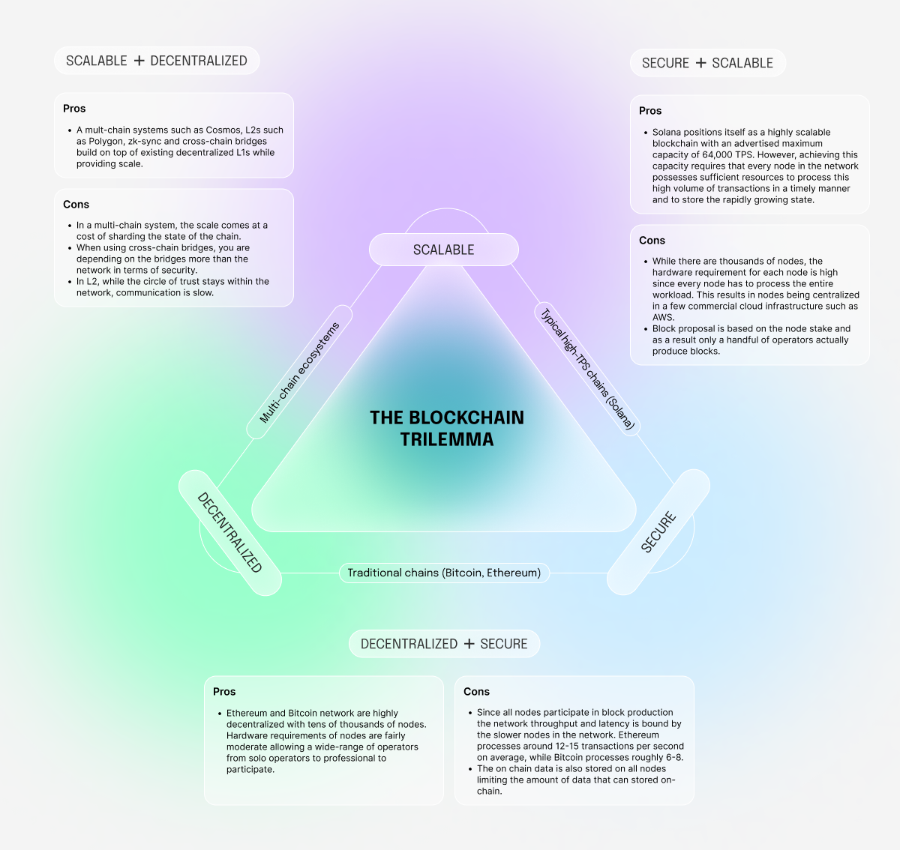

# What are the three biggest problems with blockchains?

## 1. The blockchain trilemma

A blockchain should be fully decentralized, highly scalable and extremely secure. However a well-known problem with all blockchain is the blockchain trilemma - optimizing for any one edge comes at the cost of the other two.

You can have a chain that is decentralized and secure but not scalable e.g. Bitcoin and Ethereum or you can have a chain that is scalable and secure but not as decentralized e.g. Solana, Aptos and Sui.
While multi-chain systems like Cosmos, Layer 2 solutions (L2s) like Polygon, and cross-chain bridges offer innovative approaches to address these challenges, they divide the trust into separate and independent security zones and such zones with fewer validators can be more vulnerable to attacks and therefore less secure.

## 2. Disadvantaging end-users
Most blockchains, regardless of the number of participating nodes, inherently disadvantage individual end-users. This is because (colluding) nodes can censor user transactions or unfairly extract value from users in a phenomenon commonly known as Miner Extractable Value [MEV]. As a result, individual end users can end up paying an “invisible tax” or otherwise seeing their transactions fail due to MEV.

## 3. Energy inefficient and unsustainable
It is well established that Proof-of-Work chains like Bitcoin consume massive amounts of energy, require perpetual hardware upgrades for the miners to stay competitive, and are therefore extremely harmful to the environment. A Proof-of-Stake chain’s environmental impact is less severe, but as web3 applications achieve mainstream adoption, every node in these chains will have to provide more and more hardware resources to meet the increasing throughput demand and the ever growing on-chain state. Vertically scaling the nodes implies higher energy consumption and environmental footprint.
