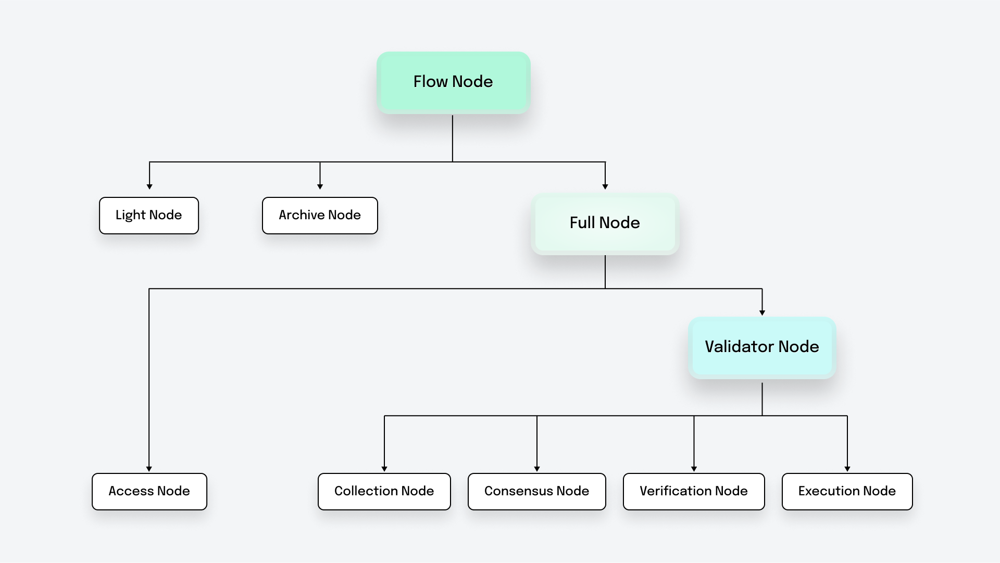

# Hello Node Operator!

Flow nodes are vital components of the Flow blockchain. These nodes are responsible for a variety of network operations to maintain the distributed ledger.

## Why Run a Node?

---

By running your own node, you have direct access to the evolving state of the network, without having to rely on third parties.
This increases privacy and security, reduces reliance on external servers, and helps balance load distribution.
By running a node, you also directly contribute to the security and decentralization of the whole network.

Flow multirole architecture makes it more scalable and provides several node types that you as a node operator can pick and choose from.

## Which Node Should You Run?

---

The different types of nodes are described [here](./node-operation/node-roles.md). As node operator, you can choose to run any of the different types of node that best fits your needs.

The nodes are classified as follows,

## Light Node A.K.A. Observer Node

---

The light node is one of the easiest nodes to spin up and can be run by Dapp developers who need the latest block data available locally, e.g. a wallet application that needs to track the latest block ID and height.
In addition to supporting dapps, an observer node can also be run by access node operators who want to scale their access nodes' endpoints. Access node operators can spin up geographically dispersed observer nodes which can talk to their staked access nodes and to each other.

The observer node is not staked but still provides the same API as the access node.

:::info

To run a light node, follow this [guide](./light-nodes/observer-node.md)

:::

## Full Node

---

In a nutshell, Full Nodes are staked network participants that drive network progress, e.g. by creating and executing new blocks. They are the primary contributors to network safety (all of them validate the correctness of the consensus process and secure the network additionally through their role-specific tasks). In comparison, Light Nodes don't contribute to the networks progress. Though, they help to secure the network by also validating the integrity of the consensus process. 
- The Access node is a full node that serves as an RPC node and acts as a gateway node for the network.
- The Validator node (Collection, Consensus, Verification and Execution) is a full node that plays a role in block generation.

### Access Node

---

If you want local access to the protocol state data (blocks, collections, transactions) and do not want to use one of the community access nodes you can run an access node.
Dapp developers, chain explorers, chain analytics and others who want exclusive access to chain data and not be subject to the rate-limits on the community access node can choose to run an access node.

An access node is minimally staked for network security.
The central goal for Access Nodes is to provide RPC functionality to its node operator.
In comparison, contributing to protocol progress (e.g. routing transactions to collector clusters, relaying blocks to the unstaked peer-to-peer network, etc.) should only take up a marginal fraction an Access Node's computational resources.
Furthermore, Access Node operators can freely rate-limit the amount of resources their Access Node dedicates to supporting the broader ecosystem. Therefore, Access Nodes do not receive staking rewards.

:::info

Launch an access node using QuickNode

[https://www.quicknode.com/chains/flow](https://www.quicknode.com/chains/flow)

:::

:::info

To run a self-hosted access node, follow this [guide](./access-nodes/access-node-setup.md)

:::

:::tip

Alternately, instead of running an access node, you can use the [Flow community](../access-onchain-data/index.md) access nodes or the ones run by any of the other node operators.

:::

### Validator Node

---

You can also be a core participant in running the Flow network and contribute to securing it. Depending on your preference, you could run one or any combination of the following node roles:
- Collection Nodes collaboratively create batches of transactions (in Flow terminology collections).
- Consensus Nodes create blocks, schedule them for asynchronous execution, and commit execution results once they are verified (so called sealing). In addition, they orchestrate the Flow protocol and enforce protocol compliance. 
- Execution Nodes asynchronously execute blocks. They are the power-houses in the protocol, providing the vast computational resources available to Flow transactions. 
- Verification Nodes check the execution results in a distributed manner.

Nodes with these roles are staked and also receive staking rewards.

### Running a Staked Node

---

To run a staked node (node type access, collection, consensus, verification or execution) the node must:
* be registered with sufficient stake
* be authorized by the governance working group

Before proceeding, ensure you have the stake required for your new node and that your node will be authorized by the governance working group (apply [here](https://github.com/onflow/flow-validator)).

To set up a new staked node after it has been authorized by the Flow governance working group, you will need to complete the following steps:

1. [Provision](./node-operation/node-setup.md) the machine on which your node will run.

2. [Generate and register](./node-operation/node-bootstrap.md) your node identity.

3. [Start](./node-operation/node-bootstrap.md#step-3---start-your-flow-node) your node!
