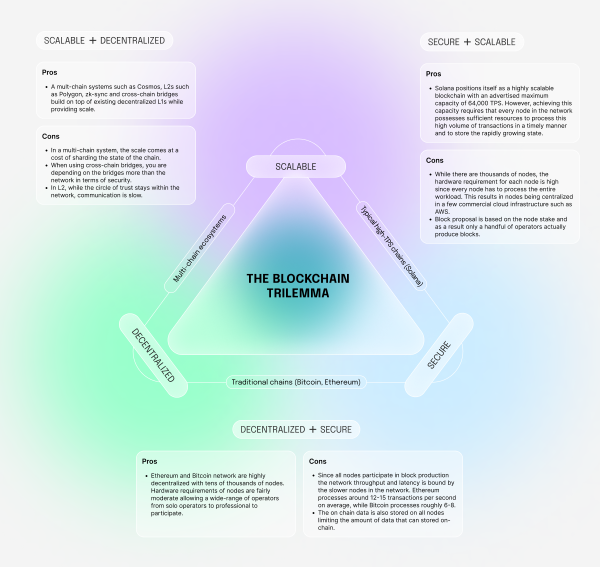
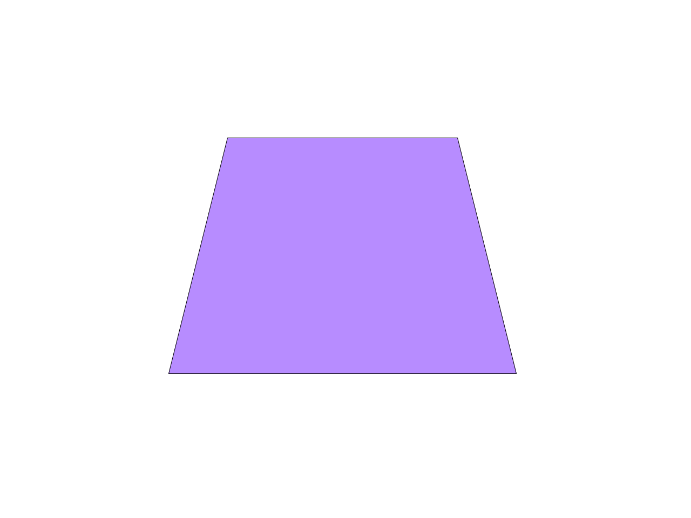

Flow introduces a new paradigm in blockchain architecture - **an [MEV-resistant] modular design** that combines decentralized sequencers, stateless validators, and an execution layer built for **rich atomic composability across complex state**. This novel structure achieves scalability, decentralization, and security - without compromise - ensuring both [user safety] and long-term sustainability.

Flow ships what roll-ups only promise: **a full modular feature-set on a single L1**.

- **Decentralized sequencing** via Consensus + Collector roles - no central bottleneck and [MEV-resistance]
- **Native data availability** - Flow architecture ensures all necessary state data is available within the protocol, allowing nodes to verify state without relying on an external data availability layer
- **Execution / verification split** for lightweight validators, yet one global state for atomic composability
- **Protocol-level [account abstraction]:** multi-key wallets, gas sponsorship, scoped capabilities
- **Dual runtimes:** [EVM equivalence] alongside Cadence, so Solidity and resource-oriented contracts live side-by-side

To appreciate architecture of Flow, it's important to first understand the core challenges in building performant blockchains - and then explore how the Flow **multi-role architecture** addresses them directly.

## What Problems Does the Flow Multi-Role Architecture Solve?

### 1. The Blockchain Trilemma

The blockchain trilemma proposes that networks can only optimize for **two out of three** fundamental properties: **decentralization**, **security**, and **scalability**. For example:

- Bitcoin and Ethereum prioritize decentralization and security, but suffer from scalability limitations.
- Networks like Solana, Aptos, and Sui improve scalability and security, but centralize validator infrastructure, compromising decentralization.

Multi-chain solutions (e.g. Cosmos), Layer 2s (e.g. Optimism), and cross-chain bridges aim to overcome this tradeoff. However, they do so by **splitting trust** across **independent security domains**, often with fewer validators - introducing new attack vectors and lowering security guarantees.

### 2. MEV and End-User Exploitation

Most blockchains inherently expose users to **Maximum (or Miner) Extractable Value (MEV)** - a phenomenon where block proposers reorder or censor transactions to extract value, or third parties manipulate priority fees to insert transactions before and/or after a target transaction. This results in users paying a hidden "invisible tax", experiencing failed transactions, or in extreme cases **having hundreds of thousands of dollars stolen from them**.

Even in large, decentralized networks, MEV can be exploited by colluding actors, creating **unfair outcomes for individual users**.

### 3. Energy Inefficiency and Unsustainable Growth

Proof-of-Work chains like Bitcoin are **energy-intensive** and require constant hardware upgrades to stay viable. While Proof-of-Stake reduces the carbon footprint, it still scales poorly. As usage grows, so does the **onchain state and throughput demand**, requiring validators to **vertically scale** their hardware-leading to greater **centralization pressure** and higher energy consumption.

## Rethinking Blockchain Design

In traditional blockchains like Ethereum and Bitcoin, every full node is responsible for **all aspects of transaction processing**-from validating the full state to executing smart contracts and maintaining history. This ensures security but is inherently inefficient and limits scalability in terms of **throughput** and **data capacity**.

Second-generation blockchains typically address this in one of two ways:

1. **Reduce decentralization** by requiring high-performance hardware (e.g. Solana), or
2. **Increase complexity** by fragmenting the network with techniques like sharding (e.g. Optimism and other L2s).

The first approach risks validator centralization and cartelization. The second shifts the burden to developers, who must manage cross-shard or cross-chain infrastructure - **introducing developer overhead and new failure modes**.

Flow offers a new path: **pipelining** applied to blockchain networks.

### The Flow Alternative: Modular Design and Pipelining

Flow applies pipelining, a proven method from manufacturing and computing, to blockchain consensus and execution.

Rather than making each node perform all duties, Flow splits the responsibilities across **five specialized node roles**.

Every transaction is still validated by the network - but **each node only handles a specific stage**, allowing them to specialize and **optimize for their role**. This specialization unlocks massive gains in **throughput**, **efficiency**, and **scalability** - without sacrificing decentralization or composability.

### Flow Node Roles and What They Do

|                                          |  Node type   | Responsibility                                                                                                                             | What do the nodes of this role do?                                                                                                                              |
| ---------------------------------------- | :----------: | :----------------------------------------------------------------------------------------------------------------------------------------- | --------------------------------------------------------------------------------------------------------------------------------------------------------------- |
|      |  Collection  | Collection nodes act as a censorship-resistant data availability layer, which caches transactions for subsequent execution.                | Collection nodes order transactions into batches known as collection.                                                                                           |
|        |  Consensus   | The consensus committee serves as the security authority in the network and orchestrates the Flow transaction processing pipeline.         | Consensus nodes order collections into blocks and commit execution results after verification.                                                                  |
|        |  Execution   | Execution nodes provide the computational resources for executing transactions and maintaining the state.                                  | Execution nodes execute the transaction and record state changes.                                                                                               |
|  | Verification | Verification nodes ensure that transactions are truthfully executed.                                                                       | Verification nodes verify the work of the execution nodes. They either approve or disagree with their results, reporting their findings to the consensus nodes. |
|              |    Access    | Access Nodes route transactions into the network and replicate (parts of) the state and transaction results for external clients to query. | Access node serve the API calls to send and read data from the chain.                                                                                           |

### Further reading

1. [Primer on multi-role architecture](https://flow.com/primer#primer-multinode)
2. [Technical papers](https://flow.com/technical-paper)
3. [Core protocol vision](https://flow.com/core-protocol-vision)
4. [Medium article from Jan which deep dives into the Flow architecture](https://jan-bernatik.medium.com/introduction-to-flow-blockchain-7532977c8af8)

In the next section, lets look at how Flow multi-role architecture solves those three big problems with blockchains.

[MEV-resistant]: ../../build/cadence/basics/mev-resistance.md
[user safety]: ./user-safety.md
[MEV-resistance]: ../../build/cadence/basics/mev-resistance.md
[account abstraction]: ../../build/cadence/basics/accounts.md
[EVM equivalence]: ../../build/evm/about.md
