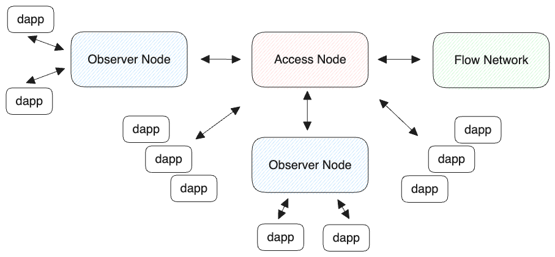

## Node Types
Flow network is made up of many node types. Here is more information on the different [Node Types](./node-operation/node-roles.mdx#collection). For a quick reference here are the types:

| Node Type | Stake Required in FLOW | Permissionless| Description | Running a Node |
| --- | --- | --- | --- | -- |
| Light | Zero | Yes | Best node for application developers that need high throught-put. This node is used to observe the network and get the latest blockchain data. | [Setup](../run-and-secure/node-operation/observer-node.mdx) |
| Archive | Zero | Yes | Scalable and efficient way to access the history of Flow protocol. | [Setup](../run-and-secure/node-operation/node-setup.mdx) |
| Access | 100 | Yes | Provides access to the Flow network. Public nodes, that rate limits, is used to send transactions to the network and provide Flow blockchain data. | [Setup](../run-and-secure/node-operation/access-node-setup.md) |
| Verification | 135,000 | No | Verify the correctness of blocks proposed by the Consensus nodes. | [Setup](../run-and-secure/node-operation/node-setup.mdx) |
| Collection | 250,000 | No | Bandwidth-optimized nodes divided by the protocol into several cooperating Clusters. | [Setup](../run-and-secure/node-operation/node-setup.mdx) |
| Consensus | 500,000 | No | Form and propose blocks in a manner similar to traditionally-structured proof-of-stake blockchains. | [Setup](../run-and-secure/node-operation/node-setup.mdx) |
| Execution | 1,250,000 | No | Most resource-intensive nodes on the Flow network, responsible for executing transactions and maintaining the Execution State. | [Setup](../run-and-secure/node-operation/node-setup.mdx) |

### Permissioned vs Permissionless

The goal is to make all node types permissionless, currently there are three node types that are permissionless these are the first steps towards having all node types permissionless.

## Why run a Flow node?

On Flow there is no requirement to run a node to develop applications. For many use cases, an [emulator](../../tools/emulator) for local development and a public access node will fulfill your needs. For those with higher throughput requirements running your own light node or access is simple.

# Running a Light Node

There are community access nodes available to use, but they are rate limited. Alternative to an Access node, anyone can run their own Light node. This is a good option if you want to have untrottled access to current Flow blockchain data. [More information](./nodes/index.md#which-node-should-you-run)

## Setup

First make sure your node has the needed resources, here are the requirements, and step by step instructions to get up and running. [Light Node Documentation](./node-operation/observer-node.mdx#running-an-observer-node). Light node can be run in a Docker container, it's available for testnet and mainnet. 

## Running

For high usage applications on Flow, that have many user interactions, it might be necessary to run your own Light node. Here are the step by step instructions to [run an observer node](./node-operation/observer-node.mdx#steps-to-run-an-observer-node). The benefit is, no staked FLOW and no register is required. Also, already mentioned you have untrottled access to the blockchain data.

<Callout type="info">
Light nodes do not need to be staked. Transactions are relayed to an access node upstream.
</Callout>

# Running an Access Node

Application developers can choose to run their own private permissionless access node and move away from using the community access nodes. This will also allow them to not be subjected to the API rate limits of the public access nodes.

## Setup

Make sure you have the needed resources, here are the requirements, and step by step instructions to get up and running. [Access Node Documentation](./node-operation/access-node-setup.md#limitations). Access node can be run in a Docker container, it's available for testnet and mainnet.

## Running

If you want to run an access node, you will need to stake FLOW and register your node. Here are the step by step instructions to [run an access node](./node-operation/access-node-setup.md). There are benefit to running an Access node.
