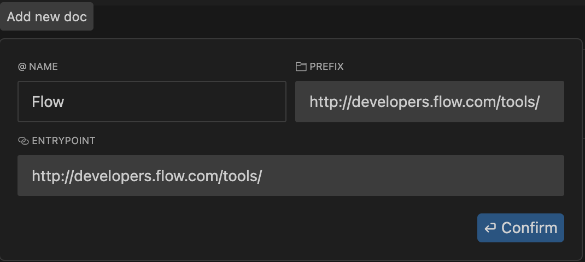

[Cursor](https://www.cursor.com/) is an AI code editor that makes it easy to write code while building Flow apps.  
Let's walk through how to setup Cursor for the best possible experience when writing applications on Flow.

## Installation

Adding Flow docs lets you interact with our docs directly and get the most accurate answers to your questions.

1. Go to Cursor Settings > Features > Docs and click "+ Add new doc".

2. Set Flow Docs:
    - Enter the URL of the Flow docs: `https://developers.flow.com/tools` and press Enter.
    - Cursor will automatically detect the Flow docs and index them for you.
    - Ensure the name is `Flow`, and click "Confirm" to add the docs.

3. Set Cadence Docs: (Optional, but recommended)
    - Click "+ Add new doc" again, now enter the URL of the Cadence docs: `https://cadence-lang.org/docs/` and press Enter.
    - Same process as before, ensure the name is `Cadence`, and click "Confirm" to add the docs.
4. Now wait for Cursor to index the docs. You can check the progress in the Docs section of the settings. After the indexing is complete, you can start using the docs in Cursor.

## Using Flow Docs in Cursor

You can then reference the Flow docs in your prompt with the `@Flow` symbol or `@Cadence` for the Cadence docs.  

