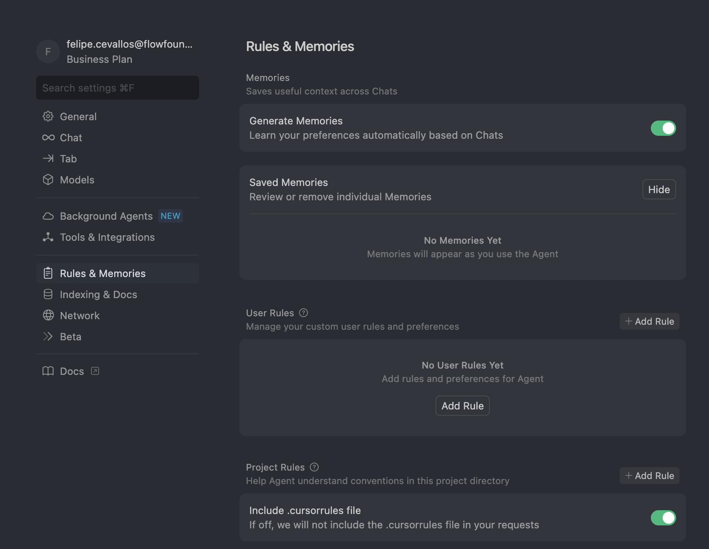
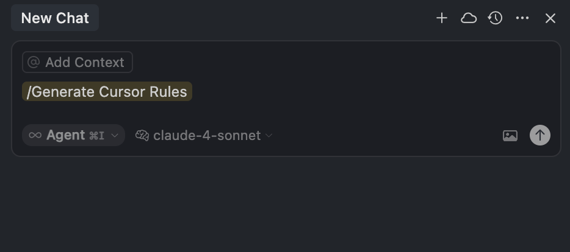

# Cadence Rules

## Introduction

When building with AI, it is hard to make the agent consistently understand what standards it should use when building or generating responses. Cursor Rules mitigates this issue by setting up global rules, project wide rules or document specific rules that are inserted in the agent's context before reading the prompt. With Cursor Rules, you can create an assistant that can consistently understand the intended development process, desired formatted responses, and avoid common mistakes. Consider it your tool to make guard rails for agents that can reduce hallucination and incorrecting development flows. 

In this guide, you'll learn how to configure and use Cursor Rules that transform your AI assistant into a Flow development expert with persistent knowledge of Cadence syntax patterns, NFT standards, project configuration, and development workflows.

## Learning Objectives

After completing this guide, you'll be able to:

- Configure and use Cursor Rules to enhance AI assistance for Flow blockchain development
- Apply specialized Cadence syntax patterns and NFT development standards through persistent AI context
- Utilize workflow-based rules to guide project setup, deployment, and debugging processes across the Flow development lifecycle
- Create your own Cadence Rules in order to supercharge your development on Flow 

## What Are Cursor Rules?

Cursor rules are a way to shape AI behavior with persistent, reusable instructions that guide how Cursor's Agent and Inline Edit assist you. Rules act as continuous context - embedding your preferences, coding standards, and workflows directly into the AI's decision-making process. Since AI models start fresh with each interaction, rules bridge this gap by automatically injecting your preferences and context into every conversation.
When active, rules are included at the beginning of the AI's context, providing consistent guidance for code generation, edit suggestions, and workflow assistance.

Cursor offers two rule types:

- **Project Rules**: Live in `.cursor/rules`, version-controlled with your code, and apply to specific projects
- **User Rules**: Global preferences in Cursor Settings that apply across all your projects


### Rule anatomy

Each rule file is written in MDC (.mdc), a format supporting metadata and content. Control how rules are applied from the type dropdown which changes properties `description`, `globs`, `alwaysApply`.

|Rule Type               |Description                                                                      |
|------------------------|---------------------------------------------------------------------------------|
|Always Apply            |Always included in model context                                                 |
|Apply to Specific Files |Included when files matching a glob pattern are referenced                       |
|Apply Intellegently     |Available to AI, which decides whether to include it. Must provide a description |
|Apply Manually          |Only included when explicitly mentioned using `@ruleName`                        |

```mdc
---
description: Cadence NFT development standards and best practices
globs: ["**/*.cdc", "**/contracts/**", "**/cadence/**"]
alwaysApply: false
---

- Always implement NonFungibleToken interface for NFT contracts
- Use MetadataViews for marketplace compatibility
- Follow proper resource handling with @ and & symbols
- Include required standard functions and path conventions

@nft-template.cdc

```

Referenced files like `@nft-template.cdc` are included as additional context when the rule triggers.

## User Rules

User rules are global preferences defined in Cursor Settings → Rules that apply across all projects. They’re plain text and perfect for setting preferred communication style or coding conventions:

```md
Please reply in a concise style. Avoid unnecessary repetition or filler language.
```

## Project rules

Project rules are stored as individual files in `.cursor/rules` and get version-controlled alongside your code. Each rule can target specific file types using glob patterns, be manually invoked when needed, or automatically activate based on context. You can also create nested rule directories - any folder can have its own `.cursor/rules` directory with rules that apply specifically to that area of your project.

Project rules excel at:

- Capturing specialized knowledge about your codebase and domain
- Establishing consistent workflows and development patterns
- Enforcing coding standards and architectural decisions across your team

### Nested Rules

Organize rules by placing them in .cursor/rules directories throughout your project. Nested rules automatically attach when files in their directory are referenced.

```mdc
project/
  .cursor/rules/        # Project-wide rules
  Cadence/
    .cursor/rules/    # Cadence-specific rules
  frontend/
    .cursor/rules/      # Frontend-specific rules
```

## Creating a rule

Create rules using the Cursor Rule command or going to Cursor Settings > Rules. This creates a new rule file in .cursor/rules. From settings you can see all rules and their status.

Click on the cog icon on the upper right section of the window. Then click the "Rules and Memories" section on the left side bar. Finally click on the "+ Add Rule" button in the User Rules or Project Rules section (depending on your objective). 



### Generating rules

Generate rules directly in conversations using the `/Generate Cursor Rules` command. Useful when you’ve made decisions about agent behavior and want to reuse them.



## Best practices

Good rules are focused, actionable, and scoped.

- Keep rules under 500 lines
- Split large rules into multiple, composable rules
- Provide concrete examples or referenced files
- Avoid vague guidance. Write rules like clear internal docs
- Reuse rules when repeating prompts in chat

## Cadence Rules

Here are a couple of Cursor Rules made by [claucondor] made for Flow development and NFTs

### Cadence NFT Standards

The [cadence-nft-standards.mdc] rule provides comprehensive guidelines for developing NFTs using Cadence on Flow blockchain. It ensures proper implementation of:

- **Core Interface Conformance**: `NonFungibleToken`, `NFT`, and `Collection` interfaces
- **MetadataViews Integration**: Marketplace-compatible metadata standards
- **Modular Architecture**: Patterns for complex NFTs with traits, evolution, and breeding
- **Security Best Practices**: Proper resource handling and capability management
- **Event Standards**: Consistent event emission for off-chain indexing

**Perfect for:**

- New NFT projects on Flow
- NFT marketplace integration
- Complex NFT systems (traits, evolution, breeding)
- Code reviews and standards compliance
- Learning Flow NFT development

**Applies to:** `.cdc` files, NFT transactions, collection setup, metadata implementation

#### Rule Configuration

```mdc
---
description: Comprehensive standards and best practices for developing Non-Fungible Tokens (NFTs) using Cadence. Ensures proper implementation of NonFungibleToken interfaces, MetadataViews integration for marketplace compatibility, secure resource handling patterns, and advanced modular architectures for complex NFTs with traits, evolution, and breeding mechanics. Includes required standard functions, path conventions, event emission patterns, and security best practices for capability management.
globs: ["**/*.cdc", "**/contracts/**", "**/cadence/**"]
alwaysApply: false
---
```

Recommended Apply config: `Apply Intelligently`

#### Manual Reference

```
@cadence-nft-standards help me implement a new NFT contract
```

#### Key Benefits

- **Ecosystem Compatibility**: Guaranteed marketplace and wallet integration
- **Security**: Proper resource handling and capability management
- **Maintainability**: Modular architecture for complex systems
- **Performance**: Gas-efficient implementations with lazy initialization
- **Standards Compliance**: Follows official Flow NFT patterns

#### Usage Examples

- `"Create an NFT contract for collectible cards"` → Guides complete interface implementation
- `"Make my NFT marketplace compatible"` → Provides MetadataViews patterns
- `"Build evolving NFTs with traits"` → Suggests modular architecture patterns
- `"Review my NFT contract"` → Validates against all documented standards

### Cadence Syntax Patterns

#### What This Rule Does

The [cadence-syntax-patterns.mdc] rule provides comprehensive syntax guidance and error prevention for Cadence development. It covers essential language patterns including:

- **Resource Type Syntax**: Proper use of `@` and `&` symbols for resources and references
- **Interface Restrictions**: Correct `{}` syntax for interface constraints
- **Transaction Authorization**: Granular `auth` capabilities and permission patterns
- **Contract Member Access**: Accessing deployed contract functions and constants
- **Type Conversion & Arithmetic**: Explicit type handling and numeric operations
- **Access Control**: Field visibility, entitlements, and `view` function purity
- **Language Constructs**: Optional binding, loops, string manipulation, switch cases
- **Debugging Strategies**: Systematic error resolution and prevention techniques

**Perfect for:**

- Writing any Cadence contracts or transactions
- Debugging compilation errors with resources (`@`) or references (`&`)
- Fixing authorization issues in transactions
- Learning Cadence syntax and best practices
- Preventing common type system errors
- Understanding Flow blockchain development patterns

**Applies to:** `.cdc` files, transaction scripts, contract development, Flow CLI usage, error debugging

#### How to Use This Rule

#### Auto Attached Configuration

```mdc
---
description: Provides a comprehensive guide to syntax patterns, best practices, and common pitfalls in the Cadence language. Covers resource type syntax (@,&), interface restrictions ({}), transaction authorization patterns, contract member access, type conversion, access modifiers, view function purity, and debugging approaches. Includes language-specific patterns for optional binding, variable initialization, string manipulation, looping constructs, and idempotent transaction design.
globs: ["**/*.cdc", "**/cadence/**", "**/transactions/**", "**/scripts/**"]
alwaysApply: false
---
```

Recommended Apply config: `Apply Intelligently`

#### Manual Reference

```
@cadence-syntax-patterns help me fix this authorization error
```

#### Key Benefits

- **Error Prevention**: Avoids common syntax mistakes before they happen
- **Faster Debugging**: Systematic approaches to resolve compilation errors
- **Best Practices**: Language-specific patterns that follow Cadence conventions
- **Authorization Mastery**: Proper transaction permission handling
- **Type Safety**: Correct resource handling and type conversions
- **Performance**: Optimized patterns for gas efficiency

#### Usage Examples

- `"Fix this resource handling error"` → Provides `@` and `&` syntax corrections
- `"My transaction authorization is failing"` → Suggests proper `auth` capabilities
- `"How do I loop in Cadence?"` → Shows `while` loop patterns (no range loops)
- `"String manipulation not working"` → Provides `String.split()` and `String.contains()` patterns
- `"Interface restriction syntax error"` → Corrects to `{}` interface syntax
- `"Access control for resource fields"` → Guides `access(self)` vs `access(all)` patterns

#### Key Syntax Patterns Covered

- **Resources**: `@{NonFungibleToken.NFT}` not `@NonFungibleToken.NFT`
- **Authorization**: `auth(Storage) &Account` or granular capabilities
- **Optional Binding**: `if let` syntax (no `guard let`)
- **Variable Initialization**: All `var` declarations must have initial values
- **Type Conversion**: Explicit conversion required for arithmetic
- **View Functions**: Cannot call non-`view` functions
- **String Operations**: Use `.split()` and `.contains()` (no `.indexOf()`)
- **Loops**: `while` loops only (no range-based `for` loops)

### Flow Development Workflow

#### What This Rule Does

The [flow-development-workflow.mdc] rule provides comprehensive workflow methodology for Flow blockchain development covering the complete development lifecycle. It includes:

- **Documentation-First Approach**: Always reference official Flow documentation and standard examples
- **Development Sequence**: Emulator → Testnet → Mainnet progression with proper validation
- **Transaction Authorization**: Granular `auth` capabilities and permission management
- **Deployment Verification**: Post-deployment validation protocols and testing strategies
- **FCL Integration**: Frontend configuration, network management, and user experience patterns
- **Error Resolution**: Systematic debugging approaches and common error prevention
- **Optimization Techniques**: Computation limit handling and gas efficiency strategies
- **Testnet Validation**: Comprehensive validation protocols before mainnet deployment

**Perfect for:**

- Starting new Flow projects or need setup guidance
- Moving between development stages (emulator → testnet → mainnet)
- Debugging deployment or transaction authorization issues  
- Integrating frontend applications with FCL
- Handling computation limits and gas optimization
- Learning Flow development best practices and official patterns
- Comprehensive project validation strategies

**Applies to:** Complete Flow development lifecycle, project setup, deployment, FCL integration, debugging

#### Manual Reference

```
@flow-development-workflow help me deploy to testnet properly
```

#### Auto Attached Configuration

```mdc
---
description: Comprehensive workflow and best practices guide for Flow blockchain development covering the complete development lifecycle from setup through mainnet deployment. Includes documentation-first debugging methodology, transaction authorization patterns, FCL integration best practices, deployment verification protocols, optimization techniques for computation limits, error resolution strategies, and testnet validation procedures. Emphasizes official Flow documentation usage and iterative development approach for both Cadence contracts and frontend integration.
globs: ["flow.json", "**/config.js", "**/cadence/**", "**.md"]
alwaysApply: false
---
```

Recommended Apply config: `Apply Intelligently`

#### Key Benefits

- **Systematic Approach**: Step-by-step methodology prevents common mistakes
- **Official Patterns**: Emphasizes Flow documentation and standard examples
- **Error Prevention**: Proactive strategies for avoiding deployment and integration issues
- **Full-Stack Awareness**: Covers both Cadence backend and FCL frontend integration
- **Optimization Focus**: Gas efficiency and computation limit management
- **Validation Protocols**: Comprehensive testing before production deployment

#### Usage Examples

- `"How do I set up a new Flow project?"` → Guides project setup and configuration
- `"My transaction authorization is failing"` → Provides auth capability debugging
- `"Deploy my contract to testnet"` → Shows deployment sequence and verification
- `"FCL integration not working"` → Suggests configuration and network troubleshooting
- `"Computation limit exceeded"` → Recommends optimization strategies
- `"Prepare for mainnet deployment"` → Provides comprehensive validation checklist

#### Key Workflow Areas Covered

- **Project Setup**: `flow.json` configuration, FCL setup, environment management
- **Authorization**: `auth(Storage)`, `auth(BorrowValue, SaveValue)`, granular capabilities
- **Development Sequence**: Emulator testing → Frontend integration → Testnet → Validation
- **Error Resolution**: Syntax errors, deployment errors, FCL errors, computation limits
- **FCL Best Practices**: Network configuration, contract address management, user authentication
- **Optimization**: Accumulative processing, loop optimization, gas efficiency
- **Deployment**: Verification protocols, update strategies, multi-network consistency
- **Documentation Usage**: When and how to reference official Flow resources

#### Development Philosophy Emphasized

- **Documentation-Driven**: Reference official sources before creating custom solutions
- **Iterative Approach**: Fix issues one at a time, test frequently at each stage
- **Standard Compliance**: Prefer established Flow patterns over custom implementations
- **Full-Stack Awareness**: Consider entire stack from contracts to frontend UI
- **Error-Driven Learning**: Use errors as opportunities to refine understanding

### Flow Project Configuration

#### What This Rule Does

The [flow-project-config.mdc] rule provides comprehensive guidance for Flow project configuration and `flow.json` management. It covers essential configuration patterns including:

- **`flow.json` Structure**: Accounts, contracts, deployments, and networks configuration
- **Account Management**: Named accounts, addresses, private keys, and signer setup
- **Contract Registration**: Source paths, network-specific aliases, and pre-deployment setup
- **Deployment Configuration**: Network-specific deployments and contract mappings
- **FCL Integration**: Synchronizing backend deployment with frontend address configuration
- **Network Management**: Multi-network consistency across emulator, testnet, and mainnet
- **Error Prevention**: Common configuration mistakes and troubleshooting strategies
- **Address Mapping**: Contract address management and import resolution

**Perfect for:**

- Setting up new Flow projects or configuring `flow.json`
- Debugging deployment or contract resolution issues
- Managing FCL integration and address mapping problems
- Working across different networks (emulator/testnet/mainnet)
- Troubleshooting CLI errors related to signers or contract imports
- Account management and private key handling
- Contract aliasing and deployment configurations

**Applies to:** `flow.json`, FCL config files, deployment scripts, network switching, contract imports

#### Auto Attached Configuration

```mdc
---
description: Comprehensive guide to Flow project configuration and flow.json management covering account setup, contract registration, deployment configuration, network-specific aliases, and FCL integration. Includes best practices for multi-network consistency, common configuration errors prevention, contract address management, and synchronization between backend deployment and frontend FCL configuration across emulator, testnet, and mainnet environments.
globs: ["flow.json", "**/config.js", "**/.env*", "**/package.json"]
alwaysApply: false
---
```

Recommended Apply config: `Apply Intelligently`

#### Manual Reference

```
@flow-project-config help me configure my flow.json for testnet deployment
```

#### Key Benefits

- **Configuration Accuracy**: Prevents common setup and deployment errors
- **Multi-Network Support**: Seamless switching between emulator, testnet, and mainnet
- **FCL Synchronization**: Ensures frontend and backend configurations stay aligned
- **Error Prevention**: Addresses typos, address mismatches, and path issues proactively
- **Deployment Success**: Proper account setup and contract registration workflows
- **Address Management**: Centralized contract address handling across environments

#### Usage Examples

- `"Configure flow.json for new project"` → Provides complete structure and setup guidance
- `"Failed to resolve contract import"` → Suggests address mapping and alias fixes
- `"Wrong signer/network CLI error"` → Guides account and network configuration
- `"FCL can't find my contract"` → Shows frontend address configuration patterns
- `"Deploy contract to testnet"` → Provides deployment configuration and verification
- `"Switch from emulator to testnet"` → Guides network transition and address updates

#### Key Configuration Areas Covered

- **Account Setup**: Address accuracy, key file paths, network-specific accounts
- **Contract Registration**: Source paths, aliases, pre-deployment requirements
- **Deployment Management**: Signer assignment, contract lists, network specificity
- **Standard Contract Addresses**: Official addresses for NonFungibleToken, MetadataViews, FungibleToken
- **FCL Configuration**: Network settings, contract address mapping, environment variables
- **Error Prevention**: Typo checking, address consistency, permission handling
- **Multi-Network Patterns**: Network-specific aliases and deployment strategies
- **CLI Usage**: Correct `--signer`, `--network`, and `--update` flag usage

#### Common Issues Addressed

- **"failed to get contract"**: Missing or incorrect aliases in `flow.json`
- **"failed to resolve import"**: Address mapping issues in FCL configuration  
- **"Permission Denied"**: Key file accessibility and path problems
- **"transaction failed to decode"**: Network mismatch or FCL configuration errors
- **Signer/Network Mismatches**: Using emulator accounts on testnet and vice-versa
- **Address Inconsistencies**: Misaligned addresses between `flow.json` and FCL config

#### Best Practices Emphasized

- **Pre-deployment Registration**: Always add contracts to `flow.json` before deploying
- **Address Consistency**: Ensure addresses match across `flow.json`, FCL config, and imports
- **Environment Variables**: Use `.env` files for network-specific contract addresses
- **Network Separation**: Maintain distinct configurations for each network environment
- **Key Security**: Proper `.gitignore` setup for private key files

### User Preferences

#### What This Rule Does

The [user-preferences.mdc] rule personalizes AI assistance behavior for Flow blockchain development. It defines preferred communication style and development methodology including:

- **Communication Style**: Concise, actionable solutions with proactive error prevention explanations
- **Development Philosophy**: Documentation-driven approach with official Flow patterns preference
- **Problem-Solving Methodology**: Root cause analysis, iterative fixes, and pattern recognition
- **Code Quality Standards**: Standards compliance, consistency, and completeness requirements
- **Workflow Preferences**: Thorough setup, emulator-first testing, and systematic debugging
- **Error Resolution Style**: Reference-based solutions and prevention-focused learning
- **Full-Stack Awareness**: Solutions considering entire stack from Cadence to frontend UI
- **User Experience Focus**: Clear blockchain interaction feedback and user-friendly interfaces

**Perfect for:**

- Ensuring consistent AI behavior across all Flow development projects
- Matching AI assistance style to your preferred working methodology
- Getting responses formatted in your preferred communication style
- Maintaining documentation-driven and standards-compliant approaches
- Ensuring full-stack consideration in all solutions provided
- Receiving proactive error prevention guidance with solutions

**Applies to:** All AI assistance, communication style, problem-solving approach, solution methodology

#### Synergy with Technical Rules

This rule works as the **behavioral foundation** for your technical Flow rules:

- **Technical Rules** provide **WHAT** information to apply
- **User Preferences** defines **HOW** to deliver that information
- **Result**: Consistent, personalized assistance across all Flow development scenarios

#### Always Applied Configuration

```mdc
---
description: Defines personalized development preferences and communication style for Flow blockchain development including concise response formatting, documentation-driven problem solving, iterative workflow methodology, full-stack awareness, and systematic error resolution. Guides AI behavior to match user's preferred development philosophy with emphasis on official Flow patterns, practical solutions, and proactive error prevention across the entire development stack.
alwaysApply: true
---
```

Recommended Apply config: `Always Apply`

#### Key Benefits

- **Consistent Communication**: AI responses match your preferred style and level of detail
- **Methodology Alignment**: Solutions follow your preferred development philosophy
- **Error Prevention Focus**: Proactive guidance on avoiding similar issues in the future
- **Efficiency**: Concise but complete responses without unnecessary verbosity
- **Standards Compliance**: Emphasis on official Flow patterns and best practices
- **Full-Stack Perspective**: Solutions consider entire development stack implications

#### How This Rule Affects AI Responses

- **Response Style**: `"Configure flow.json for testnet"` → Provides direct steps + brief prevention tips
- **Problem-Solving**: `"Authorization error"` → Root cause analysis + pattern to prevent recurrence
- **Code Solutions**: Always includes reference to official documentation when available
- **Error Debugging**: Systematic, one-issue-at-a-time approach with testing checkpoints
- **Architecture Decisions**: Prefer established Flow patterns over custom implementations
- **Learning Approach**: Uses errors as learning opportunities with rule/pattern references

#### Behavioral Patterns Defined

- **Conciseness**: Clear, actionable solutions without excessive explanation
- **Practical Focus**: Working code examples prioritized over theoretical explanations
- **Documentation-Driven**: Official Flow, Cadence, FCL docs referenced first
- **Iterative Methodology**: Fix one issue at a time, test frequently
- **Standard Compliance**: Established patterns preferred over custom solutions
- **Root Cause Analysis**: Address underlying issues, not just symptoms
- **Prevention-Oriented**: Include brief explanations of why errors occurred
- **Full-Stack Consideration**: Account for contracts, transactions, FCL, and UI implications

#### Configuration Recommendation

**Best Setup**: Configure as **"Always"** rule or add to **User Rules** in Cursor Settings for global application across all your Flow development work.

This ensures consistent AI behavior regardless of which specific project or technical rule is active.

## Conclusion

In this guide, you explored how to configure and use Cursor Rules to enhance AI assistance for Flow blockchain development. You learned about the different types of rules available, from always-applied user preferences to context-specific project rules that activate based on file types and project structure.

You discovered five specialized Cursor Rules designed specifically for Cadence and Flow development: NFT development standards for marketplace-compatible contracts, syntax patterns for error prevention and debugging, comprehensive development workflows for the complete project lifecycle, project configuration management for seamless multi-network deployment, and personalized user preferences that ensure consistent AI behavior across all your Flow projects.

Now that you have completed this guide, you should be able to:

- Configure and use Cursor Rules to enhance AI assistance for Flow blockchain development
- Apply specialized Cadence syntax patterns and NFT development standards through persistent AI context  
- Utilize workflow-based rules to guide project setup, deployment, and debugging processes across the Flow development lifecycle 

<!-- Relative links, will not render on page -->

[claucondor]: https://gist.github.com/claucondor/453cb30c56597b53071bb5bbf18d2c9c
[cadence-rules]: https://github.com/onflow/cadence-rules
[cadence-nft-standards.mdc]: https://github.com/onflow/cadence-rules/blob/main/cadence-nft-standards.mdc
[cadence-syntax-patterns.mdc]: https://github.com/onflow/cadence-rules/blob/main/cadence-syntax-patterns.mdc
[flow-development-workflow.mdc]: https://github.com/onflow/cadence-rules/blob/main/flow-development-workflow.mdc
[flow-project-config.mdc]: https://github.com/onflow/cadence-rules/blob/main/flow-project-config.mdc
[user-preferences.mdc]: https://github.com/onflow/cadence-rules/blob/main/user-preferences.mdc
