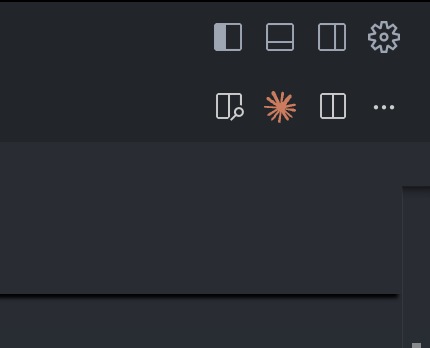
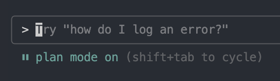

# Claude Code for Flow Development

## Introduction

[Claude Code] (CC) transforms the development experience by providing an AI-powered coding assistant specifically designed for iterative, systematic development. Unlike general-purpose AI tools, Claude Code excels at breaking down tasks into manageable, incremental steps while maintaining context across your entire development lifecycle.

What makes Claude Code exceptionally powerful is its ability to maintain unlimited context windows, allowing it to understand entire codebases without the compression limitations that plague other AI coding tools. This comprehensive understanding enables Claude Code to deploy multiple subagent instances that work in parallel on complex tasks, iterate continuously until optimal solutions are achieved, and maintain persistent memory of your project's architecture and coding standards across all development sessions.

## Learning Objectives

After completing this guide, you'll be able to:

- Set up and configure Claude Code for optimal Flow blockchain development workflows
- Implement the four-stage development methodology (Idea → Visualization → Planning → Build) for Cadence projects
- Configure persistent project context using CLAUDE.md files with Flow-specific instructions and MCP tools
- Apply iterative development practices with git-based checkpoint systems for safe blockchain development
- Utilize advanced Claude Code features including subagents, auto-verification, and specialized debugging workflows
- Integrate Claude Code with Flow CLI, FCL, and other Flow development tools for comprehensive project management
- Create and manage team-wide development standards through shared CLAUDE.md configurations

## Prerequisites

Before proceeding with this guide, you should have:

### Technical Requirements

- [Claude Code Subscription]: $200/month plan recommended for comprehensive Flow development features
- [Flow CLI]: Installed and configured for emulator, testnet, and mainnet interactions
- [Git]: Version control system for checkpoint-based development workflow
- [Node.js]: For Claude Code, FCL integration, and frontend development components

## Claude Code Setup and Configuration

### What is Claude Code?

Claude Code is an AI-powered coding assitant that integrated directly into your terminal. This allows you to use it in any IDE or simply from your terminal. The power of Claude Code comes from its ability to explain complex and large codebases, manage Git workflows, and iterate for long periods of time in order to accomplish a task.

Most IDEs like Cursor rely on their ability to compress the context window that is fed to agents so that their business model justifies charging $20 while using expensive LLM models. This naturally decreases the ability of the agents to have a comprehensive understanding of the working codebase when managing with large or complex codebases. 

This is why Claude Code can be so powerful, it is able to include entire codebases in its context, deploy other instances of Claude Code in order to work on multiple actions in parallel, and iterate on its results in order to achieve better results.


### Installation and Subscription

Claude Code requires a [subscription] to access its full development capabilities. There are 3 subscription levels: Pro, Max 5x, and Max 20x.

The Pro plan is very limited, so expect it to only be sufficient for testing and experimentation.

The $200/month Max 20x plan is recommended for developers with a lot of projects or if you need to build something quickly where time is of the essence. This plan will grant you access to:

- Unlimited context windows for complex smart contract projects
- Advanced subagent capabilities for parallel development tasks
- Persistent memory across development sessions
- Integration with MCP (Model Context Protocol) servers
- Team collaboration features through shared configurations

You can also use the API pricing, but this is not recommended since any meaningful implementation of CC will most likely require more than $100 in API credits. 

### Initial Configuration

To install Claude Code, run the following command:

```bash
npm install -g @anthropic-ai/claude-code
```

After the installation process completes, navigate to your project and start Claude Code:

```bash
cd your-awesome-project
claude
```

This will automatically install the extension. You can run the `/ide` command in the CC terminal to make sure your IDE is connected to CC. With the extension installed, you can click on the orange Anthropic logo on the upper right hand of the screen in order to launch Claude Code in a separate window.  




### CLAUDE.md Files

CLAUDE.md files are configuration files that contain project-specific instructions and context for Claude Code. They allow you to define development standards, frequently used commands, and project architecture that the AI remembers across all coding sessions. They are similar to Cursor Rules, but they differ in that CLAUDE.md only specifies the configuration of Claude Code.

If you are now sure of what type of information to place in your CLAUDE.md file, then you can simply create your primary CLAUDE.md file in the project root. Use the `/init` command in Claude Code to generate the initial structure, then customize for Flow development: 

Create your Flow project with the standard directory structure:

```
flow-project/
├── .claude/
│   └── CLAUDE.md           # Project-wide AI instructions
├── cadence/
│   ├── .claude/
│   │   └── CLAUDE.md       # Cadence-specific instructions
│   ├── contracts/
│   ├── transactions/
│   └── scripts/
├── frontend/
│   ├── .claude/
│   │   └── CLAUDE.md       # Frontend-specific instructions
│   └── src/
├── flow.json               # Flow project configuration
└── package.json
```

#### 3. Root CLAUDE.md Configuration

Placing CLAUDE.md in the root file sets the instructions you want Claude to do very frequently, such as: 

- Bash commands you want to run frequently
- Files it should really know about when making changes or big architectural decisions
- MCP servers

This file is great for sharing across your team so you set it once and everyone has the same extended functionality.

**Team Configuration Setup**:

```md
# Flow Project AI Assistant Configuration

## Project Overview

This is a Flow blockchain application with Cadence smart contracts and FCL frontend integration.

## Team-wide Development Standards

- MCP servers standardized across development environments
- Git workflow and commit message standards enforced
- Follow official Flow documentation patterns
- Use incremental, checkpoint-based development
- Test on emulator before testnet deployment
- Implement proper resource handling with @ and & syntax
- Follow MetadataViews standards for NFT projects

## Frequently Used Commands

- `flow emulator start` - Start local development environment
- `flow project deploy --network emulator` - Deploy contracts locally
- `flow transactions send ./cadence/transactions/example.cdc --network emulator` - Execute transactions locally
- `npm run dev` - Start frontend development server

## Key Files to Reference

- flow.json - Project configuration and contract deployments
- cadence/contracts/ - Smart contract implementations
- frontend/src/config.js - FCL configuration and contract addresses

## MCP Servers

- Use flow-mcp for reading blockchain data, managing accounts, checking balances, and interacting with native contracts.
- Use flow-defi-mcp fro checking token prices, swapping tokens on decentralized exchanges, and interacting with ERC20 tokens.

## Architecture Notes

[Document your specific project architecture, contract relationships, and deployment strategies]
```

#### 3. Nested CLAUDE.md Files

You can have a more granular control of the capabilities of Claude Code when working with different ares of your repo by creating specialized instructions for different project areas. This is acheived by placing a nested CLAUDE.md file in subdirectories in your repo(cadence, frontend, backend, etc.). Claude Code will automatically read these files when working on these subdirectories. Here is an example:

**cadence/.claude/CLAUDE.md:**

```md
# Cadence Development Instructions

## Syntax Requirements

- Always use proper resource syntax: @{NonFungibleToken.NFT}
- Implement required interfaces: NonFungibleToken, MetadataViews
- Use view functions for read-only operations
- Follow auth capability patterns for transactions

## Testing Protocol

- Write unit tests for all contract functions
- Test resource creation and destruction
- Verify proper event emission
- Validate access controls and permissions
- Test for breaking changes and edge cases

## Standard Patterns

Reference the Flow documentation for:

- Contract deployment and initialization
- Resource collection patterns
- Proper error handling and panics
- Gas optimization techniques
```

**frontend/.claude/CLAUDE.md:**

```markdown
# Frontend FCL Integration Instructions

## Configuration Management

- Keep contract addresses in environment variables
- Use proper network switching logic
- Implement user authentication flows
- Handle transaction status updates

## Best Practices

- Show loading states for blockchain interactions
- Provide clear error messages for failed transactions
- Cache contract data when appropriate
```

#### Local Claude.md 

You can also create a `CLAUDE.local.md` file that is used just for you and not shared with your team.

## Workflow Strategies

Claude Code excels when following a structured development approach. We recommend you implement this four-stage methodology:

### Stage 1: Idea Development

**Objective**: Bounce ideas with CC in order to have a better understanding of what can be built and why it would work.

**Process**:

1. Click `Shift` + `Tab` in order to cycle through the different response forms that CC has to offer until you reach the Plan Mode.



2. Describe your Flow project concept to Claude Code
3. Ask for requirement analysis and technical feasibility assessment

**Example Conversation**:
```
User: "I want to create a collectible card game on Flow where players can battle and evolve their cards"

Claude Code Response: [Analyzes requirements, suggests NFT architecture, identifies game mechanics, proposes contract structure]
```

**Outputs**:
- Detailed project requirements document
- Technical architecture overview
- Flow-specific implementation considerations
- Resource and timeline estimates

### Stage 2: Visualization

**Objective**: Create visual representations and demos to validate project concepts before development. You can use Claude Code during this process, but it is best to combine LLM models like Gemini 2.5 in order to create the visual representations. 

**Tools and Techniques**:

- **Mermaid Diagrams**: Generate contract relationship diagrams, user flow charts, and system architecture visuals
- **UI Mockups**: Create interface mockups for frontend applications
- **Contract Schemas**: Visualize data structures and resource relationships
- **Transaction Flow Maps**: Diagram user interactions and blockchain state changes

**Example Workflow**:
```
User: "Create a diagram showing how card evolution works in my game"

[Claude Code generates Mermaid diagram showing contract interactions, resource transformations, and event emissions]
```

**Claude Code Commands**:

- Use image upload to share visual concepts
- Request Mermaid diagrams for complex systems
- Ask for UI mockups based on Flow wallet integration patterns

### Stage 3: Planning with Claude Code

**Objective**: Break down the project into manageable, incremental development tasks using Claude Code's planning capabilities.

**Planning Process**:

1. **Enable Planning Mode**: Explicitly tell Claude Code you're in planning phase or cycle through the different modes (with `Shift` + `Tab`) until you reach Plan Mode
2. **Confirm Knowledge Comprehension**: Ask Claude to read important files first and then confirm the knowledge with you. Immediately ask it questions about the codebase to verify its knowledge
3. **Plan Generation**: Tell CC to generate an action plan that is incremental and has specific goals and checkpoints (this file can be called T0-DO.md and placed in a `/tasks` folder that will contain relevant information regarding the completion of specific tasks or steps)
4. **Task Breakdown**: Request comprehensive task decomposition for incremental changes
5. **Dependency Mapping**: Identify task dependencies and critical path
6. **Checkpoint Strategy**: Define git commit points and testing milestones

**Example Planning Session**:
```
User: "Set up a roadmap and plan of the to-do's that need to be completed for my card game NFT contracts"

Claude Code Response:
Task 1: Set up basic NFT contract structure
- Implement NonFungibleToken interface
- Add MetadataViews compatibility
- Create basic card resource
- Write deployment transaction
- Checkpoint: Basic NFT functionality

Task 2: Add game mechanics
- Implement battle system
- Add evolution functionality
- Create game state management
- Write game transaction scripts
- Checkpoint: Core game mechanics

[Continues with detailed breakdown]
```

**Planning Outputs**:

- Generate a detailed to-do list that is thoroughly divided between goals, objectives, checkpoints and tasks that need to be achieved in an incremental manner
- Dependency graph showing task relationships
- Testing strategy for each development phase
- Deployment sequence and validation protocols

A downside of using CC is that it does not have a checkpoint control like the agent chat does in Cursor. So making frequent git commits and working on separate branches can help you mitigate this. Never attempt to give Claude Code a big task as it will most liekly not have enough knowledge about the task at hand to be able to complete it successfully.

### Stage 4: Build Execution

**Objective**: Implement planned tasks systematically using Claude Code's development capabilities.

**Build Process**:

1. **Task Assignment**: Work on one incremental task at a time
2. **Implementation**: Use Claude Code to generate code, debug issues, and optimize solutions. 
3. **Reporting**: After completing a task, CC should generate a report of what it did and why it has done it in a md file in the `/tasks` folder so that you can have a better understanding of the changes made
3. **Validation**: Test each component thoroughly before proceeding
4. **Documentation**: Generate inline documentation and update project docs
5. **Checkpoint**: Commit working code with descriptive messages
6. **Updating**: Ask Claude Code to update the TO-DO.md with the completed steps and changes once the commit has been approved. 

**Development Workflow**:
```
User: "Implement Task 1: Basic NFT contract structure"

[Claude Code generates contract code, deployment scripts, and tests]

User: "Test this implementation"

[Claude Code provides testing commands and validation scripts]

User: "Commit this checkpoint"

[Claude Code suggests commit message and validates completion]
```

## Advanced Claude Code Features

### Subagent Utilization

For complex Flow projects, leverage Claude Code's subagent capabilities to handle parallel development tasks:

**When to Use Subagents**:

- Developing multiple contracts simultaneously
- Frontend and backend development in parallel
- Testing different implementation approaches
- Documentation generation while coding
- Dealing with a big task so that CC can deploy subagents to break down the task into smaller components that are running in parallel

**Example Subagent Usage**:
```
User: "Create subagents to develop the NFT contract and the marketplace contract in parallel"

[Claude Code spawns separate conversation threads for each contract, maintaining coordination between them]
```

### Auto-Verification and Iteration

Configure Claude Code to automatically verify its work and iterate for improvements:

**Verification Patterns**:

- **Compilation Checks**: Automatically test Cadence syntax after code generation
- **Test Execution**: Run unit tests and integration tests after implementation
- **Deployment Validation**: Verify contract deployment on emulator before suggesting testnet deployment

### Memory and Context Management

**Using the # Memory Mode**:
Press `#` to enter memory mode and specify important information for Claude Code to remember:

```
# Remember that this project uses a modular NFT architecture with separate traits contracts
# Remember that we need to use a DS Proxy system for upgrading contracts
```

**Context Optimization**:

- Use `Ctrl+R` for verbose output when debugging complex issues
- Compact conversations at natural breakpoints (around 20% context usage)
- Constantly refactor CLAUDE.md to take into account changes made throughout the development process
- Maintain focused conversations for specific development tasks

## Development Workflows and Best Practices

Give Claude Code some sort of tool it can use for feedback (MCP or tool) to check its work and it will iterate by itself to get better results. Claude Code has the ability to iterate for hours if needed, but it needs to be able to analyze its work. These alternative workflows can be very useful as well, depending on your ability to close the feedback loop so that CC can analyze and comprehend the results of its code generation:

### Test-Driven Development with Claude Code

**Workflow**: Write Tests → Commit → Code → Iterate → Commit

```
User: "Write tests for card evolution functionality first"

[Claude Code generates comprehensive test suite]

User: "Now implement the evolution logic to pass these tests"

[Claude Code implements feature with test-driven approach]
```

### Screenshot-Driven Development

**Workflow**: Write Code → Screenshot Result → Iterate

Particularly useful for frontend development:

```
User: "Implement this card display component"

[Claude Code generates React component]

User: [Uploads screenshot of result]

Claude Code: "I see the card layout needs improvement. Let me adjust the CSS..."
```

### Checkpoint-Based Development

**Best Practices**:

- Commit after each completed task
- Use descriptive commit messages generated by Claude Code
- Create branches for experimental features
- Tag stable releases for easy rollback

**Example Checkpoint Strategy**:

```
git commit -m "feat: implement basic NFT contract with MetadataViews

- Add NonFungibleToken interface implementation
- Include required MetadataViews for marketplace compatibility
- Create basic card resource with metadata
- Add deployment transaction and initialization script
- All tests passing on emulator

Checkpoint: Basic NFT functionality complete"
```

### Error Resolution and Debugging

**Systematic Debugging Approach**:

1. **Error Analysis**: Provide Claude Code with complete error messages and context
2. **Root Cause Investigation**: Let Claude Code analyze potential causes
3. **Solution Implementation**: Apply suggested fixes incrementally
4. **Verification**: Test fixes thoroughly before proceeding
5. **Documentation**: Update project documentation with lessons learned

**Example Debugging Session**:

```
User: "Getting authorization error in my transaction"

Claude Code: "Let me analyze the auth capability requirements. I see the issue is with the granular auth pattern. Here's the fix..."

[Provides corrected transaction with proper auth syntax]
```

### Multi-Network Deployment

**Deployment Workflow with Claude Code**:

1. **Emulator Testing**: Comprehensive local testing and validation
2. **Configuration Update**: Update flow.json and FCL config for testnet
3. **Testnet Deployment**: Deploy and validate on testnet
4. **Frontend Integration**: Update frontend configuration and test user flows
5. **Mainnet Preparation**: Final validation and deployment to mainnet


### MCP Server Sharing

You can set up [MCPs] for Claude Code to use as tools. These can also be set up in the CLAUDE.md file so that the same MCPs are used consistently by every team member. Share the `/Claude/mcp.json` files so that the team can use the same MCP servers.

**Team MCP Configuration**:

To grant Claude Code [access to use an MCP server], run the following commands:  

```bash
# Adding a MCP server
claude mcp add <name> <command> [args...]

# Adding a local server
claude mcp add my-server -e API_KEY=123 -- /path/to/server arg1 arg2
```
You can also try these [MCPs for Flow development]:

```bash
# Shared MCP servers for team consistency
claude mcp add flow_mcp
claude mcp add flow-defi-mcp
```

### Version Control for AI Configuration

**Best Practices**:

- Include CLAUDE.md files in version control
- Document MCP server configurations in README
- Share CLAUDE.local.md patterns (without committing personal configs)
- Maintain team coding standards through shared AI instructions

## Key Bindings and Shortcuts

### Essential Claude Code Shortcuts

| Shortcut    | Function          | Flow Development Usage |
|-------------|-------------------|------------------------|
| `#`         | Memory mode       | Store project architecture decisions |
| `Shift+Tab` | Auto-accept edits | Quickly accept generated Cadence code |
| `!`         | Bash mode         | Execute Flow CLI commands directly |
| `@`         | Add file/folder   | Reference contracts, transactions, configs |
| `Esc`       | Cancel operation  | Stop incorrect generation/execution |
| `Ctrl+R`    | Verbose output    | Detailed debugging for complex issues |

### Flow-Specific Usage Patterns

**Memory Mode Examples**:

```
# This project follows the composite NFT pattern with separate trait contracts
# Gas optimization is critical - avoid loops in public functions
# All contracts must support MetadataViews for marketplace compatibility
```

**File Reference Patterns**:

```
@flow.json - Project configuration
@cadence/contracts/MyNFT.cdc - Main NFT contract
```

## Troubleshooting and Optimization

### Common Issues and Solutions

**Context Window Management**:

- Compact conversations at natural breakpoints or manually at around 20% of context usage remaining
- Use focused sub-conversations for specific tasks
- Reference key files rather than copying entire contents

**Performance Optimization**:

- Use the $200/month plan for complex Flow projects
- Enable auto-compact to prevent context overflow
- Break large tasks into smaller, focused conversations
- Hit `Esc` often if you see the agent is going on the wrong path and ask it to undo its recent action

**Integration Problems**:

- Verify MCP server configurations
- Check Flow CLI integration and permissions
- Validate CLAUDE.md file syntax and structure

### Best Practices for Flow Development

**Project Management**:

- Maintain clear separation between contracts, transactions, and frontend code
- Use nested CLAUDE.md files for different development areas
- Keep project documentation synchronized with implementation

**Code Quality**:

- Always compile Cadence code before deployment
- Use Claude Code for security review suggestions
- Implement comprehensive testing at each development stage

**Deployment Management**:

- Test thoroughly on emulator before testnet deployment
- Validate FCL configuration changes across networks
- Use systematic deployment checklists generated by Claude Code

## Conclusion

In this guide, you explored how to leverage Claude Code for efficient Flow blockchain and Cadence development. You learned to implement a systematic four-stage development methodology that transforms ideas into production-ready applications through AI-assisted visualization, planning, and execution.

You discovered how to configure persistent project context through CLAUDE.md files, enabling your AI assistant to maintain comprehensive understanding of Flow-specific patterns, project architecture, and team standards across all development sessions. The integration of specialized tools like Flow CLI, FCL configuration management, and MCP servers creates a comprehensive development environment optimized for blockchain application building.

The systematic approaches covered - from test-driven development and checkpoint-based workflows to subagent utilization and auto-verification - provide a foundation for building complex Flow applications with confidence and efficiency. The emphasis on incremental development, comprehensive testing, and systematic deployment ensures your projects meet the reliability requirements essential for blockchain applications.

Now that you have completed this guide, you should be able to:

- Set up and configure Claude Code for optimal Flow blockchain development workflows with persistent context and specialized tooling
- Implement the four-stage development methodology (Idea → Visualization → Planning → Build) for systematic Cadence project development
- Apply advanced Claude Code features including subagents, auto-verification, and team collaboration patterns for complex Flow applications
- Integrate Claude Code seamlessly with Flow CLI, FCL, and other Flow development tools for comprehensive project management across emulator, testnet, and mainnet environments

The combination of AI-powered development assistance with Flow's comprehensive toolchain creates an unprecedented opportunity for building sophisticated blockchain applications efficiently and reliably. As you continue developing on Flow, these systematic approaches will help you maintain high code quality while accelerating your development velocity.


<!-- Relative links, will not render on page -->

[Claude Code]: https://docs.anthropic.com/en/docs/claude-code/overview
[Claude Code Subscription]: https://claude.ai/upgrade
[Flow CLI]: https://developers.flow.com/tools/flow-cli
[Git]: https://git-scm.com/downloads
[Node.js]: https://docs.npmjs.com/downloading-and-installing-node-js-and-npm
[subscription]: https://claude.ai/upgrade
[MCPs]: https://docs.anthropic.com/en/docs/claude-code/mcp
[access to use an MCP server]: https://docs.anthropic.com/en/docs/claude-code/mcp
[MCPs for Flow development]: https://github.com/Outblock/flow-mcp-monorepo