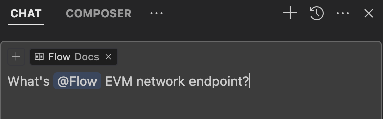

# Use Flow Knowledge Base in Cursor

[Cursor] is an AI code editor that makes it easy to write code while building Flow apps. Let's walk through how to setup Cursor for the best possible experience when writing applications on Flow.

  <iframe 
    style={{ position: 'absolute', top: 0, left: 0, width: '100%', height: '100%' }}
    src="https://www.youtube.com/embed/Lu6KrNvGthI" 
    title="YouTube video player" 
    frameborder="0" 
    allow="accelerometer; autoplay; clipboard-write; encrypted-media; gyroscope; picture-in-picture" 
    allowfullscreen
  ></iframe>

## Installation

Adding Flow docs lets you interact with our docs directly and get the most accurate answers to your questions.

1. Go to Cursor Settings > Features > Docs and click "+ Add new doc".

1. Set Flow Docs:

- Enter the URL of the Flow docs: `https://developers.flow.com/tools` and press Enter.
  - Note: This **will index all** the docs. We're investigating why you need `/tools`
  - Cursor will automatically detect the Flow docs and index them for you.
  - Ensure the name is `Flow`, and click "Confirm" to add the docs.

1. Set Cadence Docs:

- Click "+ Add new doc" again, now enter the URL of the Cadence docs: `https://cadence-lang.org/docs/` and press Enter.
- Same process as before, ensure the name is `Cadence`, and click "Confirm" to add the docs.

1. Add [Flow Data Sources]:
   Click "+ Add new doc" one more time and enter the URL of our massive, auto-generated file with the most current data and practices for Flow and Cadence: `https://github.com/onflow/Flow-Data-Sources/blob/main/merged_docs/all_merged.md` and press Enter.

- Enter `Flow Data Sources`, and click "Confirm" to add the doc.
- **Caution**: This file is very large. For older development machines, you may wish to use the [essentials merged] file instead.

1. Now wait for Cursor to index the docs. You can check the progress in the Docs section of the settings. After the indexing is complete, you can start using the docs in Cursor.

## Using Flow Docs in Cursor

You can then reference the Flow docs in your prompt with the `@Flow`, `@Cadence`or `@Flow Data Sources` docs.

## Best Practices

When using Cursor with Flow documentation:

- Use `@Flow` when asking questions about Flow-specific concepts, tools, or ecosystem
- Use `@Cadence` when asking questions about Cadence programming language syntax or features
- Use `@Flow Data Sources` when asking about complex questions, difficult tasks, or anything that the first two sources didn't provide a satisfactory result
- Be specific in your prompts to get more accurate and relevant answers
- Combine both `@Flow` and `@Cadence` when working on cross-VM applications
- Use the documentation to verify AI-generated code and ensure best practices

## Troubleshooting

If you encounter any issues:

1. Ensure all three sources are properly indexed
2. Try refreshing the documentation if answers seem outdated
3. Check your internet connection as Cursor needs to access the documentation
4. Verify the URLs are correct in your settings
5. Contact Cursor support if issues persist

[Cursor]: https://www.cursor.com/
[Flow Data Sources]: ../flow-data-sources.md
[essentials merged]: https://github.com/onflow/Flow-Data-Sources/blob/main/merged_docs/essentials_merged.md
