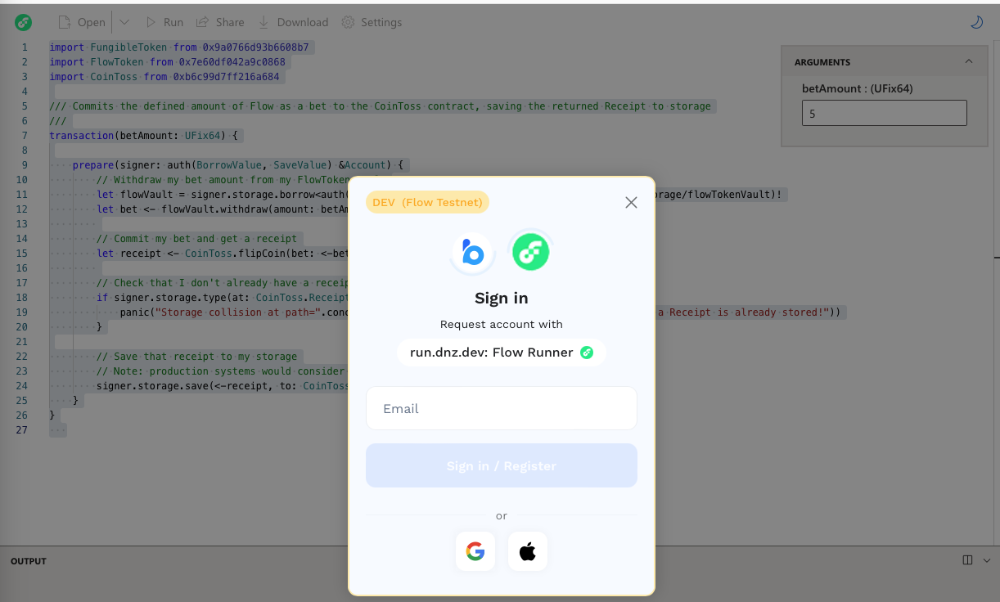

# Introduction

One approach to generating a random number on EVM chains is to utilize block hashes. This method involves combining the block hash with a user-provided seed and hashing them together. The resulting hash can be used as a pseudo-random number. However, this approach has limitations:


1. **Predictability**: Miners can potentially manipulate the block hash to influence the generated random number.
2. **Replay attacks**: In case of block reorganizations, the revealed answers will not be re-used again.

Chainlink VRF is a popular tool for generating provably random values on Ethereum and other blockchains, however, while Chainlink VRF is a powerful tool, it does have several limitations, including cost, latency, dependency on external oracles, and scalability concerns. For use cases with high-volume randomness requirements or where low latency is crucial, it may be worth considering alternative solutions or hybrid approaches.

On Flow, however, you can simply use Flow's Random Beacon contract which enhances blockchain functionality and eliminates reliance on external oracles by providing native on-chain randomness at the protocol level. Via a commit-and-reveal scheme, Flow's protocol-native secure randomness can be safely used within both Cadence and Solidity smart contracts when contracts are transacted on by untrusted parties. By providing examples of commit-reveal implementations we hope to foster a more secure ecosystem of decentralized applications and encourage developers to build with best practices.


## Objectives
In this guide, we'll learn how to use a commit-reveal scheme in conjunction with the Random Beacon in order to achieve non-revertible randomness, mitigating post-selection attacks.

To achieve non-revertible randomness, the contract should be structured to resolve in two phases:


1. **Commit** - Caller commits to the resolution of their bet with some yet unknown source of randomness (i.e. in the future)
2. **Reveal** - Caller can then resolve the result of their bet once the source of randomness is available in the `RandomBeaconHistory` with a separate transaction. From a technical perspective, this could also be called a "resolving transaction", because the transaction simply executes the smart contract with the locked-in inputs, whose output all parties committed to accept in the previous phase.


After completing this guide, you'll be able to:

* Deploy a Cadence contract on the Flow network
* Call functions on this contract to utilize Flow’s native capabilities for on-chain randomness

## Prerequisites


> [Run.dnz](https://run.dnz.dev/)

In order to implement this structure into our logic, we're gonna use three supporting abstract contracts.


1.  **[Xorshift128plus](https://github.com/onflow/random-coin-toss/blob/main/contracts/Xorshift128plus.cdc)**
2. **[RandomBeaconHistory](https://contractbrowser.com/A.e467b9dd11fa00df.RandomBeaconHistory)**
3. **[CadenceRandomConsumer](https://github.com/onflow/random-coin-toss/blob/main/contracts/RandomConsumer.cdc)**

The **first** one is a base contract that implements the Xorshift128+ pseudo-random number generator (PRG) algorithm.

The **second** one is a base contract that stores the history of random sources generated by the Flow network. The defined Heartbeat resource is updated by the Flow Service Account at the end of every block with that block's source of randomness.

And the **third** one is a base contract for secure consumption of Flow's protocol-native randomness via the Random Beacon History contrac. Implementing contracts benefit from the commit-reveal scheme below, ensuring that callers cannot revert on undesirable random results.

If you want to explore deeper into the implementation of these contracts, you can check the [original GitHub repo](https://github.com/onflow/random-coin-toss).

Since these contracts are already deployed on testnet, all we gotta do is import the [RandomConsumer](https://contractbrowser.com/A.ed24dbe901028c5c.RandomConsumer) contract into the new `CoinToss.cdc` contract we're building, which is a contract that represents a simple coin toss game where users can place a bet and win prizes by flipping a coin. The way the game works is as following: a user commits to bet a voluntary amount by signing a transaction, and then the same user can flip a coin and see the result at a second transaction. They win the prize if the random result is **even**. As simple as that! 

Let's define our `CoinToss.cdc` and bring the other supporting contracts. 
```cadence
import "Burner"
import "FungibleToken"
import "FlowToken"

import "RandomConsumer"

access(all) contract CoinToss {
    /// The multiplier used to calculate the winnings of a successful coin toss
    access(all) let multiplier: UFix64
    /// The Vault used by the contract to store funds.
    access(self) let reserve: @FlowToken.Vault
    /// The RandomConsumer.Consumer resource used to request & fulfill randomness
    access(self) let consumer: @RandomConsumer.Consumer

    /* --- Events --- */
    access(all) event CoinFlipped(betAmount: UFix64, commitBlock: UInt64, receiptID: UInt64)
    access(all) event CoinRevealed(betAmount: UFix64, winningAmount: UFix64, commitBlock: UInt64, receiptID: UInt64)
}
```

After this, let's define the first step in our scheme; the commit phase. We do this through a `flipCoin` public function. In this method, the caller commits a bet. The contract takes note of the block height and bet amount, returning a `Receipt` resource which is used by the former to reveal the coin toss result and determine their winnings.
```cadence
access(all) fun flipCoin(bet: @{FungibleToken.Vault}): @Receipt {
        let request <- self.consumer.requestRandomness()
        let receipt <- create Receipt(
                betAmount: bet.balance,
                request: <-request
            )
        self.reserve.deposit(from: <-bet)

        emit CoinFlipped(betAmount: receipt.betAmount, commitBlock: receipt.getRequestBlock()!, receiptID: receipt.uuid)

        return <- receipt
    }
```
Now we implement the reveal phase with the `revealCoin` function. Here the caller provides the Receipt given to them at commitment. The contract then "flips a coin" with `_randomCoin()` providing the Receipt's contained Request. If result is **1**, user loses, but if it's **0** the user doubles their bet. Note that the caller could condition the revealing transaction, but they've already provided their bet amount so there's **no loss** for the contract if they do.
```cadence
access(all) fun revealCoin(receipt: @Receipt): @{FungibleToken.Vault} {
        let betAmount = receipt.betAmount
        let commitBlock = receipt.getRequestBlock()!
        let receiptID = receipt.uuid

        let coin = self._randomCoin(request: <-receipt.popRequest())

        Burner.burn(<-receipt)

        // Deposit the reward into a reward vault if the coin toss was won
        let reward <- FlowToken.createEmptyVault(vaultType: Type<@FlowToken.Vault>())
        if coin == 0 {
            let winningsAmount = betAmount * self.multiplier
            let winnings <- self.reserve.withdraw(amount: winningsAmount)
            reward.deposit(
                from: <-winnings
            )
        }

        emit CoinRevealed(betAmount: betAmount, winningAmount: reward.balance, commitBlock: commitBlock, receiptID: receiptID)

        return <- reward
    }
```
Now let's try these functions on Testnet, using the fully developed and deployed contract at this address: [0xb6c99d7ff216a684](https://contractbrowser.com/A.b6c99d7ff216a684.CoinToss). And we're going to use a tool similar to Remix on Ethereum, but for the Flow blockchain and called [run.dnz](https://run.dnz.dev/).

In it, we're going to paste the following Cadence transaction code:
```cadence
import FungibleToken from 0x9a0766d93b6608b7
import FlowToken from 0x7e60df042a9c0868
import CoinToss from 0xb6c99d7ff216a684

/// Commits the defined amount of Flow as a bet to the CoinToss contract, saving the returned Receipt to storage
///
transaction(betAmount: UFix64) {

    prepare(signer: auth(BorrowValue, SaveValue) &Account) {
        // Withdraw my bet amount from my FlowToken vault
        let flowVault = signer.storage.borrow<auth(FungibleToken.Withdraw) &FlowToken.Vault>(from: /storage/flowTokenVault)!
        let bet <- flowVault.withdraw(amount: betAmount)
        
        // Commit my bet and get a receipt
        let receipt <- CoinToss.flipCoin(bet: <-bet)
        
        // Check that I don't already have a receipt stored
        if signer.storage.type(at: CoinToss.ReceiptStoragePath) != nil {
            panic("Storage collision at path=".concat(CoinToss.ReceiptStoragePath.toString()).concat(" a Receipt is already stored!"))
        }

        // Save that receipt to my storage
        // Note: production systems would consider handling path collisions
        signer.storage.save(<-receipt, to: CoinToss.ReceiptStoragePath)
    }
}
```
A modal should pop-up, prompting us to input the "bet amount". After you submit your bet, click on the "Run" button and the `WalletConnect` window shall appear. On this website, we can use Blocto. Sign-in with your email, and then "Approve" the transaction to send it to the Testnet network. 

You can take the transaction id to [FlowDiver](https://testnet.flowdiver.io/)[.io](https://testnet.flowdiver.io/tx/9c4f5436535d36a82d4ae35467b37fea8971fa0ab2409dd0d5f861f61e463d98) to have a full view of everything that's going on with this `FlipCoin` transaction. Now, we want to reveal the coin and find out if we win or lose. For this, we'll copy/paste and use the following Cadence transaction, which must be signed with the same account that signed the flip transaction. 
```cadence
import FlowToken from 0x7e60df042a9c0868
import CoinToss from 0xb6c99d7ff216a684

/// Retrieves the saved Receipt and redeems it to reveal the coin toss result, depositing winnings with any luck
///
transaction {

    prepare(signer: auth(BorrowValue, LoadValue) &Account) {
        // Load my receipt from storage
        let receipt <- signer.storage.load<@CoinToss.Receipt>(from: CoinToss.ReceiptStoragePath)
            ?? panic("No Receipt found in storage at path=".concat(CoinToss.ReceiptStoragePath.toString()))

        // Reveal by redeeming my receipt - fingers crossed!
        let winnings <- CoinToss.revealCoin(receipt: <-receipt)

        if winnings.balance > 0.0 {
            // Deposit winnings into my FlowToken Vault
            let flowVault = signer.storage.borrow<&FlowToken.Vault>(from: /storage/flowTokenVault)!
            flowVault.deposit(from: <-winnings)
        } else {
            destroy winnings
        }
    }
}
```
After running this transaction, we reveal the result of the coin flip and it's 1! Meaning we have won nothing this time, but keep trying! 

You can find the full transaction used for this example, with its result and events, at [FlowDiver.io/tx/](https://testnet.flowdiver.io/tx/a79fb2f947e7803eefe54e48398f6983db4e0d4d5e217d2ba94f8ebdec132957)


## Conclusion

The commit-reveal scheme implemented within the context of Flow's Random Beacon provides a robust solution for generating secure and non-revertible randomness in decentralized applications. By leveraging this mechanism, developers can ensure that their applications are not only fair but also resistant to manipulation and replay attacks, which are common pitfalls in traditional random number generation methods on other blockchains. 

The example of the CoinToss game illustrates the practical implementation of these concepts, showing how simple yet effective this approach can be. As blockchain technology continues to evolve, such best practices are crucial for fostering a secure and trustworthy ecosystem, encouraging developers to innovate while adhering to the principles of decentralization and fairness. By utilizing Flow’s native capabilities, developers can focus more on creating engaging user experiences without the complexities and limitations often associated with external oracles. As the landscape of decentralized applications grows, adopting these advanced techniques will be vital in ensuring the integrity and reliability of randomness-based functionalities.

