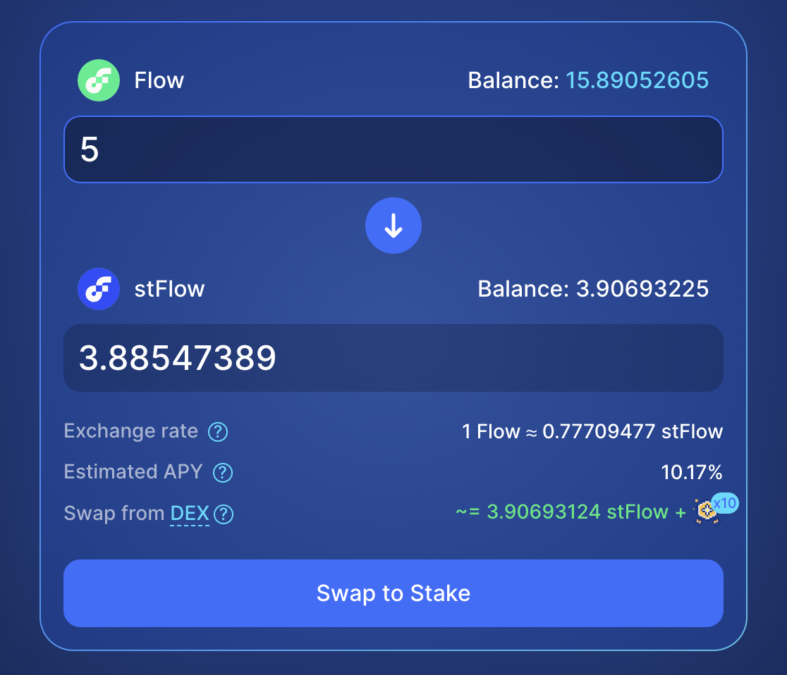

# DeFi Actions Transaction

:::warning

Defi actions on Flow are being reviewed and finalized in [FLIP 339]. The specific implementation may change as a part of this process.

These tutorials will be updated, but you may need to refactor your code if the implementation changes.

:::

[Staking] is an entry-level way to participate in the blockchain process by supplying some of the tokens needed to participate in governance in return for a share of the reward this process generates. It's a great way to increase the value of a holding that would otherwise sit unutilized and provides a much higher rate of return than a savings account, though you should make sure you understand how [slashing] works and make your own determinations on risk.

You can stake directly by locking up your tokens with [Flow Port], or you can participate in other platforms and protocols that have a different strategy for participating in this process. [IncrementFi] has a Liquid Staking Protocol they describe as:

> LSP allows users to earn staking rewards without locking $flow tokens or running node softwares. Users can deposit $flow tokens and receive transferrable $stFlow tokens in return. Liquid staking combines the benefits of staking (earning rewards) and brings liquidity, as well as additional possibilities to increase your assets or hedge your positions by participating in Flow's DeFi ecosystem.

Participation in staking comes with a tedious chore - you'll need to regularly complete one or more transactions to claim your rewards and restake them to compound your earnings.

Defi actions help developers simplify this type of task by giving developers a suite of blocks that once instantiated, perform actions in the same way from one protocol to another.

In this tutorial, you'll learn how to build a transaction that simplifies restaking on [IncrementFi], and can be adapted using different connectors to work on other protocols as well.

:::tip

If you combine this transaction with [scheduled transactions], you can automate it completely!

:::

## Learning Objectives

After completing this tutorial, you will be able to:

-

## Prerequisites

## Cadence Programming Language

This tutorial assumes you have a modest knowledge of [Cadence]. If you don't, you'll be able to follow along, but you'll get more out of it if you complete our series of [Cadence] tutorials. Most developers find it more pleasant than other blockchain languages and it's not hard to pick up.

## Getting Started

This demo uses **mainnet** and a real DeFi protocol. Before writing any code, you'll need to do some setup.

:::danger

This tutorial uses a real protocol with real funds. Only work with funds your comfortable losing in the event of an error or mistake.

Cadence is much safer than Solidity, but there are a limited number of ways you could accidentally do something undesirable.

:::

### Starting With the Scaffold

Create a new repo using the [Defi Actions Scaffold] as a template. Clone your new repo locally and open it in your editor.

Run `flow deps install` to install dependencies.

### Export Your Wallet Key

:::danger

Never use a wallet with with a large amount of funds for development! If you are tricked into downloading a malicious VS Code extension, these funds may be stolen.

Never put a wallet key directly in `flow.json`.

:::

[Export] the key for the wallet you want to use for this exercise. It needs to have some funds in it, but you shouldn't do development with the same wallet you keep any valuable assets in.

Create a `.pkey` file for your wallet key, **add it to `.gitignore`\***, then add the account to `flow.json`:

```json
"accounts": {
  "my-testnet-account": {
    "address": "<YOUR CADENCE ADDRESS>",
    "key": {
      "type": "file",
      "location": "./my-testnet-account.key"
    }
  }
}
```

### Staking with IncrementFi

Go to Increment Fi, switch to the [staking app], and stake 5 $FLOW.



### Initialize Your Staking User Certificate

IncrementFi uses a `Staking.UserCertificate` internally for some actions. You don't need one of these to stake tokens, and it's automatically created when you do other actions on the platform that use it. You will need this certificate to complete this tutorial. You can accomplish that with this [script on Flow Runner].

When it succeeds, you'll see output similar to:

```zsh
Transaction ID: 7d3efabb98d3fed69aabf8fa9007fa11571b70300cbd641120271bbfa8e932f5
Transaction Result:
{6 items
"blockId":string"1206e0a1e6f16098e8d3555f7568f7f14e8e6df1983946408627a964dd87d69d"
"status":int4
"statusString":string"SEALED"
"statusCode":int0
"errorMessage":string""
# Remaining details omitted for brevity
```

### Find Your `pid`

Open the [IncrementFi Farms] and use the number in the pool name (e.g., #198). That number is your pid.

## Setting Up the Project

Begin by using the [DeFi Actions Scaffold] repo as a template to create a new repository. Clone your new repository and open it in your editor.

Follow the instructions in the README for **mainnet**.

## Building the Transaction

State that we're duplicating the transaction provided in the scaffold `cadence/transactions/increment_fi_restake.cdc`

Assemble the transactions step by step without using AI. Explain what each part is and why we are using it in the setup.

Explain

## Running the Transaction

### Interpreting the Results

## Conclusion

<!-- Reference-style links, will not render on page -->

[FLIP 339]: https://github.com/onflow/flips/pull/339/files
[Staking]: ../../networks/staking/index.md
[slashing]: ../../networks/staking/04-stake-slashing.md
[Flow Port]: https://port.flow.com/
[IncrementFi]: https://app.increment.fi/
[Defi Actions Scaffold]: https://github.com/onflow/defiactions-scaffold
[zap]: ./breakthislinkfornow
[zapper]: ./breakthislinkfornow
[`/cadence/transactions/increment_fi_restake.cdc`]: https://github.com/onflow/defiactions-scaffold/blob/main/cadence/transactions/increment_fi_restake.cdc
[scheduled transactions]: ./scheduled-transactions-introduction.md
[Export]: https://docs.wallet.flow.com/tutorial/extension-private-key-and-seed-phrase-guide
[Cadence]: https://cadence-lang.org/docs
[staking app]: https://app.increment.fi/staking
[script on Flow Runner]: https://run.dnz.dev/snippet/d1bf715483551879
[IncrementFi Farms]: https://app.increment.fi/farm
