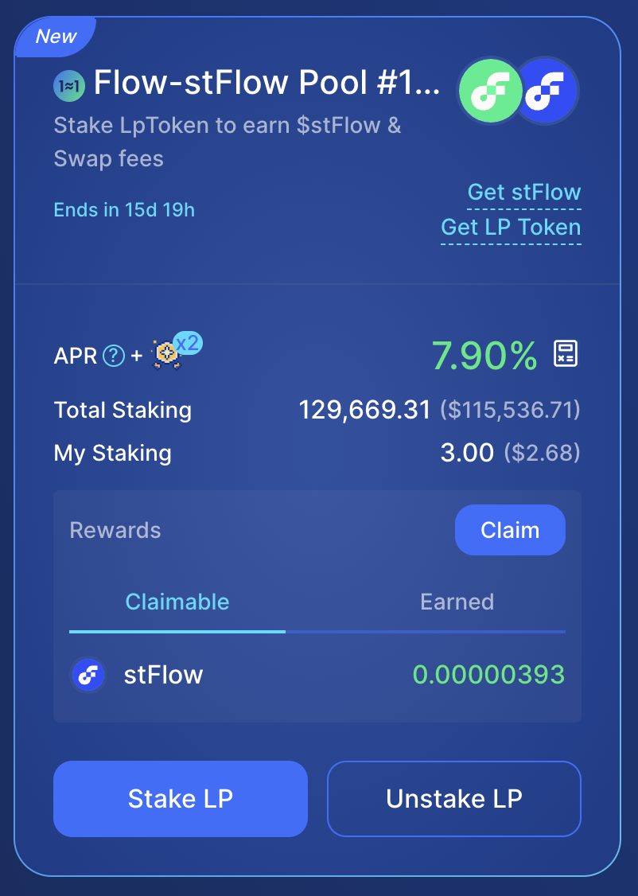

# Flow Actions Transaction

:::warning

Flow Actions are being reviewed and finalized in [FLIP 339]. The specific implementation may change as a part of this process.

These tutorials will be updated, but you may need to refactor your code if the implementation changes.

:::

[Staking] is an entry-level way to participate in the blockchain process by supplying some of the tokens needed to participate in governance in return for a share of the reward this process generates. It's a great way to increase the value of a holding that would otherwise sit unutilized and provides a much higher rate of return than a savings account, though you should make sure you understand how [slashing] works and make your own determinations on risk.

You can stake directly by locking up your tokens with [Flow Port], or you can participate in other platforms and protocols that have a different strategy for participating in this process. [IncrementFi] has a Liquid Staking Protocol they describe as:

> LSP allows users to earn staking rewards without locking $flow tokens or running node softwares. Users can deposit $flow tokens and receive transferrable $stFlow tokens in return. Liquid staking combines the benefits of staking (earning rewards) and brings liquidity, as well as additional possibilities to increase your assets or hedge your positions by participating in Flow's DeFi ecosystem.

Participation in staking comes with a tedious chore - you'll need to regularly complete one or more transactions to claim your rewards and restake them to compound your earnings.

Flow Actions help developers simplify this type of task by giving developers a suite of blocks that once instantiated, perform actions in the same way from one protocol to another.

In this tutorial, you'll learn how to build a transaction that simplifies restaking on [IncrementFi], and can be adapted using different connectors to work on other protocols as well.

:::tip

If you combine this transaction with [scheduled transactions], you can automate it completely!

:::

## Learning Objectives

After completing this tutorial, you will be able to:

- Chain multiple DeFi operations atomically
- Handle token type mismatches automatically  
- Build safe, validated transactions with proper error handling
- Create reusable, protocol-agnostic DeFi building blocks

## Prerequisites

- Flow CLI: install from the [Flow CLI docs]
- Cursor + [Cadence Extension] (recommended)

## Cadence Programming Language

This tutorial assumes you have a modest knowledge of [Cadence]. If you don't, you'll be able to follow along, but you'll get more out of it if you complete our series of [Cadence] tutorials. Most developers find it more pleasant than other blockchain languages and it's not hard to pick up.

## Getting Started on Mainnet

This demo uses **mainnet** and a real DeFi protocol. Before writing any code, you'll need to do some setup.

:::danger

This tutorial uses a real protocol with real funds. Only work with funds your comfortable losing in the event of an error or mistake.

Cadence is much safer than Solidity, but there are a limited number of ways you could accidentally do something undesirable.

:::

### Staking with IncrementFi

In order to complete this tutorial, we must set up a staking position in Increment Fi. If you already have LP tokens then you can skip to the **Staking LP Token** step.

**Creating an LP Position**

First go to the [Increment Fi Liquidity Pool] and select the 'Single Asset' button to be able to provide liquidity with your FLOW tokens.


Then input the amount of FLOW you want to add as liquidity. Once the transaction is confirmed, you are ready to proceed with the next step.

**Staking LP Token**

Now that you have LP tokens from the FLOW-stFLOW pool, you can stake these token to receive rewards from them. To do this you must go to the [IncrementFi Farms] page and look for the `Flow-stFlow Pool #199` pool. Note that the #199 is the Pool ID (pid). You might need to select the list view first (the middle button in the upper-right section of the LP pools page) in order to properly see the pid.


This pid is necessary to execute the restaking transaction later, so be sure to know with pid you are using. 


Then select the `Stake LP` button and input the amount of LP tokens that you wish to stake into the pool. Once the transaction has been approved and confirmed, you will see you total stake position and rewards that are claimable in the pool card.



Now our staking position will generate rewards as time passes by. We will use Flow Actions to be able to execute a single transaction that can claim the rewards (stFLOW), convert the optimal amount into FLOW, increase the LP position (thus getting more LP tokens), and restaking them into the farm. 

### Initialize Your Staking User Certificate

IncrementFi uses a `Staking.UserCertificate` internally for some actions. You don't need one of these to stake tokens, and it's automatically created when you do other actions on the platform that use it. You will need this certificate to complete this tutorial. You can accomplish that with this [script on Flow Runner].

When it succeeds, you'll see output similar to:

```zsh
Transaction ID: 7d3efabb98d3fed69aabf8fa9007fa11571b70300cbd641120271bbfa8e932f5
Transaction Result:
{6 items
"blockId":string"1206e0a1e6f16098e8d3555f7568f7f14e8e6df1983946408627a964dd87d69d"
"status":int4
"statusString":string"SEALED"
"statusCode":int0
"errorMessage":string""
# Remaining details omitted for brevity
```

The UserCertificate is a resource stored in your account's private storage that:

  1. Proves your identity for IncrementFi staking operations
  2. Allows you to claim rewards from staking pools

## Setting Up the Project

Begin by using the [Flow Actions Scaffold] repo as a template to create a new repository. Clone your new repository and open it in your editor.

Follow the instructions in the README for **mainnet**.

### Starting With the Scaffold

Create a new repo using the [Flow Actions Scaffold] as a template. Clone your new repo locally and open it in your editor.

Run `flow deps install` to install dependencies.

**Note** that this Scaffold repo is a minimal Flow project with dependencies for Flow Actions and Increment Fi connectors. It only has support for the specific transaction that we will execute in this demo (Claim → Zap → Restake for IncrementFi LP rewards)

### Export Your Wallet Key

:::danger

Never use a wallet with with a large amount of funds for development! If you are tricked into downloading a malicious VS Code extension, these funds may be stolen.

Never put a wallet key directly in `flow.json`.

:::

:::warning

Transactions on mainnet incur fees and affect on-chain balances. Consider creating a new Flow Wallet account with limited funds.

:::

[Export] the key for the wallet you want to use for this exercise. It needs to have some funds in it, but you shouldn't do development with the same wallet you keep any valuable assets in.

Create a `.pkey` file for your wallet key, **add it to `.gitignore`**, then add the account to `flow.json`:

```json
"accounts": {
  "my-testing-account": {
    "address": "<YOUR CADENCE ADDRESS>",
    "key": {
      "type": "file",
      "location": "./my-testing-account.pkey"
    }
  }
}
```

## Building the Transaction

Now that the dependencies have been properly setup and we have made sure that our account is properly setup, the staking position is established as well as the `Staking.UserCertificate`; we are now ready to finally build the restaking transaction

We will be duplicating the transaction provided in the scaffold `cadence/transactions/increment_fi_restake.cdc`

The key pattern we need to create is:

**Source** → **Swap** → **Sink**

- **Source**: Provides tokens (rewards, vaults, etc.)
- **Swap**: Converts tokens (swapping to zap input then zapping to LP tokens)
- **Sink**: Receives and deposits tokens (staking pools, vaults)

### Import Required Contracts

First we need to import all the contracts needed to build the transaction:

```cadence
import "FungibleToken"
import "DeFiActions"
import "SwapConnectors"
import "IncrementFiStakingConnectors"
import "IncrementFiPoolLiquidityConnectors"
import "Staking"
```

- `FungibleToken`: Standard token interface for Flow
- `DeFiActions`: Core Flow Actions framework for composability
- `SwapConnectors`: Wraps swap operations as Flow Actions
- `IncrementFiStakingConnectors`: Flow Actions connectors for IncrementFi staking
- `IncrementFiPoolLiquidityConnectors`: LP token creation (zapping)
- `Staking`: Core staking contract for user certificates

### Define Transaction Parameters

We will specify the `pid` (Pool ID) as the transaction parameter because it identifies which IncrementFi staking pool to interact with

```cadence
transaction(
    pid: UInt64
) {
```

### Declare Transaction Properties

Then we need to declare all the properties that are needed for the transaction to occur. Here is where the `Staking.UserCertificate` we created will be useful for authentication staking operations. The `pool` is used to reference the staking pool for validation. The starting balance for post-condition verification is the `startingStake`. The composable source that provides LP tokens is the `swapSource`. The `expectedStakeIncrease` is the minimum expected increase for safety. Finally we have the `operationID` which serves as the unique identifier for tracing the operation across Flow Actions.

```cadence
let userCertificateCap: Capability<&Staking.UserCertificate>
let pool: &{Staking.PoolPublic}
let startingStake: UFix64
let swapSource: SwapConnectors.SwapSource
let expectedStakeIncrease: UFix64
let operationID: DeFiActions.UniqueIdentifier
```

### Prepare Phase

The `prepare` phase is used for setup and validation for a transaction in Cadence, it runs before anything else. The `prepare` phase is essentially "plan and validate" while `execute` is "do it atomically".


**Pool Validation** ensures the specified pool exists and is accessible.

```cadence
// Get pool reference and validate it exists
self.pool = IncrementFiStakingConnectors.borrowPool(pid: pid)
    ?? panic("Pool with ID \(pid) not found or not accessible")
```

**User State Validation** records current staking balance to verify the transaction worked correctly.

```cadence
// Get starting stake amount for post-condition validation
self.startingStake = self.pool.getUserInfo(address: acct.address)?.stakingAmount
    ?? panic("No user info for address \(acct.address)")
```

**User Authentication** creates a capability to access your UserCertificate (required for staking operations)

```cadence
// Issue capability for user certificate
self.userCertificateCap = acct.capabilities.storage
    .issue<&Staking.UserCertificate>(Staking.UserCertificateStoragePath)
```

**Operation Tracking** creates a unique ID to trace this operation through all Flow Actions components

```cadence
// Create unique identifier for tracing this composed operation
self.operationID = DeFiActions.createUniqueIdentifier()
```

### Token Type Detection and Configuration

Then we need to get the liquidity pair information (what tokens make up this pool), this will be done with the `pid` from the pool we staked the LP tokens. We also convert token identifiers to actual Cadence types and determines if this is a stableswap pool or a regular AMM

```cadence
// Get pair info to determine token types and stable mode
let pair = IncrementFiStakingConnectors.borrowPairPublicByPid(pid: pid)
    ?? panic("Pair with ID \(pid) not found or not accessible")

// Derive token types from the pair
let token0Type = IncrementFiStakingConnectors.tokenTypeIdentifierToVaultType(pair.getPairInfoStruct().token0Key)
let token1Type = IncrementFiStakingConnectors.tokenTypeIdentifierToVaultType(pair.getPairInfoStruct().token1Key)
```

### Build the Flow Actions Chain

We need to create the `RewardsSource` so that we can claim the available rewards from the staking pool.

```cadence
// Create rewards source to claim staking rewards
let rewardsSource = IncrementFiStakingConnectors.PoolRewardsSource(
    userCertificate: self.userCertificateCap,
    pid: pid,
    uniqueID: self.operationID
)
```

In case the reward token might not match the pool's token0, we check if we need to reverse the order to account for this mismatch. This helps us ensure that the zapper can function properly. 

```cadence
// Check if we need to reverse token order: if reward token doesn't match token0, we reverse
// so that the reward token becomes token0 (the input token to the zapper)
let reverse = rewardsSource.getSourceType() != token0Type
```

Now the zapper can function properly and it will take the reward token as an input (regardless of token ordering). The zapper will swap half to the other token pair in order to combine them into LP tokens. 

```cadence
// Create zapper to convert rewards to LP tokens
let zapper = IncrementFiPoolLiquidityConnectors.Zapper(
    token0Type: reverse ? token1Type : token0Type,  // input token (reward token)
    token1Type: reverse ? token0Type : token1Type,  // other pair token
    stableMode: pair.getPairInfoStruct().isStableswap,
    uniqueID: self.operationID
)
```

Here is where the true **composition** of Flow Actions come into place. The `lpSource` creates a single source that claims rewards from the staking pool. automatically converts them into LP tokens, and provides LP tokens as output. 

```cadence
// Wrap rewards source with zapper to convert rewards to LP tokens
let lpSource = SwapConnectors.SwapSource(
    swapper: zapper,
    source: rewardsSource,
    uniqueID: self.operationID
)
```

Then the minimum LP tokens we expect to receive are calculated for safety validation.

```cadence
// Calculate expected stake increase for post-condition
self.expectedStakeIncrease = zapper.quoteOut(
    forProvided: lpSource.minimumAvailable(),
    reverse: false
).outAmount
```

### Post-Condition Safety Check

This phase runs at the end and it is used for condition verification. We ensure that the transaction actually increased your staking balance as expected.

```cadence
post {
    // Verify that staking amount increased by at least the expected amount
    self.pool.getUserInfo(address: self.userCertificateCap.address)!.stakingAmount
        >= self.startingStake + self.expectedStakeIncrease:
        "Restake below expected amount"
}
```

### Execute the Transaction

**poolSink** creates the staking pool sink in which the LP tokens will be deposited.

```cadence
// Create pool sink to receive LP tokens for staking
let poolSink = IncrementFiStakingConnectors.PoolSink(
    pid: pid,
    staker: self.userCertificateCap.address,
    uniqueID: self.operationID
)
```

Now we have all the components ready for the full flow of transactions. `swapSource.withdrawAvailable()` triggers the entire Source → Transformer chain. This claims rewards, swaps to LP tokens and withdraws LP tokens. The `poolSink.depositCapacity()` deposits LP tokens into the staking pool. And finally we ensure that all tokens were properly deposited (no dust left behind).

```cadence
// Withdraw LP tokens from swap source (sized by sink capacity)
let vault <- self.swapSource.withdrawAvailable(maxAmount: poolSink.minimumCapacity())

// Deposit LP tokens into pool for staking
poolSink.depositCapacity(from: &vault as auth(FungibleToken.Withdraw) &{FungibleToken.Vault})

// Ensure no residual tokens remain
assert(vault.balance == 0.0, message: "Residual after deposit")
destroy vault
```

See what happened? We are able to execute this whole (and quite complex) flow in an atomic manner with a single transaction!

## Running the Transaction

We are now ready to restake the position with a single transaction!

```bash
flow transactions send cadence/transactions/increment_fi_restake.cdc \
  --network mainnet \
  --signer my-testing-account \
  --args-json '[{"type":"UInt64","value":"<YOUR_POOL_PID>"}]'
```
Replace `<YOUR_POOL_PID>` with your actual pool ID from the IncrementFi Farms page, in this case it is 199. 

### Interpreting the Results

Once you have completed the transaction successfully you see that the following events occurred:

- The rewards (stFLOW) were claimed from pool #199 and the reward balance has been updated properly 
- The stFLOW was converted to FLOW 
- FLOW and stFLOW was used to add liquidity to the liquidity pool
- LP tokens were received 
- LP tokens were staked back into the #199 pool causing the staking balance to increase


## Running the Transaction on Emulator

You can run this whole flow on Emulator as well. It is recommended to do all the testing on Emulator. After cloning the [Flow Actions Scaffold] and installing the dependencies you can run:

```bash
make start
```

The `make start` command handles all setup automatically using the built-in emulator service account, so no manual configuration is needed. This starts the Flow Emulator and deploys Increment FI dependencies, creates test tokens (1M each), sets up the liquidity pool, sets up the staking pool #0 and displays the complete environment summary. The `pid` is `0` because the automated setup creates the first staking pool with ID `0` containing your staked LP tokens and active rewards

Now you can test the restake workflow:

```bash
# Check available rewards
flow scripts execute cadence/scripts/get_available_rewards.cdc \
--network emulator \
--args-json '[{"type":"Address","value":"0xf8d6e0586b0a20c7"},{"type":"UInt64","value":"0"}]'

# Run the restake transaction
flow transactions send cadence/transactions/increment_fi_restake.cdc \
--signer emulator-account \
--network emulator \
--args-json '[{"type":"UInt64","value":"0"}]'

# Verify rewards were claimed and restaked
flow scripts execute cadence/scripts/get_available_rewards.cdc \
--network emulator \
--args-json '[{"type":"Address","value":"0xf8d6e0586b0a20c7"},{"type":"UInt64","value":"0"}]'
```

If you want to run Cadence tests then you can use the following commands:

```bash
make test
# or directly:
flow test
```


## Conclusion

This transaction demonstrates how to chain multiple DeFi operations atomically, handle token type mismatches automatically, build safe validated transactions with proper error handling, and create reusable protocol-agnostic DeFi building blocks. These patterns can be applied to build yield farming, arbitrage, and portfolio management strategies across Flow's DeFi ecosystem. Flow Actions enable sophisticated DeFi strategies, that are complex in nature and dependant on various protocols, to be executed in a single atomic transaction. 


<!-- Reference-style links, will not render on page -->

[FLIP 339]: https://github.com/onflow/flips/pull/339/files
[Staking]: ../../networks/staking/index.md
[slashing]: ../../networks/staking/04-stake-slashing.md
[Flow CLI docs]: https://developers.flow.com/tools/flow-cli/install
[Cadence Extension]: https://marketplace.visualstudio.com/items?itemName=onflow.cadence
[Flow Port]: https://port.flow.com/
[IncrementFi]: https://app.increment.fi/
[Flow Actions Scaffold]: https://github.com/onflow/flow-actions-scaffold
[Increment Fi Liquidity Pool]: https://app.increment.fi/liquidity/add?in=A.1654653399040a61.FlowToken&out=A.d6f80565193ad727.stFlowToken&stable=true
[zap]: ./breakthislinkfornow
[zapper]: ./breakthislinkfornow
[`/cadence/transactions/increment_fi_restake.cdc`]: https://github.com/onflow/flow-actions-scaffold/blob/main/cadence/transactions/increment_fi_restake.cdc
[scheduled transactions]: ./scheduled-callbacks-introduction.md
[Export]: https://docs.wallet.flow.com/tutorial/extension-private-key-and-seed-phrase-guide
[Cadence]: https://cadence-lang.org/docs
[staking app]: https://app.increment.fi/staking
[script on Flow Runner]: https://run.dnz.dev/snippet/d1bf715483551879
[IncrementFi Farms]: https://app.increment.fi/farm
