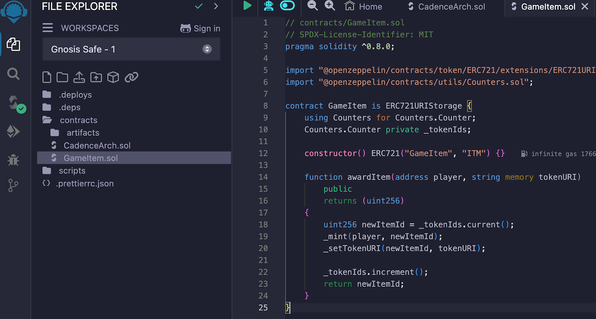
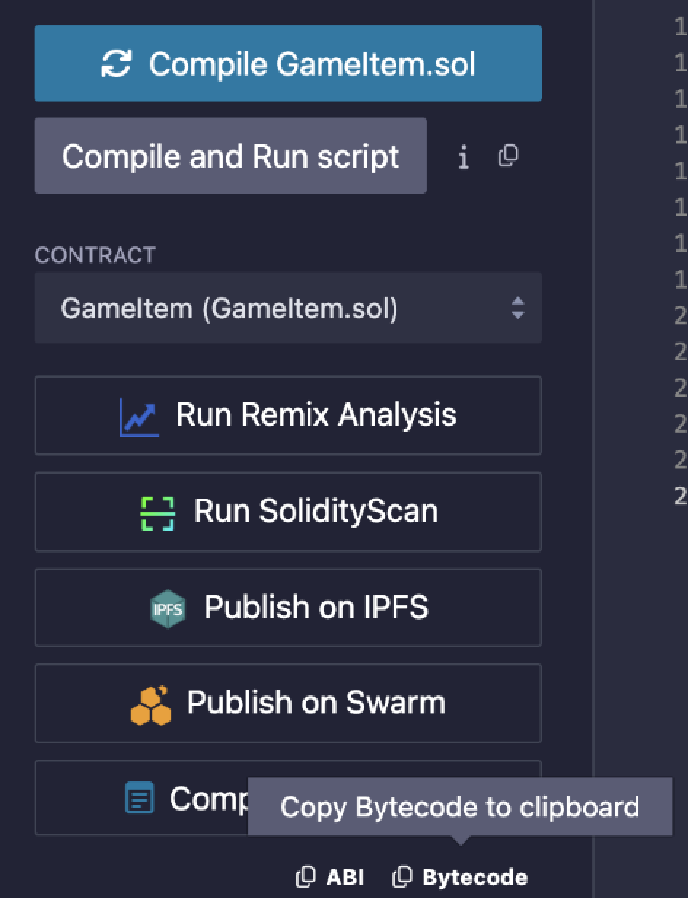
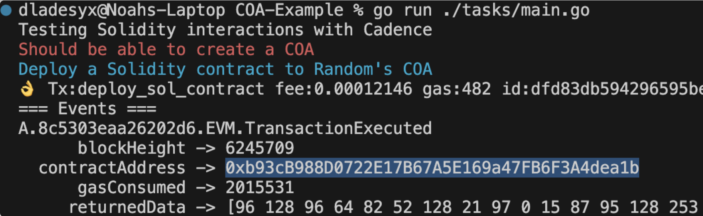

# Introduction

As the blockchain landscape continues to evolve, developers are continually seeking ways to bridge the gap between different smart contract platforms. While Solidity has become the de facto language for Ethereum smart contracts, Cadence has emerged as a powerful and innovative programming language designed specifically for the Flow blockchain. This guide aims to provide a comprehensive overview of the process of deploying Solidity contracts using Cadence, facilitating an environment for developers to leverage the benefits of both worlds.

In this guide, we will walk you through the step-by-step process of deploying a Solidity contract within a Cadence environment, addressing common challenges and best practices along the way. Whether you are a seasoned developer looking to expand your skill set or a newcomer eager to explore the synergies between these two languages, this guide will equip you with the knowledge and tools needed to successfully deploy your smart contracts. By the end, you will have a solid understanding of how to utilize Cadence to interact with Solidity contracts and the unique features Flow offers for scalable and efficient contract deployment. Let’s embark on this journey into the world of smart contracts and discover the potential that lies in bridging these two technologies.

## Objectives

After completing this guide, you'll be able to:

* Deploy a Solidity contract on Flow-EVM using Cadence
* Call functions on this contract from the Cadence side

## Prerequisites

> [NodeJs](https://nodejs.org/en/download/) and [NPM](https://docs.npmjs.com/downloading-and-installing-node-js-and-npm)

> [Go for testing](https://go.dev/)

> [The Flow Command Line Interface](https://developers.flow.com/tools/flow-cli/install) (Flow CLI)

> [Your favorite IDE](https://code.visualstudio.com/)

> [Remix](https://remix.ethereum.org/)

For this guide I'm using Remix for the Solidity contract compilation and Overflow for running Cadence transaction on Flow-EVM. In order to deploy a sol contract using Cadence, you'll need a Cadence Owned Account; follow [this guide](https://developers.flow.com/evm/cadence/interacting-with-coa) to learn how to create one.

First, we'll the byte-code for the Solidity contract we're going to deploy and pass it as an argument to the Cadence transaction for it to be deployed on Flow-EVM. For this example, compile this Solidity ERC721 Solidity contract. Here is OpenZeppelin's [example](https://developers.flow.com/evm/cadence/interacting-with-coa), which is a ERC721 contract used to track items in a game. We're going to deploy this contract using this Cadence transaction:

```cadence
import "EVM"

transaction(code: String, pathId: Int) {
    let coa: auth(EVM.Deploy) &EVM.CadenceOwnedAccount
    
    prepare(signer: auth(Storage) &Account) {
        // COA should be at "EVM_${pathId}"
        // this setting is done to avoid collition, but is only a simple example
        let coaPath = StoragePath(identifier: signer.address.toString().concat("EVM_").concat(pathId.toString()))!
        self.coa = signer.storage.borrow<auth(EVM.Deploy) &EVM.CadenceOwnedAccount>(
        from: coaPath) ?? panic("Could not borrow reference to the COA!")

    }

    execute {
      self.coa.deploy(code: code.decodeHex(),  gasLimit: 15000000, value: EVM.Balance(attoflow: 0))
    }
}
```

Copy and pasted the Solidity contract on remix so we can get its byte-code.


After pasting our contract in Remix, we'll need to compile the contract and copy the bytecode from Remix. 


From the root directory, create a folder called bytecode  and inside it create a file named `GameItem.js` and paste the bytecode inside of it. 

To run the transactions and tests, we'll use [Overflow](https://github.com/bjartek/overflow). You can use the following Go code to read the byte-code from the JavaScript file and use it as an argument for the    `deploy_sol_contract`. You can install Overflow by using this command on your terminal: 

 ```bash
go mod init flow/tutorials
go get github.com/bjartek/overflow/v2
 ```

From the root directory, create a folder called `tasks` and inside it create a file called `main.go` and paste the following Golang code:

```go
package main

import (
	"fmt"
	"io/ioutil"
	"log"

	//if you imports this with .  you do not have to repeat overflow everywhere
	. "github.com/bjartek/overflow/v2"
	"github.com/fatih/color"
)

func readJSFile(filePath string) (string, error) {
	content, err := ioutil.ReadFile(filePath)
	if err != nil {
		return "", err
	}
	return string(content), nil
}

func main() {

	// Specify the path to your JavaScript file
	filePath := "bytecode/GameItem.js"
	// Read the content of the JavaScript file
	jsContent, err := readJSFile(filePath)
	if err != nil {
		log.Fatalf("Error reading JavaScript file: %v", err)
	}
	//start an in memory emulator by default
	o := Overflow(
		WithGlobalPrintOptions(),
		WithNetwork("testnet"),
	)

	color.Red("Should be able to create a COA")
	// Create COA inside Bob's account
	 	o.Tx("create_COA",
		WithSigner("gamer"),
	).Print() 

	// Deploy a Solidity contract to the COA
	color.Cyan("Deploy a Solidity contract to Random's COA")
	o.Tx("deploy_sol_contract",
		WithSigner("gamer"),
		WithArg("code", jsContent),
		WithArg("pathId", 0),
	).Print()
}
```
The recently created Testnet account called "gamer" has an address of `0xb995271139c0126f`. `"pathId"` Is the id of the slot in which your Cadence Owned Account lives, which is `0` if you've ran the `create_COA` transaction once, but if you've ran it multiple times, then you'll use a different `pathId` accordingly.

In order to run this file, you can use the following command from Terminal:
```bash
go run ./tasks/main.go
```
And you should see a similar terminal result, and in it: the deployed contractAddress. Which can be found in the [Flow-evm scanner](https://evm-testnet.flowscan.io/address/0xb93cB988D0722E17B67A5E169a47FB6F3A4dea1b?tab=txs).



Congratulations! You just deployed a Solidity contract using only Cadence! 

Now, let's call the `awardItem` function from this contract. For this, you can use this Cadence script:
```cadence
import "EVM"

access(all)
fun main(hexEncodedAddress: String, address: Address, pathId: UInt64): [AnyStruct] {
    let account = getAuthAccount<auth(Storage) &Account>(address)

    // COA should be at "EVM_${pathId}"
    // this setting is done to avoid collition, but is only a simple example
    let coaPath = StoragePath(identifier: address.toString().concat("EVM_").concat(pathId.toString()))!

    let coa = account.storage.borrow<auth(EVM.Call) &EVM.CadenceOwnedAccount>(
        from: coaPath
    ) ?? panic("Could not borrow reference to the COA!")
    let addressBytes = hexEncodedAddress.decodeHex().toConstantSized<[UInt8; 20]>()!

    let callResult = coa.call(
        to: EVM.EVMAddress(bytes: addressBytes),
        data: EVM.encodeABIWithSignature(
                "awardItem(address,string)",
                [EVM.addressFromString("000000000000000000000002A16A68E971e4670B"), "{name: gamerz}"]
            ),
        gasLimit: 15000000, // todo make it configurable, max for now
    value: EVM.Balance(attoflow: 0)
    )

    return EVM.decodeABI(types: [Type<UInt256>()], data: callResult.data)
}
```

You can run this script on the `main.go` file by adding these lines(replace the address with your contract address)
```go
	color.Cyan("Mint a game item from the Solidity contract")
	o.Script("call_sol_function",
		WithArg("hexEncodedAddress", "b93cB988D0722E17B67A5E169a47FB6F3A4dea1b"),
		WithArg("address", "gamer"),
		WithArg("pathId", 0),
	).Print()
```
After running this script, we'll see the following result:

Which is the ID of the token that was recently minted. 

## Conclusion

Deploying a Solidity contract within a Cadence environment on the Flow blockchain is not only feasible but also presents an exciting opportunity for developers to harness the strengths of both programming languages. Throughout this guide, we have navigated the critical steps involved in the deployment process, from compiling the Solidity contract using Remix to executing transactions with Overflow and Cadence scripts.

As the blockchain landscape continues to evolve, the ability to bridge diverse smart contract languages and platforms will be essential for innovation and collaboration. We encourage you to explore further and experiment with the tools and methodologies presented in this guide, paving the way for new possibilities in decentralized application development. Your journey into the world of cross-platform smart contracts is just beginning—embrace the adventure!
