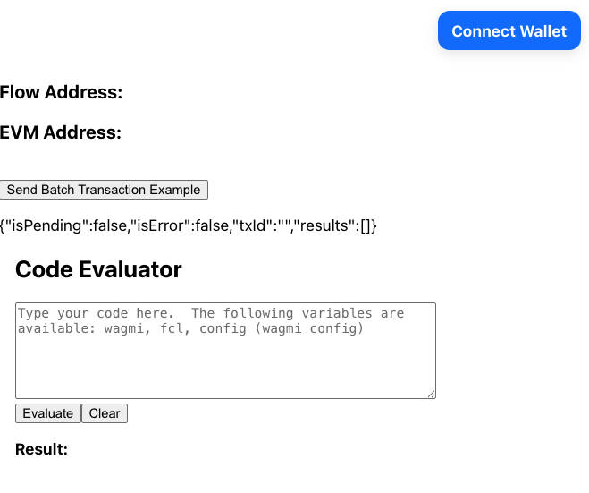

Ever since the launch of Flow EVM, it's been possible to _supercharge_ your EVM apps by using Flow Cadence features and contracts.  Some benefits, such as [native VRF] and inexpensive gas without compromising security are built in and either easy or automatic to use.  Others, such as the ability to use [Cadence] to [structure and call EVM transactions], are powerful but complicated to configure and use.  They also require developers to manage concurrent connections to both networks.

[FLIP 316] improves the [Flow Client Library (FCL)] to support cross-VM functionality between Flow EVM and Flow Cadence.

For EVM developers, this means that you can use the familiar [wagmi], [viem], and [rainbowkit] stack you're used two, add FCL, and get features like **multi-call write** with one signature for users with a Cadence-compatible [wallet].

In this tutorial, you'll learn how to create a hybrid application and use some basic cross-VM features.

:::warning

The FCL functionality described in this tutorial is in alpha.  Some steps may change.  We'll keep the tutorial updated, but please [create an issue] or let us know on [Discord] if something isn't working for you.

:::

## Objectives

After completing this guide, you'll be able to:

- 3-5 appropriate level Bloom's taxonomy verb objectives
- Don't wordsmith these
- It's ok of they're repetitive

## Prerequisites

### Next.js and Modern Frontend Development

This tutorial uses [Next.js]. You don't need to be an expert, but it's helpful to be comfortable with development using a current React framework. You'll be on your own to select and use a package manager, manage Node versions, and other frontend environment tasks. If you don't have your own preference, you can just follow along with us and use [npm].

### Solidity and Cadence Smart Contract Development

Apps using the hybrid approach can interact with both [Cadence] and [Solidity] smart contracts.  You don't need to be an expert in either of these, but it's helpful to be familiar with how smart contracts work in at least one of these languages.

### Onchain App Frontends

We're assuming you're familiar with [wagmi], [viem], and [rainbowkit].  If you're coming from the Cadence, you might want to take a quick look at the getting started guides for these platforms.  They're all excellent and will rapidly get you up to speed on how the EVM world commonly connects their apps to their contracts.

## Getting Started

For this tutorial, we'll be starting from a fork of the [FCL + RainbowKit + Wagmi Integration Demo] built by the team.

Fork the repo so you can push your work freely to your own copy, then follow the setup instructions.

For _Step 3_, you'll want to clone and build FCL [FCL-JS] in a folder in the same level as where you cloned your fork of the hybrid app starter.

```bash
/some-parent-folder/
  ├── my-project/       # Your project
  ├── fcl-js/           # The cloned FCL-JS repo
```

Running the command **from the root of your hybrid-app project folder**, the you can clone it with:

```bash
git clone https://github.com/onflow/fcl-js.git ../fcl-js
```

Once the download completes, navigate to the FCL folder in your terminal and build it with:

```bash
npm i
npm run build
```

Once the build completes, return to the hybrid app, run it, and view the site in your browser:

```bash
npm run dev
```

You should see:



Connect with a Cadence-compatible [wallet].

:::warning

In a production app, you'll want to manage this process carefully.  Non-Cadence EVM wallets can connect, but they will **not** be able to use any Cadence features.

:::

## Project Overview


:::info

Manually building FCL locally is a temporary step during alpha.  In the future, you'll just install the package.

:::

### Subsection 1

Divide each part into appropriate categories.

**Avoid h4 and above**

## Part 2

More text goes here

## Conclusion

In this tutorial, you ...

Now that you have completed the tutorial, you should be able to:

- Copy/paste the Objectives from above here

(OPTIONAL) Now that you've completed this tutorial, you're ready to...

<!-- Relative links, will not render on page -->

[Cadence]: https://cadence-lang.org/docs
[Next.js]: https://nextjs.org/docs/app/getting-started/installation
[npm]: https://www.npmjs.com/
[create an issue]: https://github.com/onflow/docs/issues/new/choose
[Cadence]: https://cadence-lang.org
[Solidity]: https://soliditylang.org/
[native VRF]: ../../evm/guides/vrf.md
[structure and call EVM transactions]: ../../evm/cadence/batched-evm-transactions.md
[FLIP 316]: https://github.com/onflow/flips/pull/317
[Flow Client Library (FCL)]: ../../tools/clients/fcl-js
[wagmi]: https://wagmi.sh/
[viem]: https://viem.sh/
[rainbowkit]: https://www.rainbowkit.com/
[wallet]: ../../ecosystem/wallets.md
[Discord]: https://discord.com/channels/613813861610684416/1162086721471647874
[FCL + RainbowKit + Wagmi Integration Demo]: https://github.com/jribbink/cross-vm-app
[FCL-JS]: https://github.com/onflow/fcl-js