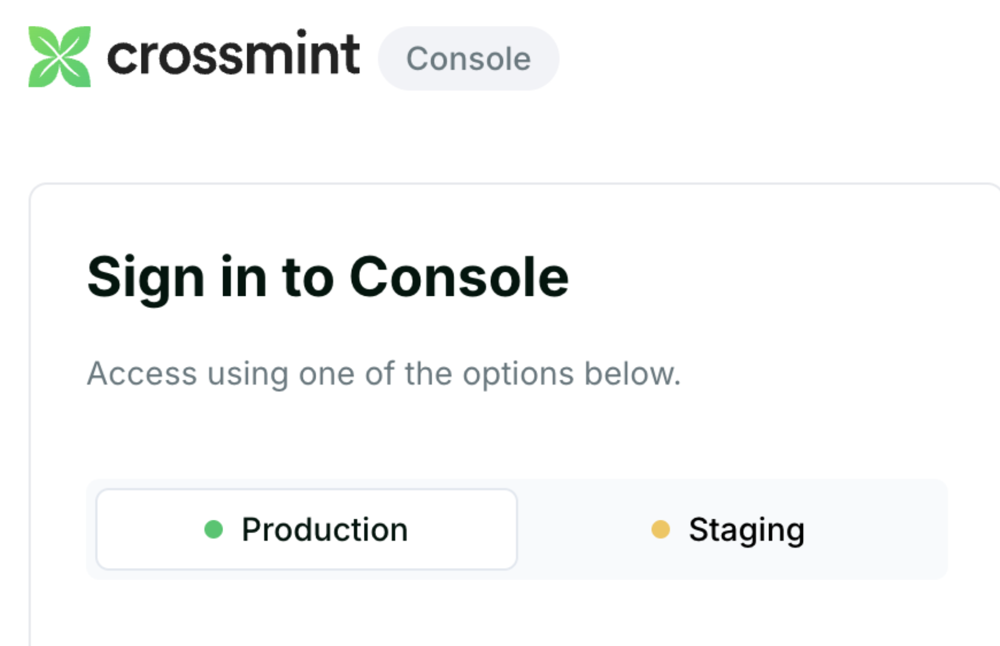
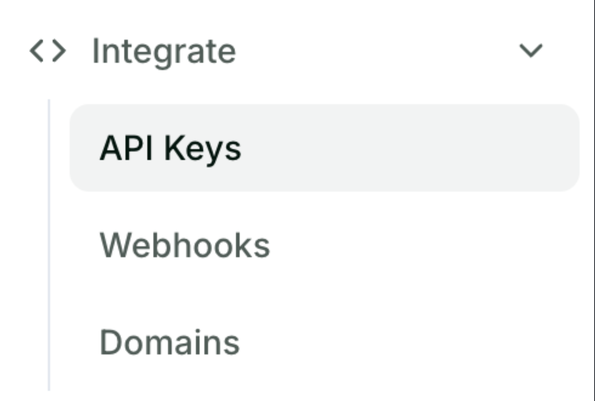

# Authentication Integration Guide

Crossmint provides a comprehensive user management solution tightly integrated with all other Crossmint products. Authenticate users using Web3 or traditional sign-in methods, with seamless wallet creation and unified identity management.

**Why this matters:**

- **Unified identity system**: Single user account across your backend and Web3 app
- **Multiple auth methods**: Email OTP, social logins, wallet connections, and Farcaster
- **Automatic wallet creation**: Optionally create or link wallets with user accounts
- **Drag and drop integration**: Setup in under 5 minutes

## 🎯 Available Authentication Methods

### 1. Email OTP Authentication

Passwordless sign-in using one-time codes delivered to the user's email.
- No passwords required
- Secure and user-friendly
- Automatic account creation

### 2. Social Account Authentication

Sign in with popular social platforms:

- Google
- Apple
- X (Twitter)
- And more

### 3. Farcaster Integration

Using the [Sign In With Farcaster (SIWF) standard]

- Web3-native authentication
- Decentralized identity support

### 4. External Wallet Authentication

Connect with crypto wallets for Web3 authentication:

- MetaMask
- WalletConnect
- Flow wallets
- And other Web3 wallets


## Prerequisites

Make sure you have:

**Crossmint account:**

- [Crossmint Console](https://staging.crossmint.com) account
- Client API key with authentication scopes

**React/Next.js project:**

- React 16.8+ or Next.js 13+
- TypeScript support (recommended)

**Technical knowledge:**
- Basic React hooks and state management
- Understanding of authentication flows

## Quick Start (5 minutes)

### Step 1: Install the SDK

```bash
npm i @crossmint/client-sdk-react-ui
```

### Step 2: Add Crossmint Providers

```tsx
"use client";

import {
    CrossmintProvider,
    CrossmintAuthProvider,
    CrossmintWalletProvider
} from "@crossmint/client-sdk-react-ui";

export function Providers({ children }: { children: React.ReactNode }) {
    return (
        <CrossmintProvider apiKey="<crossmint-client-api-key>">
            <CrossmintAuthProvider>
                {children}
            </CrossmintAuthProvider>
        </CrossmintProvider>
    );
}
```

### Step 3: Create Authentication Component

```tsx
"use client";

import { useAuth } from "@crossmint/client-sdk-react-ui";

export function AuthButton() {
  const { login, logout, user, jwt } = useAuth();

  return (
    <div className="flex gap-4">
      {user == null ? (
        <button
          type="button"
          onClick={login}
          className="bg-blue-500 text-white font-bold py-2 px-4 rounded"
        >
          Login
        </button>
      ) : (
        <button
          type="button"
          onClick={logout}
          className="bg-black text-white font-bold py-2 px-4 rounded border-2 border-blue-500"
        >
          Logout
        </button>
      )}
      
      {/* Display user information */}
      <div className="user-info">
        <p>User ID: {user?.userId}</p>
        <p>Email: {user?.email ?? "None"}</p>
        <p>Phone: {user?.phoneNumber ?? "None"}</p>
        <p>Farcaster: {user?.farcaster?.username ?? "None"}</p>
        <p>Google: {user?.google?.displayName ?? "None"}</p>
        <p>JWT: {jwt}</p>
      </div>
    </div>
  );
}
```

### Environment Configuration

```typescript
// Use environment-specific API keys
const crossmintConfig = {
  apiKey: process.env.NODE_ENV === 'production' 
    ? process.env.CROSSMINT_PROD_API_KEY
    : process.env.CROSSMINT_STAGING_API_KEY,
  environment: process.env.NODE_ENV === 'production' ? 'production' : 'staging'
};
```

## Production Deployment

### 1. Create Production Account

1. Create a developer account on the [Production Console]


2. Complete account verification and KYB process

### 2. Configure Production API Keys

1. Create a production client API key

Navigate to **Integrate > API Keys**



2. Enable required scopes:
   - `users.create`
   - `users.read`
   - `wallets.read`
   - `wallets.create`

### 3. Update Environment Variables

```bash
# Production
CROSSMINT_API_KEY=your_production_client_api_key
CROSSMINT_ENVIRONMENT=production

# Staging (for testing)
CROSSMINT_API_KEY=your_staging_client_api_key
CROSSMINT_ENVIRONMENT=staging
```

### 4. Test Authentication Flow

```typescript
// Test authentication in staging first
const testAuth = async () => {
  const { login, user } = useAuth();
  
  await login();
  
  if (user) {
    console.log('Authentication successful:', user);
    // Test wallet creation
    await createUserWallet();
  }
};
```

## 🔧 Troubleshooting

### Common Issues

**Authentication fails:**
- Verify API key is correct
- Check authentication scopes are enabled
- Ensure you're using the right environment (staging vs production)

**Wallet creation fails:**
- Verify user is authenticated
- Check wallet creation scopes
- Ensure proper wallet configuration for Flow

### Getting Help

- **[Crossmint Authentication Docs](https://docs.crossmint.com/authentication/introduction)**
- **[Flow Developer Portal](https://developers.flow.com/)** 


<!-- Reference-style links, does not render on page -->

[Crossmint Console]: https://staging.crossmint.com
[Sign In With Farcaster (SIWF) standard]: https://github.com/farcasterxyz/protocol/discussions/110
[Production Console]: https://www.crossmint.com/signin?callbackUrl=/console