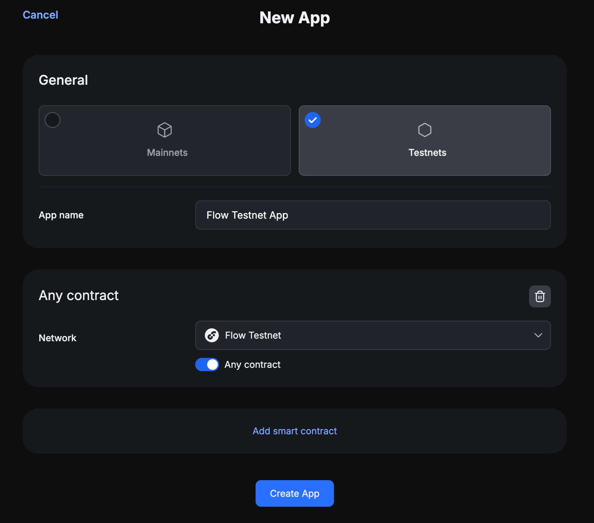
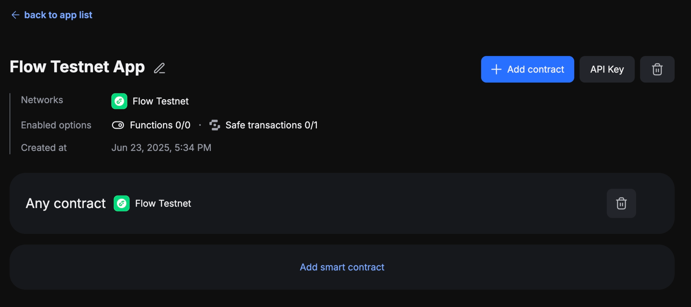
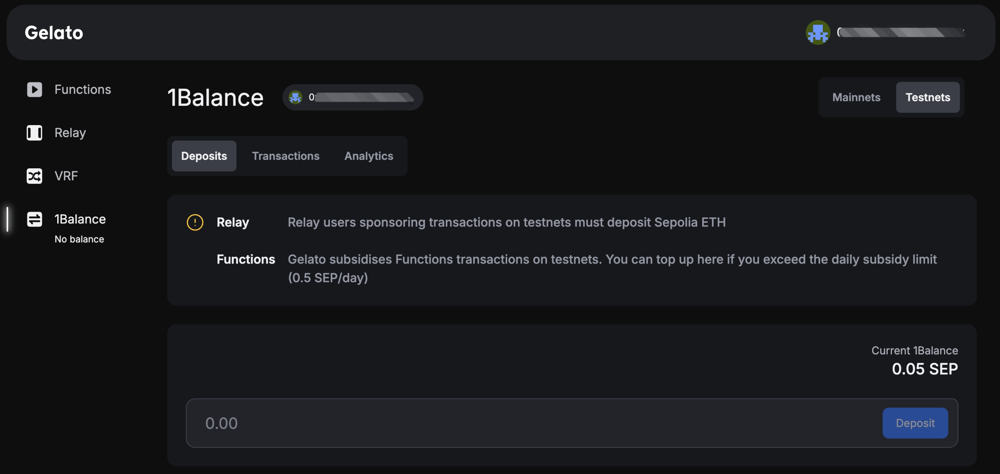

# Gelato Smart Wallet Integration Guide

You can use Gelato Smart Wallet to enable gasless transactions on Flow EVM. It supports features like: EIP-7702 or ERC-4337 depending on the wallet you use.

## Prerequisites of using Gelato Smart Wallet

You need to setup all the followings in the Gelato App to create a Gelato Sponsor API Key.

### Step 1. Create Your Gelato Account

Sign up on the [Gelato App] to establish an account. This account is the foundation for setting up relay tasks and managing gas sponsorships.

### Step 2. Create a Relay App

Within your Gelato account, create a new Relay App with the Flow EVM network.  
For Testnet, you can first allow `Any contract` to call your relay app.

:::note

You can add more smart contract information and its associated chain information later in this App.  
When set to a specific contract instead of `Any contract`, the API keys will only allow gasless transactions for calls to the designated methods within the ABI of the contract.

:::

### Step 3. Create/Obtain a Sponsor API Key

After creating the relay app, navigate to its dashboard to locate your Sponsor API Key.

This key links your Gelato setup with 1Balance for gas sponsorship.

### Step 4. Deposit Funds into 1Balance

To use Gelato sponsoring transactions, you need to deposit funds into 1Balance according to your target environment:

- Mainnets: Deposit USDC.
- Testnets: Deposit Sepolia ETH.

Here we use Sepolia ETH as the gas fee for Testnet‘s gasless transactions.

Here are some third party Sepolia ETH faucets you can use:

- [Google Cloud Sepolia Faucet]
- [Alchemy Sepolia Faucet]
- [Chainlink Sepolia Faucet]
- [Metamask Sepolia Faucet]

## Send Gasless Transactions for your users

After you have created a Sponsor API Key and deposited funds into 1Balance, you can use gasless transactions features for your users.  
With the Gelato Smart Wallet SDK, developers can easily set up sponsored transactions for their applications in just a few simple steps, enabling seamless onboarding and interaction without requiring users to hold native tokens.

:::note

You can find the examples in the [Gelato Smart Wallet SDK] repository.

:::

[Gelato App]: https://app.gelato.network/
[Google Cloud Sepolia Faucet]: https://cloud.google.com/application/web3/faucet/ethereum/sepolia
[Alchemy Sepolia Faucet]: https://www.alchemy.com/faucets/ethereum-sepolia
[Chainlink Sepolia Faucet]: https://faucets.chain.link/sepolia
[Metamask Sepolia Faucet]: https://docs.metamask.io/developer-tools/faucet/
[Gelato Smart Wallet SDK]: https://github.com/gelatodigital/smartwallet/tree/master/examples
